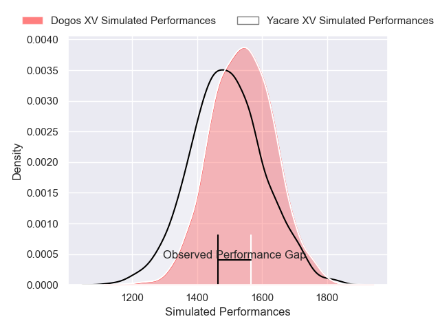
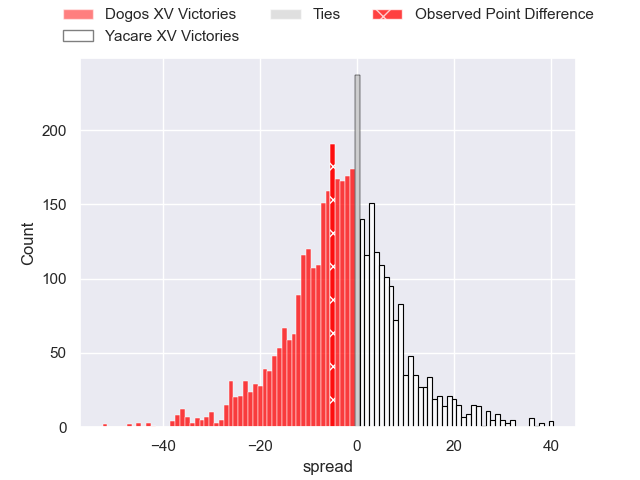
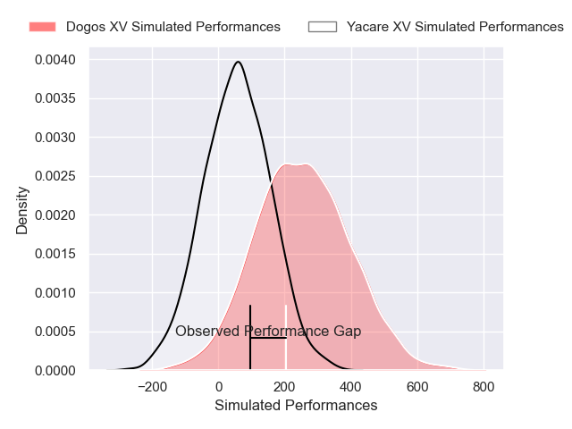
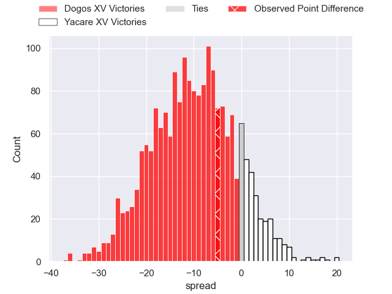

---  
layout: page  
title: Dogos XV at Yacare XV; 24-19  
date: 2025-04-06 18:00:00 -0500  
categories: "Super Rugby Americas 2025" match review  
---
# Dogos XV at Yacare XV; 24-19

# Club Level Predictions

The first set of predictions treats a club as the smallest object, as the club develops its members, organizes a gameplan, and deploys its players as needed for each match. This club model has a prediction of 0.431, which translates to predicting Dogos XV to win by 2.5.

Our Over/Under is 43.5 - and combined with the spread above, we have a predicted scoreline of 23 to 21

Each club has a rating and a rating deviation (similar to a Glicko rating), and expected performances can be generated. This allows for simulated matches and spreads like the ones below.
## Projected Performances - Club Model

## Projected Spreads - Club Model

## Projected Results - Club Model

# Player Level Predictions

Treating teams instead as an entity made up of the currently active players, I have ratings for each player in an altogether different system. These can be combined to form team ratings once teamsheets are announced, weighting starters a bit higher than the reserves. After the match is played, players can be weighted by their minutes on the field, allowing for an accurate measure of the team's composition. With these compiled team ratings, we can make predictions, measure inaccuracy, and update the individual player ratings.
## Prediction without Player Minutes: Dogos XV by 6.8

Dogos XV by 9.1 on a neutral pitch

## Projected Performances - Player Model

## Projected Spreads - Player Model

## Projected Results - Player Model

|   Away Minutes | Away Player               |   Away Percentile |   Number |   Home Percentile | Home Player                      |   Home Minutes |
|---------------:|:--------------------------|------------------:|---------:|------------------:|:---------------------------------|---------------:|
|             27 | Boris Wenger              |             82.91 |        1 |             73.77 | Mariano Muntaner                 |             29 |
|             51 | Leonel Oviedo             |             72.74 |        2 |             10.37 | Axel Zapata                      |              7 |
|             75 | Pedro Delgado             |             66.61 |        3 |             20.35 | Rolando Portillo                 |             57 |
|             53 | Lautaro Simes             |             80.3  |        4 |             12.82 | Mariano Garcete Elli             |             80 |
|             50 | Federico Albrisi          |             46.84 |        5 |             99.06 | Lucas Sommer                     |             34 |
|             68 | Aitor Bildosola           |             56.18 |        6 |              9.18 | Ramiro Nicolas Parada            |             30 |
|             80 | Valentin Cabral           |             66.76 |        7 |              6.27 | Ariel Nunez Lesme                |             56 |
|             32 | Gennaro Fissore           |             29.47 |        8 |             90.85 | Santiago Ruiz                    |             12 |
|             80 | Agustin Moyano            |             83.31 |        9 |              9.95 | Juan Cruz Strada                 |             29 |
|             80 | Juan Baronio              |             45.49 |       10 |             43.03 | Valentino Dicapua                |             58 |
|             56 | Franco Rossetto           |             87.94 |       11 |             35.16 | Arturo Lopez                     |             21 |
|             12 | Faustino Sánchez Valarolo |             89.71 |       12 |             19.55 | Ramiro Amarilla                  |             80 |
|             80 | Agustin Segura            |             83.6  |       13 |             18.43 | Francisco Diez                   |             23 |
|             56 | Mateo Soler               |             78.76 |       14 |             35.53 | Facundo Paiva                    |             80 |
|             73 | Mateo Sanchez             |             19.39 |       15 |             10.41 | Julian Quetglas                  |             58 |
|             80 | Julian Ignacio Hernandez  |             76.23 |       16 |              4.49 | Felipe Puertas                   |             80 |
|             80 | Juan Cruz Caballero       |             42.07 |       17 |            nan    | Francisco Luis Bareiro Ochipinti |              0 |
|             80 | Lorenzo Colidio           |             70.13 |       18 |            nan    | Luis Enrique Quinteros           |             48 |
|             70 | Octavio Filippa           |             86.25 |       19 |            nan    | Jordi Chavez                     |             48 |
|             80 | Gaston Revol              |            nan    |       20 |            nan    | Cesar Perez                      |             80 |
|             80 | Ignacio Jose Gandini      |            nan    |       21 |            nan    | nan                              |            nan |

