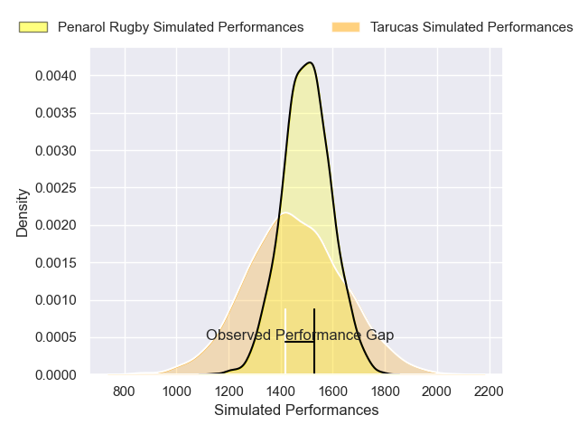
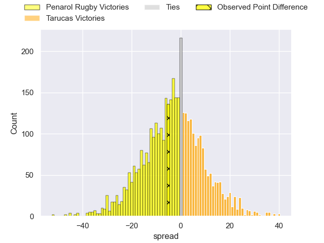
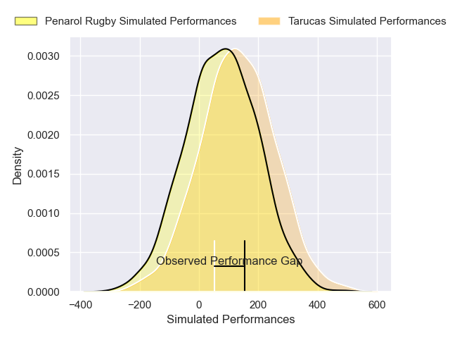
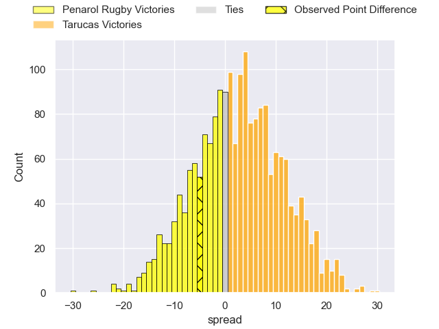

---  
layout: page  
title: Penarol Rugby at Tarucas; 21-16  
date: 2025-04-08 18:00:00 -0500  
categories: "Super Rugby Americas 2025" match review  
---
# Penarol Rugby at Tarucas; 21-16

# Club Level Predictions

The first set of predictions treats a club as the smallest object, as the club develops its members, organizes a gameplan, and deploys its players as needed for each match. This club model has a prediction of 0.432, which translates to predicting Penarol Rugby to win by 2.5.

Our Over/Under is 58.5 - and combined with the spread above, we have a predicted scoreline of 30 to 28

Each club has a rating and a rating deviation (similar to a Glicko rating), and expected performances can be generated. This allows for simulated matches and spreads like the ones below.
## Projected Performances - Club Model

## Projected Spreads - Club Model

## Projected Results - Club Model

# Player Level Predictions

Treating teams instead as an entity made up of the currently active players, I have ratings for each player in an altogether different system. These can be combined to form team ratings once teamsheets are announced, weighting starters a bit higher than the reserves. After the match is played, players can be weighted by their minutes on the field, allowing for an accurate measure of the team's composition. With these compiled team ratings, we can make predictions, measure inaccuracy, and update the individual player ratings.
## Prediction without Player Minutes: Tarucas by 3.4

Tarucas by 1.3 on a neutral pitch

## Projected Performances - Player Model

## Projected Spreads - Player Model

## Projected Results - Player Model

|   Away Minutes | Away Player                     |   Away Percentile |   Number |   Home Percentile | Home Player             |   Home Minutes |
|---------------:|:--------------------------------|------------------:|---------:|------------------:|:------------------------|---------------:|
|           80   | Mateo Sanguinetti               |              5.67 |        1 |             23    | Benjamin Garrido        |           80   |
|           80   | Guillermo Pujadas               |             87.35 |        2 |             38.6  | Tomas Bartolini         |           80   |
|           75   | Juan Francisco Aguirre Gallardo |             59.66 |        3 |             53.35 | Francisco Moreno        |           80   |
|           25   | Felipe Aliaga                   |             51.94 |        4 |             44.95 | Facundo Garcia Hamilton |           30   |
|           80   | Manuel Rosmarino                |             37.68 |        5 |             64.78 | Alvaro Garcia Iandolino |           80   |
|           80   | Santiago Civetta                |             46.36 |        6 |             40.84 | Facundo Javier Cardozo  |           80   |
|           64   | Lucas Bianchi                   |             65.23 |        7 |             35.98 | Agustin Sarelli         |           80   |
|           34   | Manuel Diana                    |              4.88 |        8 |             39.23 | Santiago Aguilar        |           25   |
|           58   | Santiago Alvarez                |             63.39 |        9 |             78.64 | Simon Benitez Cruz      |           34   |
|           48   | Felipe Etcheverry               |             35.61 |       10 |             28.36 | Nicolas Roger           |           12.5 |
|           80   | Justo Ferrario                  |             60.04 |       11 |              9.76 | Tomas Vanni             |           52   |
|            0   | Bautista Farisé                 |             60.79 |       12 |             18.95 | Mariano García Ascárate |           80   |
|           30   | Alfonso Perillo Albarracin      |             48.43 |       13 |             25.13 | Bautista Estofan        |           12.5 |
|           22   | Bautista Basso                  |             15.89 |       14 |              9.39 | Baltazar Garcia         |           64   |
|           80   | Baltazar Amaya                  |             46.11 |       15 |             36.07 | Stefano Ferro           |           32   |
|           60   | Mateo Perillo                   |             46.88 |       16 |            nan    | Julian Martin           |           80   |
|           64   | Tomas Di Biase                  |             75.25 |       17 |            nan    | Agustin Iglesias        |            0   |
|           27   | Bautista Vidal                  |             51.2  |       18 |             28.05 | Thiago Sbrocco          |           80   |
|           38.5 | Bautista Viero                  |             34.94 |       19 |             32.54 | Estanislao Pregot       |           24   |
|           58   | Carlos Deus                     |             46.55 |       20 |            nan    | Juan Manuel Molinuevo   |           30   |
|           46   | Sebastian Perez                 |            nan    |       21 |             60.23 | Juan Manuel Vivas       |           66   |
|          nan   | nan                             |            nan    |       22 |             41.64 | Luciano Asevedo         |           80   |
|          nan   | nan                             |            nan    |       23 |            nan    | Pedro Coll              |           24   |

