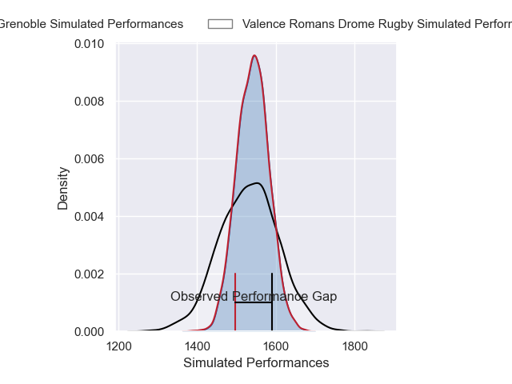
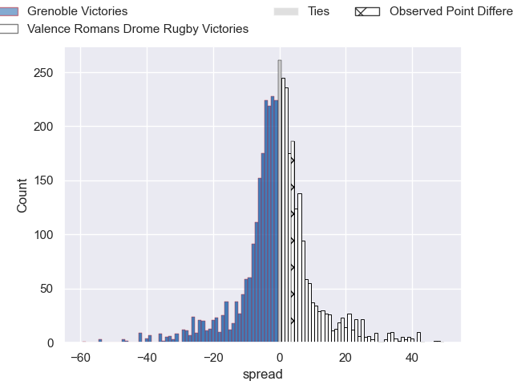
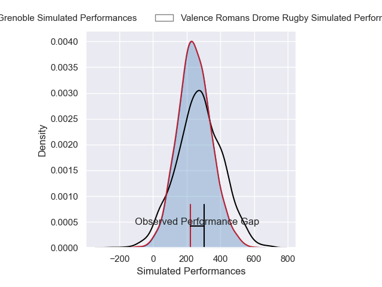
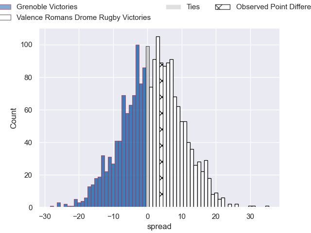

---  
layout: page  
title: Grenoble at Valence Romans Drome Rugby; 22-26  
date: 2025-04-10 18:00:00 -0500  
categories: "Pro D2 24/25" match review  
---
# Grenoble at Valence Romans Drome Rugby; 22-26

# Club Level Predictions

The first set of predictions treats a club as the smallest object, as the club develops its members, organizes a gameplan, and deploys its players as needed for each match. This club model has a prediction of 0.488, which translates to predicting Grenoble to win by 0.4.

Our Over/Under is 54.5 - and combined with the spread above, we have a predicted scoreline of 27 to 27

Each club has a rating and a rating deviation (similar to a Glicko rating), and expected performances can be generated. This allows for simulated matches and spreads like the ones below.
## Projected Performances - Club Model

## Projected Spreads - Club Model

## Projected Results - Club Model

# Player Level Predictions

Treating teams instead as an entity made up of the currently active players, I have ratings for each player in an altogether different system. These can be combined to form team ratings once teamsheets are announced, weighting starters a bit higher than the reserves. After the match is played, players can be weighted by their minutes on the field, allowing for an accurate measure of the team's composition. With these compiled team ratings, we can make predictions, measure inaccuracy, and update the individual player ratings.
## Prediction without Player Minutes: Grenoble by 0.5

Grenoble by 4.2 on a neutral pitch

## Projected Performances - Player Model

## Projected Spreads - Player Model

## Projected Results - Player Model

|   Away Minutes | Away Player         |   Away Percentile |   Number |   Home Percentile | Home Player         |   Home Minutes |
|---------------:|:--------------------|------------------:|---------:|------------------:|:--------------------|---------------:|
|             30 | Eli Eglaine         |             56.95 |        1 |             81.65 | Andrea Pontanier    |             29 |
|             22 | Bastien Soury       |             75.79 |        2 |             85.48 | Dorian Marco Pena   |             61 |
|             31 | Cody Thomas         |             46.47 |        3 |             22.72 | Gareth Milasinovich |             80 |
|             34 | Pierce Phillips     |             67.62 |        4 |             67.81 | Ryan McCauley       |             80 |
|             34 | Giorgi Javakhia     |             82.43 |        5 |             69.61 | Florian Goumat      |             80 |
|             48 | Antonin Berruyer    |             84.64 |        6 |             75.37 | Adrien Roux         |             71 |
|             48 | Thibaut Martel      |             82.4  |        7 |             34.55 | Ilia Spanderashvili |             51 |
|             48 | Richard Hardwick    |             38.82 |        8 |             82.72 | Mathieu Vachon      |             63 |
|             59 | Barnabe Couilloud   |             17.88 |        9 |             76.05 | Thomas Lhusero      |             71 |
|             22 | Marc Palmier        |              8.51 |       10 |             60.17 | Lucas Meret         |             51 |
|             55 | Geoffrey Cros       |             84.99 |       11 |             50.97 | Thomas Roziere      |             80 |
|             80 | Bautista Ezcurra    |             98.17 |       12 |             84.94 | Louis Marrou        |             80 |
|             49 | Romain Trouilloud   |             75.38 |       13 |             85.35 | Anatole Pauvert     |             54 |
|             74 | Kaminieli Rasaku    |             91.94 |       14 |              2.41 | Owen Lane           |             26 |
|             30 | Hugo Trouilloud     |             72.28 |       15 |             86.45 | Joris De Moura      |             51 |
|             50 | Sam Davies          |             41.91 |       16 |             86.05 | Thembelani Bholi    |             70 |
|             26 | Giorgi Mamaiashvili |             47.82 |       17 |             87.86 | Mosese Mawalu       |             46 |
|             52 | Tommy Raynaud       |             90.47 |       18 |             44.76 | Axel Bruchet        |             80 |
|             80 | Mathis Baret        |            nan    |       19 |             18.72 | Mattéo Rodor        |             80 |
|             19 | Yan Lestrade        |             91.05 |       20 |              0.5  | Cyril Deligny       |             80 |
|             26 | Lilian Rossi        |             77.63 |       21 |             10.38 | Mathieu Guillomot   |             30 |
|             29 | Giorgi Pertaia      |             89.91 |       22 |             72.44 | Esteban Chouteau    |             80 |
|            nan | nan                 |            nan    |       23 |             68.86 | Vincent Vial        |             64 |

