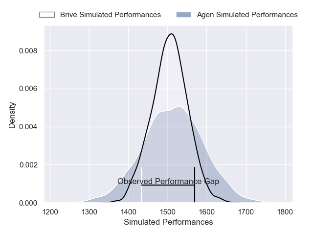
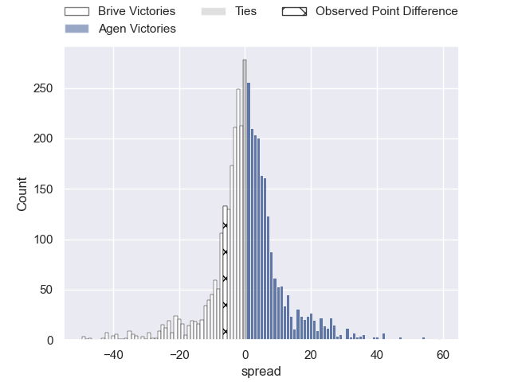
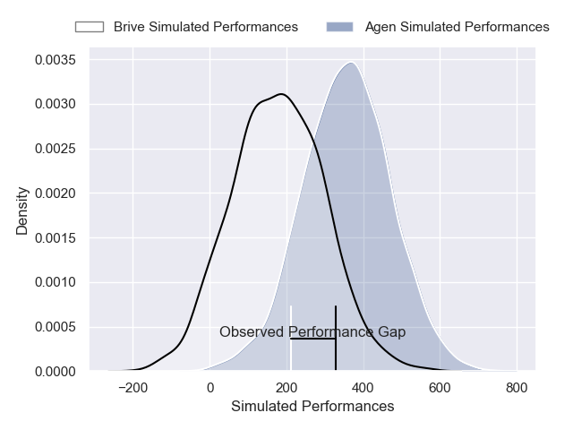
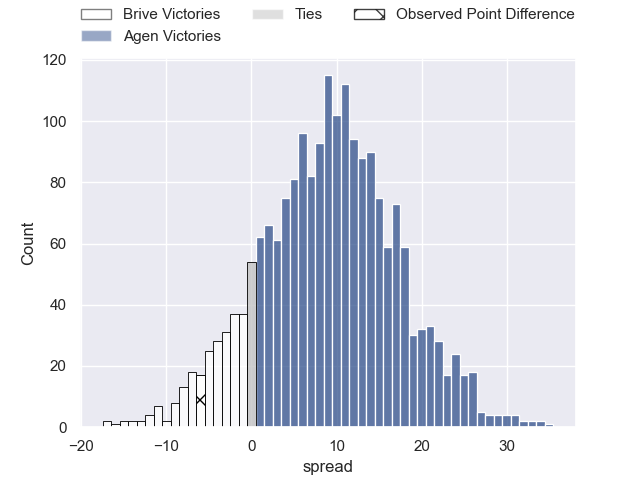
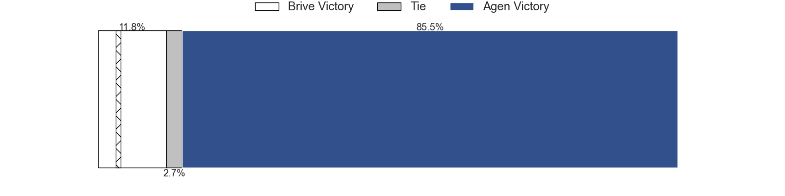

---  
layout: page  
title: Brive at Agen; 19-13  
date: 2025-04-11 18:00:00 -0500  
categories: "Pro D2 24/25" match review  
---
# Brive at Agen; 19-13

# Club Level Predictions

The first set of predictions treats a club as the smallest object, as the club develops its members, organizes a gameplan, and deploys its players as needed for each match. This club model has a prediction of 0.513, which translates to predicting Agen to win by 0.5.

Our Over/Under is 45.5 - and combined with the spread above, we have a predicted scoreline of 22 to 23

Each club has a rating and a rating deviation (similar to a Glicko rating), and expected performances can be generated. This allows for simulated matches and spreads like the ones below.
## Projected Performances - Club Model

## Projected Spreads - Club Model

## Projected Results - Club Model

# Player Level Predictions

Treating teams instead as an entity made up of the currently active players, I have ratings for each player in an altogether different system. These can be combined to form team ratings once teamsheets are announced, weighting starters a bit higher than the reserves. After the match is played, players can be weighted by their minutes on the field, allowing for an accurate measure of the team's composition. With these compiled team ratings, we can make predictions, measure inaccuracy, and update the individual player ratings.
## Prediction without Player Minutes: Agen by 5.6

Brive by 8.6 on a neutral pitch

## Projected Performances - Player Model

## Projected Spreads - Player Model

## Projected Results - Player Model

|   Away Minutes | Away Player               |   Away Percentile |   Number |   Home Percentile | Home Player          |   Home Minutes |
|---------------:|:--------------------------|------------------:|---------:|------------------:|:---------------------|---------------:|
|             24 | Simon-Pierre Chauvac      |             17.4  |        1 |             14.73 | Florent Guion        |              1 |
|             29 | Lucas da Silva            |             56.3  |        2 |             22.97 | Pierre Jouvin        |              0 |
|              8 | Marcel van der Merwe      |             10.74 |        3 |             29.23 | Alex Burin           |             40 |
|             14 | Retief Marais             |             83.55 |        4 |             57.34 | Mathieu de Giovanni  |             14 |
|             20 | Asier Usarraga            |             90.43 |        5 |             13.66 | John Madigan         |             67 |
|             80 | Asaeli Tuivuaka           |             86.53 |        6 |             14.94 | Julien Lebian        |              9 |
|             21 | Courtney Lawes            |             96.98 |        7 |             44.82 | Tomasi Fineanganofo  |             59 |
|             74 | Rahboni Warren-Vosayaco   |             66.33 |        8 |             19.59 | Valentin Gayraud     |             80 |
|             80 | Mathis Ferté              |             72.29 |        9 |             73.12 | Jack Maunder         |             20 |
|             80 | Stuart Olding             |             95.67 |       10 |             92.32 | Franck Pourteau      |             22 |
|             18 | Erwan Dridi               |             86.04 |       11 |              9.09 | Iban Etcheverry      |             80 |
|             80 | Georges Shvelidze         |             69.88 |       12 |             16.04 | Clement Garrigues    |             64 |
|             80 | Maxence Biasotto          |             81.4  |       13 |             67.13 | Peyo Muscarditz      |             80 |
|             73 | Tevita Railevu            |             17.9  |       14 |              0.4  | Loris Tolot          |             50 |
|             55 | Curwin Bosch              |             91.15 |       15 |             30.58 | Jean-Marcelin Buttin |             35 |
|             51 | Nathan Fraissenon         |             51.18 |       16 |              3.12 | Fotu Lokotui         |             53 |
|             21 | Francisco Coria Marchetti |             75.24 |       17 |             71.28 | William Demotte      |             53 |
|             51 | Hugo Verdu                |              4.17 |       18 |             33.46 | Mamuka Mstoiani      |             53 |
|             35 | David Geneste             |            nan    |       19 |             66.77 | Lasha Macharashvili  |             80 |
|              0 | Guillaume Galletier       |            nan    |       20 |              9.65 | Emile Dayral         |             80 |
|             80 | Samuel Maximin            |             71.13 |       21 |             82.78 | Hayam El Bibouji     |             80 |
|             50 | Konstantin Mikautadze     |              4.09 |       22 |             32.72 | Theo Idjellidaine    |              0 |
|             58 | Issam Hamel               |             66.83 |       23 |             38.57 | Matthieu Bonnet      |             80 |

