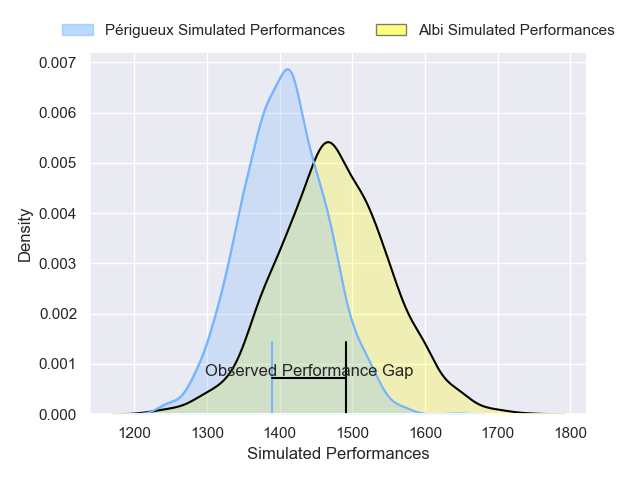
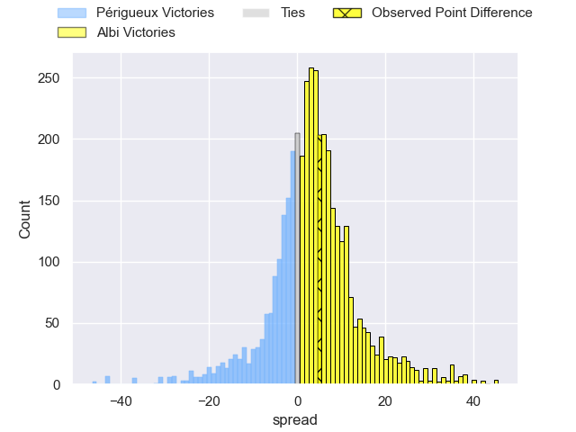
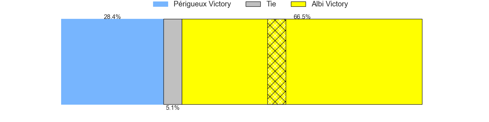
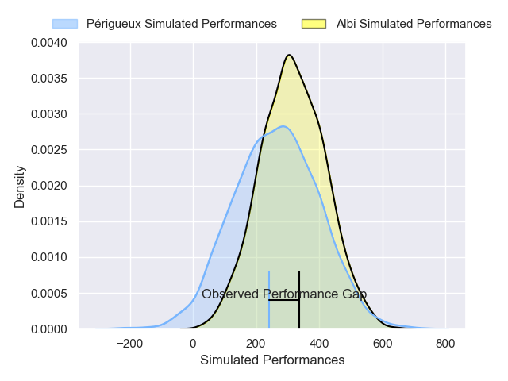
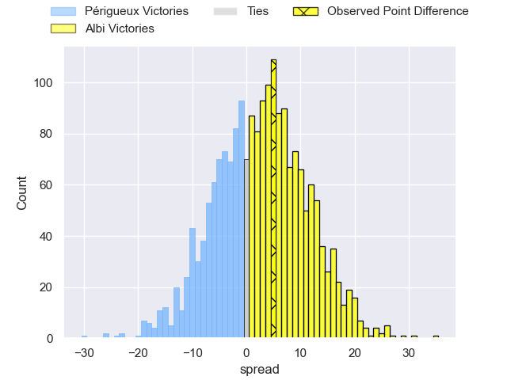
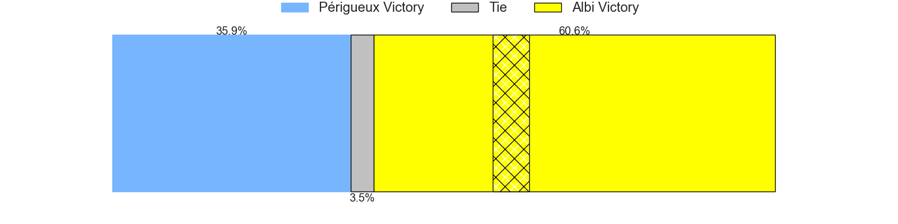

---  
layout: page  
title: Perigueux at Albi; 24-29  
date: 2025-04-11 18:00:00 -0500  
categories: "Nationale 24/25" match review  
---
# Perigueux at Albi; 24-29

# Club Level Predictions

The first set of predictions treats a club as the smallest object, as the club develops its members, organizes a gameplan, and deploys its players as needed for each match. This club model has a prediction of 0.599, which translates to predicting Albi to win by 3.5.

Our Over/Under is 40.5 - and combined with the spread above, we have a predicted scoreline of 19 to 22

Each club has a rating and a rating deviation (similar to a Glicko rating), and expected performances can be generated. This allows for simulated matches and spreads like the ones below.
## Projected Performances - Club Model

## Projected Spreads - Club Model

## Projected Results - Club Model

# Player Level Predictions

Treating teams instead as an entity made up of the currently active players, I have ratings for each player in an altogether different system. These can be combined to form team ratings once teamsheets are announced, weighting starters a bit higher than the reserves. After the match is played, players can be weighted by their minutes on the field, allowing for an accurate measure of the team's composition. With these compiled team ratings, we can make predictions, measure inaccuracy, and update the individual player ratings.
## Prediction without Player Minutes: Albi by 8.3

Périgueux by 3.1 on a neutral pitch

## Projected Performances - Player Model

## Projected Spreads - Player Model

## Projected Results - Player Model

|   Away Minutes | Away Player         |   Away Percentile |   Number |   Home Percentile | Home Player        |   Home Minutes |
|---------------:|:--------------------|------------------:|---------:|------------------:|:-------------------|---------------:|
|             29 | Emilien Borges      |             79.95 |        1 |             55.11 | Antoine Soave      |           39   |
|             29 | Manu Leiataua       |              1.33 |        2 |             24.88 | Arthur Castant     |           19   |
|             37 | Kalaveti Tawake     |             73.48 |        3 |             89.94 | Maks van Dyk       |           37   |
|             65 | Richard Fourcade    |             57.67 |        4 |             80.06 | Yanis Horvat       |           33   |
|             34 | Damien Lavergne     |             67.92 |        5 |             47.04 | Jonathan Kpoku     |           52   |
|             80 | Karl Lambert        |             65.4  |        6 |             57.72 | Robin Dione        |           80   |
|             80 | Afaesetiti Amosa    |             97.87 |        7 |             16.93 | Mattéo Coustalat   |           80   |
|              7 | Nahum Merigan       |             66.05 |        8 |             31.7  | Camille Jarreau    |           80   |
|             80 | Max Green           |             35.69 |        9 |             65.15 | Gilen Queheille    |           52   |
|             65 | Greg Hutley         |             80.29 |       10 |             23    | Victor Pisano      |           28   |
|             57 | Yon Camou           |             71.67 |       11 |             66.92 | Antoine Bouzerand  |           11   |
|              0 | Nicolas Piaton      |             48.03 |       12 |             56.31 | Gabriel Aviragnet  |            0   |
|             59 | Dorian Lavernhe     |             73.06 |       13 |             40.97 | Victorien Jacomme  |           47   |
|             34 | Tim Giresse         |             84.34 |       14 |             76.23 | Simon Hartmann     |           80   |
|             65 | Anderson Neisen     |             53.58 |       15 |             49.49 | Simeon Soenen      |           27.5 |
|             80 | Thomas Vidal        |             78.83 |       16 |             37.3  | Lucas Pindor       |           20.5 |
|             71 | Louis Martin        |            nan    |       17 |             23.05 | Reinach Venter     |           80   |
|             65 | Anthony Pelmard     |             78.51 |       18 |            nan    | Thomas Cretu       |            0   |
|             63 | Raphaël Vieilledent |             69.71 |       19 |             40.43 | Theo Mercadier     |           55   |
|             80 | Clement Lanen       |             65.19 |       20 |             72.25 | Vincent Mutel      |           80   |
|             63 | Masivesi Dakuwaqa   |             80.37 |       21 |             14.98 | Titouan Pouzoullic |           41   |
|             67 | Nicolas Faltrept    |             27.61 |       22 |             87.04 | Théo Vidal         |           23   |
|             80 | Cyril Couturier     |             87.79 |       23 |             12.71 | Leo Treilles       |           27.5 |

