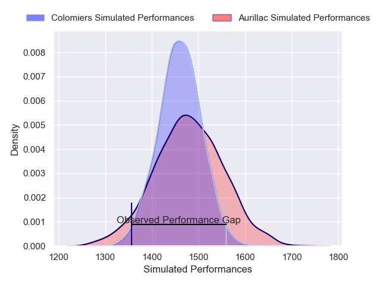
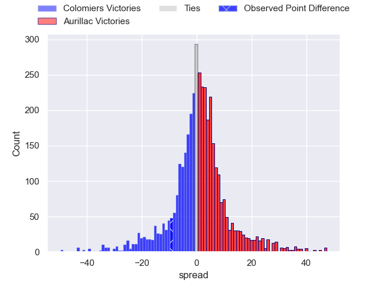
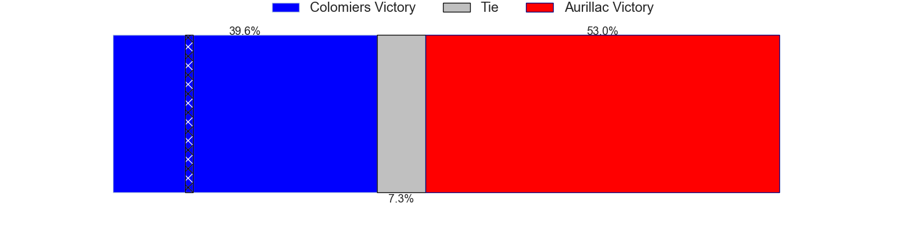
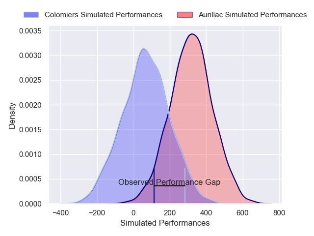
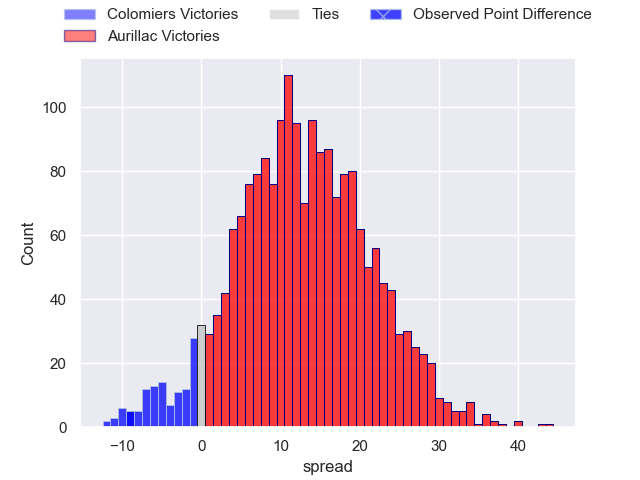
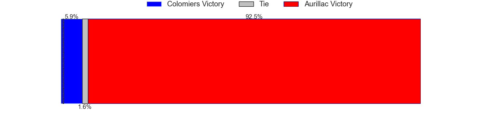

---  
layout: page  
title: Colomiers at Aurillac; 46-37  
date: 2025-04-11 18:00:00 -0500  
categories: "Pro D2 24/25" match review  
---
# Colomiers at Aurillac; 46-37

# Club Level Predictions

The first set of predictions treats a club as the smallest object, as the club develops its members, organizes a gameplan, and deploys its players as needed for each match. This club model has a prediction of 0.524, which translates to predicting Aurillac to win by 0.8.

Our Over/Under is 50.5 - and combined with the spread above, we have a predicted scoreline of 25 to 26

Each club has a rating and a rating deviation (similar to a Glicko rating), and expected performances can be generated. This allows for simulated matches and spreads like the ones below.
## Projected Performances - Club Model

## Projected Spreads - Club Model

## Projected Results - Club Model

# Player Level Predictions

Treating teams instead as an entity made up of the currently active players, I have ratings for each player in an altogether different system. These can be combined to form team ratings once teamsheets are announced, weighting starters a bit higher than the reserves. After the match is played, players can be weighted by their minutes on the field, allowing for an accurate measure of the team's composition. With these compiled team ratings, we can make predictions, measure inaccuracy, and update the individual player ratings.
## Prediction without Player Minutes: Aurillac by 13.3

Aurillac by 0.1 on a neutral pitch

## Projected Performances - Player Model

## Projected Spreads - Player Model

## Projected Results - Player Model

|   Away Minutes | Away Player        |   Away Percentile |   Number |   Home Percentile | Home Player             |   Home Minutes |
|---------------:|:-------------------|------------------:|---------:|------------------:|:------------------------|---------------:|
|             71 | Guillaume Tartas   |             87.7  |        1 |             26.36 | Irakli Mtchedlidze      |           57   |
|             40 | Theo Lachaud       |              4.31 |        2 |              5.14 | Luka Nioradze           |           51   |
|             80 | Robin Bellemand    |             75.8  |        3 |             15.58 | Giorgi Kartvelishvili   |           80   |
|             80 | Jean Thomas        |             60.96 |        4 |             81.09 | Eoghan Masterson        |           15   |
|             80 | Jack Whetton       |             11.85 |        5 |             16.65 | Louis Bruinsma          |           39   |
|             80 | Jeremy Bechu       |             58.09 |        6 |             52.91 | Tim De Jong             |           15   |
|             80 | Aldric Lescure     |             84.27 |        7 |             54.58 | Lucas Oudard            |           25   |
|             73 | Caleb Timu         |             40.08 |        8 |              9.41 | Didier Tison            |           45   |
|             29 | Natan Culinat      |             56.23 |        9 |             22.56 | Mikheil Alania          |           80   |
|             80 | Max Auriac         |             59.34 |       10 |             18.48 | Jake Strachan           |           28   |
|             80 | Anzelo Tuitavuki   |             51.07 |       11 |             47.34 | Axel Bevia              |           65   |
|             41 | Baptiste Serrano   |             43.79 |       12 |             49.65 | Hugo Bastard            |           80   |
|             51 | Martin Dulon       |             15.54 |       13 |             25.23 | Karl Martin             |           28   |
|             65 | Rodrigo Marta      |             97.48 |       14 |              8.48 | Simeli Yabaki           |           80   |
|             35 | Ugo Pacome         |             63.19 |       15 |             43.56 | Ugo Seunes              |           60   |
|             43 | Elias El Ansari    |             18.85 |       16 |             31.67 | Ronan Loughnane         |           80   |
|             40 | Louis Descoux      |            nan    |       17 |             27.96 | Dominic Robertson-McCoy |           65   |
|             26 | Maxime Granouillet |             31.23 |       18 |             66.85 | Valentin Welsch         |           61   |
|             54 | Gregoire Bazin     |             61.61 |       19 |             22.3  | Elijah Niko             |           65   |
|             15 | Pablo Dimcheff     |             48.09 |       20 |             37.16 | Martial Rolland         |           68   |
|             51 | Sadek Deghmache    |             27.78 |       21 |             39.51 | Mehdi Slamani           |           57   |
|              7 | Vincent Pinto      |             72.6  |       22 |             74.01 | Hugo Huurman            |           50   |
|             19 | Hugo Pirlet        |             30.03 |       23 |              6.9  | Boris Hadinegoro        |           20.5 |

