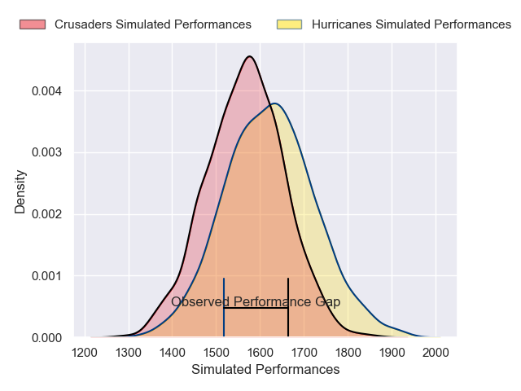
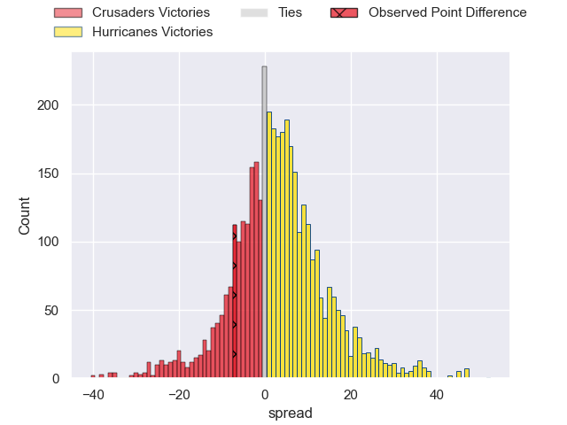
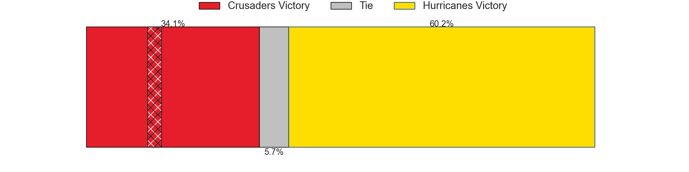
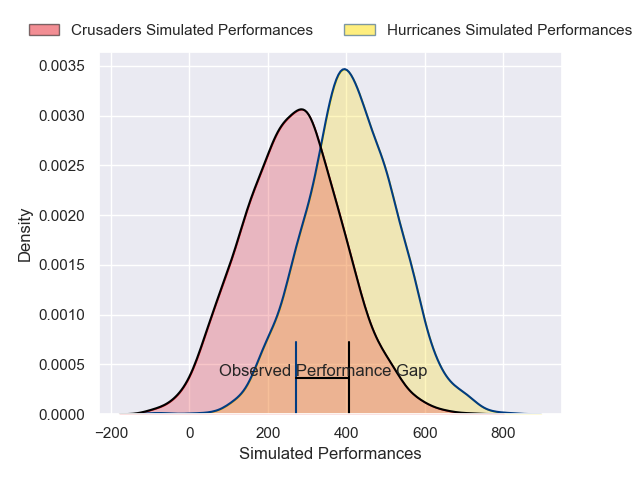
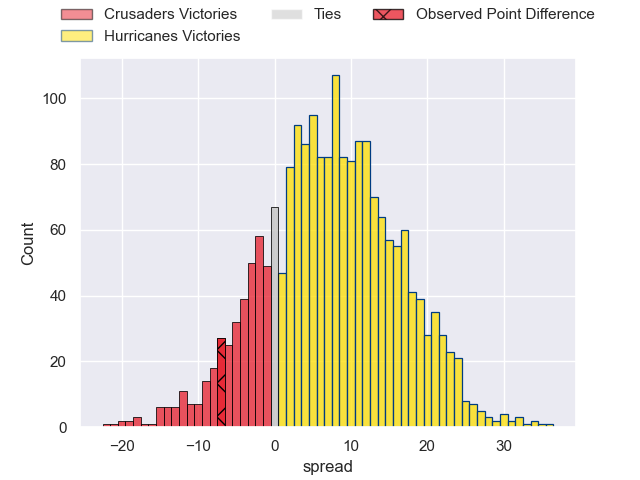
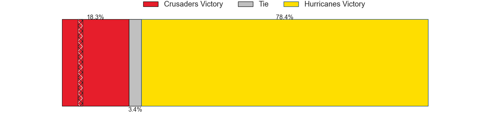

---  
layout: page  
title: Crusaders at Hurricanes; 31-24  
date: 2025-04-11 18:00:00 -0500  
categories: "Super Rugby Pacific 2025" match review  
---
# Crusaders at Hurricanes; 31-24

# Club Level Predictions

The first set of predictions treats a club as the smallest object, as the club develops its members, organizes a gameplan, and deploys its players as needed for each match. This club model has a prediction of 0.573, which translates to predicting Hurricanes to win by 2.7.

Our Over/Under is 54.5 - and combined with the spread above, we have a predicted scoreline of 26 to 29

Each club has a rating and a rating deviation (similar to a Glicko rating), and expected performances can be generated. This allows for simulated matches and spreads like the ones below.
## Projected Performances - Club Model

## Projected Spreads - Club Model

## Projected Results - Club Model

# Player Level Predictions

Treating teams instead as an entity made up of the currently active players, I have ratings for each player in an altogether different system. These can be combined to form team ratings once teamsheets are announced, weighting starters a bit higher than the reserves. After the match is played, players can be weighted by their minutes on the field, allowing for an accurate measure of the team's composition. With these compiled team ratings, we can make predictions, measure inaccuracy, and update the individual player ratings.
## Prediction without Player Minutes: Hurricanes by 9.0

Hurricanes by 1.3 on a neutral pitch

## Projected Performances - Player Model

## Projected Spreads - Player Model

## Projected Results - Player Model

|   Away Minutes | Away Player           |   Away Percentile |   Number |   Home Percentile | Home Player         |   Home Minutes |
|---------------:|:----------------------|------------------:|---------:|------------------:|:--------------------|---------------:|
|             52 | Tamaiti Williams      |             90.6  |        1 |             98.28 | Xavier Numia        |             80 |
|             80 | Ioane Moananu         |             25.68 |        2 |             89.47 | Asafo Aumua         |             47 |
|             29 | Fletcher Newell       |              5.56 |        3 |             75.78 | Tyrel Lomax         |             51 |
|             59 | Scott Barrett         |             96.19 |        4 |             80.76 | Caleb Delany        |             56 |
|             15 | Jamie Hannah          |             17.84 |        5 |              6.32 | Zach Gallagher      |             80 |
|             80 | Cullen Grace          |             88.27 |        6 |              0.18 | Brayden Iose        |             80 |
|             49 | Ethan Blackadder      |             97.53 |        7 |             95.69 | Du'Plessis Kirifi   |             51 |
|             31 | Christian Lio-Willie  |             77.35 |        8 |             95.71 | Peter Lakai         |             49 |
|             80 | Noah Hotham           |             84.81 |        9 |             27.88 | Cam Roigard         |             80 |
|             80 | Taha Kemara           |             20.28 |       10 |              5.12 | Riley Hohepa        |             74 |
|             80 | Sevu Reece            |             88.38 |       11 |             96.63 | Kini Naholo         |             80 |
|             49 | David Havili          |             91.63 |       12 |             60.93 | Peter Umaga-Jensen  |             80 |
|             15 | Levi Aumua            |             82.48 |       13 |             20.47 | Bailyn Sullivan     |              6 |
|             27 | Chay Fihaki           |             43.49 |       14 |             36.74 | Ngantungane Punivai |             31 |
|             80 | Will Jordan           |             96.78 |       15 |             92.35 | Ruben Love          |             57 |
|             80 | Matt Moulds           |             12.28 |       16 |             23.29 | Raymond Tuputupu    |             54 |
|             65 | George Bower          |             13.64 |       17 |             83.31 | Pouri Rakete-Stones |             28 |
|             23 | Kershawl Sykes-Martin |            nan    |       18 |            nan    | Pasilio Tosi        |             18 |
|             27 | Antonio Shalfoon      |             14.41 |       19 |             21.47 | Will Tucker         |             80 |
|             20 | Tom Christie          |             83.5  |       20 |             91.29 | Brad Shields        |             57 |
|             31 | Mitchell Drummond     |             82.97 |       21 |              2.17 | Ere Enari           |             20 |
|             79 | James O'Connor        |            nan    |       22 |             55.31 | Callum Harkin       |             55 |
|             21 | Macca Springer        |             28.49 |       23 |             28.96 | Fehi Fineanganofo   |             17 |

