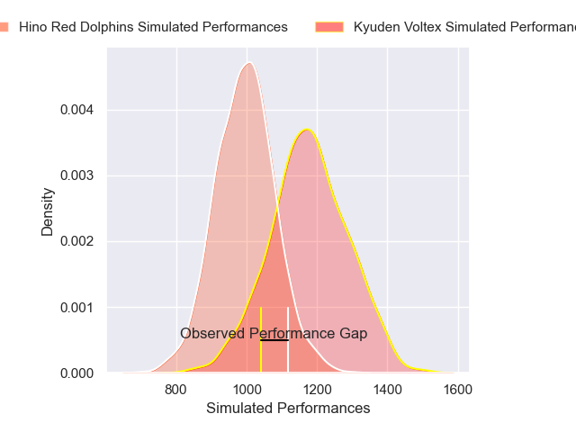
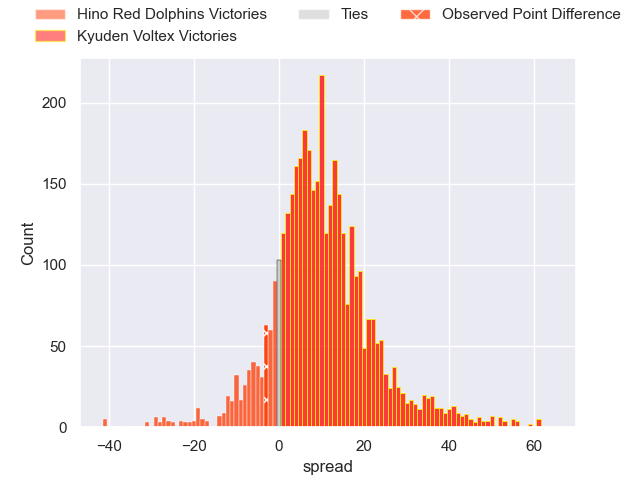
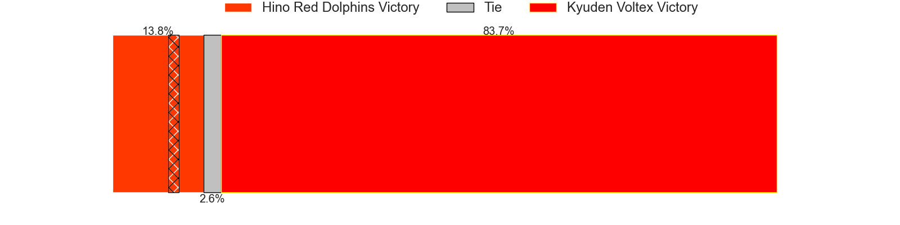
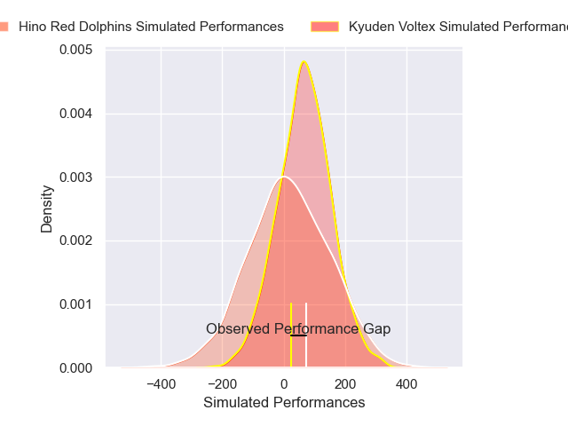
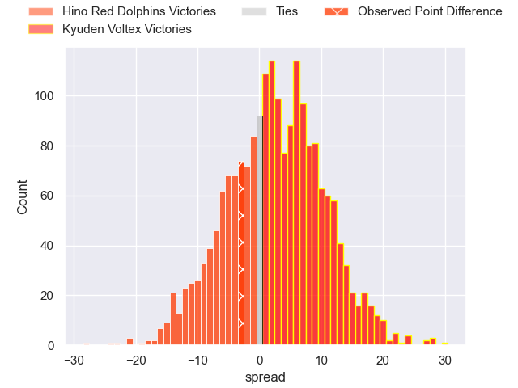
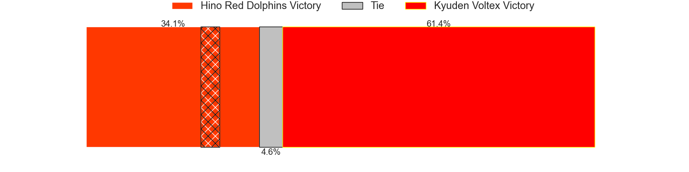

---  
layout: page  
title: Hino Red Dolphins at Kyuden Voltex; 36-33  
date: 2025-04-11 18:00:00 -0500  
categories: "Japan Rugby League One D2 24/25" match review  
---
# Hino Red Dolphins at Kyuden Voltex; 36-33

# Club Level Predictions

The first set of predictions treats a club as the smallest object, as the club develops its members, organizes a gameplan, and deploys its players as needed for each match. This club model has a prediction of 0.73, which translates to predicting Kyuden Voltex to win by 8.9.

Our Over/Under is 44.5 - and combined with the spread above, we have a predicted scoreline of 18 to 27

Each club has a rating and a rating deviation (similar to a Glicko rating), and expected performances can be generated. This allows for simulated matches and spreads like the ones below.
## Projected Performances - Club Model

## Projected Spreads - Club Model

## Projected Results - Club Model

# Player Level Predictions

Treating teams instead as an entity made up of the currently active players, I have ratings for each player in an altogether different system. These can be combined to form team ratings once teamsheets are announced, weighting starters a bit higher than the reserves. After the match is played, players can be weighted by their minutes on the field, allowing for an accurate measure of the team's composition. With these compiled team ratings, we can make predictions, measure inaccuracy, and update the individual player ratings.
## Prediction without Player Minutes: Kyuden Voltex by 4.2

Kyuden Voltex by 1.1 on a neutral pitch

## Projected Performances - Player Model

## Projected Spreads - Player Model

## Projected Results - Player Model

|   Away Minutes | Away Player     |   Away Percentile |   Number |   Home Percentile | Home Player            |   Home Minutes |
|---------------:|:----------------|------------------:|---------:|------------------:|:-----------------------|---------------:|
|           80   | Yuto Tokuda     |             31.66 |        1 |             12.54 | Yasuo Saruwatari       |             53 |
|           51   | Towa Taniguchi  |             22.01 |        2 |              1.75 | Kyungmun Wang          |             33 |
|           80   | Taiga Yamaguchi |             27.9  |        3 |             49.69 | Taro Uesugi            |             26 |
|           71   | Noah Tovio      |             19.42 |        4 |             63.57 | Masahiro Eriguchi      |             21 |
|           80   | Josh Fenner     |              5.95 |        5 |              9.76 | Ray Tatafu             |              9 |
|           40   | Shun Nakashika  |             44.45 |        6 |             17.23 | Ken Nakashima          |             11 |
|           80   | Shun Tomonaga   |             64.25 |        7 |              4.03 | Colby Fainga'a         |             33 |
|           80   | Kyosuke Horie   |             46.33 |        8 |             35.92 | Alex Takuya Walker     |             25 |
|           80   | Kotaro Hatada   |             33.89 |        9 |             24.21 | Shunta Takenouchi      |             80 |
|           80   | Simon Hickey    |             86.81 |       10 |             89.17 | Tom Taylor             |             29 |
|           29   | Moeki Fukushi   |             25.59 |       11 |             13.03 | Ren Hagiwara           |              9 |
|           33   | Keita Doi       |             13.39 |       12 |             12.99 | Noriaki Nakazuru       |             29 |
|           60   | Taroma Togo     |             25.79 |       13 |             56.1  | Sione Likuata Teaupa   |             47 |
|           21   | Yuto Mizuma     |             39.74 |       14 |             98.13 | Akihito Yamada         |             26 |
|           62   | Takumi Ishimoto |             49.3  |       15 |              3.22 | Makoto Kato            |             80 |
|           80   | Sora Ouchi      |             10.68 |       16 |             35.93 | Keisuke Yamzoe         |             19 |
|           80   | Yuki Kagoshima  |            nan    |       17 |             19.44 | Samuel Nozomu Faialaga |             59 |
|           63   | Shosuke Funaki  |             16.38 |       18 |             46.41 | Hiroki Murakawa        |              1 |
|           80   | AJ Wolf         |            nan    |       19 |             19.28 | Kosuke Oike            |             10 |
|            4.5 | Kyoji Takano    |             12.07 |       20 |             11.71 | Yoshihiro Sononaka     |             80 |
|          nan   | nan             |            nan    |       21 |             19.39 | Hayato Kojo            |             53 |
|          nan   | nan             |            nan    |       22 |             57.43 | Spencer Jeans          |             33 |

