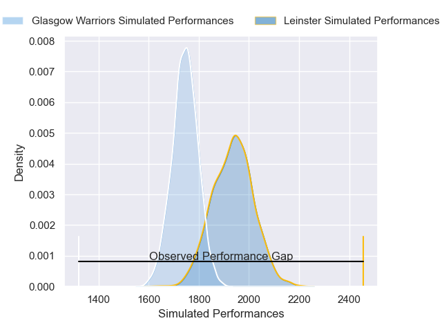
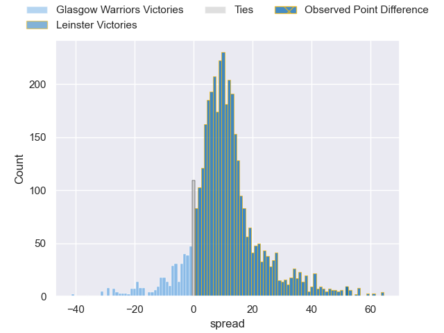
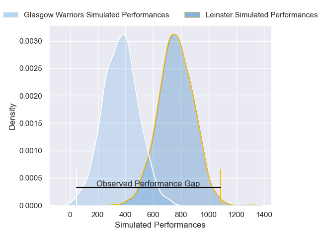
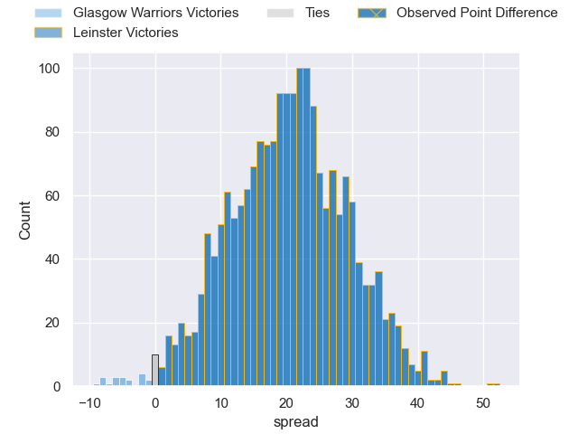

---  
layout: page  
title: Glasgow Warriors at Leinster; 0-52  
date: 2025-04-11 18:00:00 -0500  
categories: "European Rugby Champions Cup 24/25" match review  
---
# Glasgow Warriors at Leinster; 0-52

# Club Level Predictions

The first set of predictions treats a club as the smallest object, as the club develops its members, organizes a gameplan, and deploys its players as needed for each match. This club model has a prediction of 0.746, which translates to predicting Leinster to win by 9.5.

Our Over/Under is 60.5 - and combined with the spread above, we have a predicted scoreline of 25 to 35

Each club has a rating and a rating deviation (similar to a Glicko rating), and expected performances can be generated. This allows for simulated matches and spreads like the ones below.
## Projected Performances - Club Model

## Projected Spreads - Club Model

## Projected Results - Club Model

# Player Level Predictions

Treating teams instead as an entity made up of the currently active players, I have ratings for each player in an altogether different system. These can be combined to form team ratings once teamsheets are announced, weighting starters a bit higher than the reserves. After the match is played, players can be weighted by their minutes on the field, allowing for an accurate measure of the team's composition. With these compiled team ratings, we can make predictions, measure inaccuracy, and update the individual player ratings.
## Prediction without Player Minutes: Leinster by 21.0

Leinster by 10.8 on a neutral pitch

## Projected Performances - Player Model

## Projected Spreads - Player Model

## Projected Results - Player Model

|   Away Minutes | Away Player           |   Away Percentile |   Number |   Home Percentile | Home Player         |   Home Minutes |
|---------------:|:----------------------|------------------:|---------:|------------------:|:--------------------|---------------:|
|             30 | Nathan McBeth         |             74.14 |        1 |             91.77 | Cian Healy          |             80 |
|             53 | Johnny Matthews       |             50.24 |        2 |             95.22 | Ronan Kelleher      |             15 |
|             78 | Sam Talakai           |             11.21 |        3 |             96.63 | Tadhg Furlong       |             80 |
|             62 | Gregor Brown          |             75.19 |        4 |             76.95 | Joe McCarthy        |             80 |
|             80 | Alex Samuel           |             40.61 |        5 |             99.54 | RG Snyman           |             80 |
|             80 | Matt Fagerson         |             97.25 |        6 |             93.49 | Max Deegan          |             80 |
|             80 | Rory Darge            |             89.83 |        7 |             98.08 | Josh van der Flier  |             50 |
|             62 | Sione Vailanu         |             15.92 |        8 |             98.16 | Jack Conan          |             62 |
|             30 | George Horne          |             99.67 |        9 |             95.66 | Jamison Gibson-Park |             10 |
|             35 | Adam Hastings         |             98.43 |       10 |             17.91 | Sam Prendergast     |             70 |
|             12 | Kyle Steyn            |             99.16 |       11 |            100    | James Lowe          |             80 |
|             18 | Tom Jordan            |             70.37 |       12 |             86.32 | Jordie Barrett      |             18 |
|             18 | Stafford McDowall     |             90.55 |       13 |             98.13 | Garry Ringrose      |             30 |
|             18 | Jamie Dobie           |             91.38 |       14 |             67.48 | Tommy O'Brien       |             34 |
|             45 | Kyle Rowe             |             73.04 |       15 |             99.4  | Hugo Keenan         |             30 |
|             80 | Grant Stewart         |              6.86 |       16 |             39.07 | Dan Sheehan         |             50 |
|             80 | Jamie Bhatti          |             97.88 |       17 |             87.3  | Andrew Porter       |             80 |
|             68 | Patrick Schickerling  |             84.95 |       18 |              1.25 | Rabah Slimani       |             80 |
|             18 | JP du Preez           |            nan    |       19 |             24.35 | Diarmuid Mangan     |             60 |
|              0 | Max Williamson        |             66.73 |       20 |             94.49 | Caelan Doris        |             20 |
|             65 | Euan Ferrie           |             47.03 |       21 |             98.33 | Luke McGrath        |             80 |
|             62 | Ben Afshar            |             37.06 |       22 |             93.9  | Ross Byrne          |             46 |
|             80 | Sebastian Cancelliere |             99.25 |       23 |             91.73 | Robbie Henshaw      |             60 |

