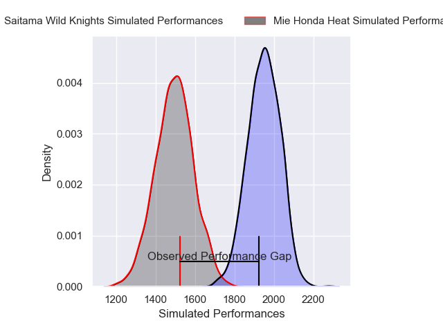
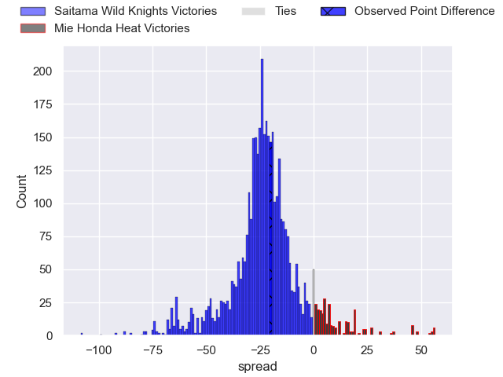
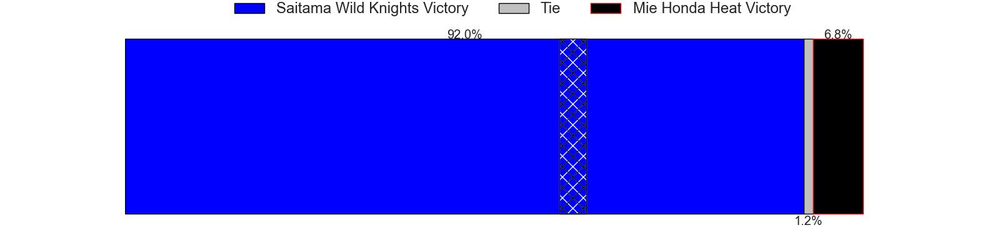
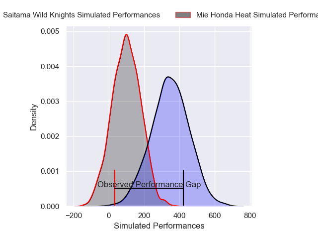
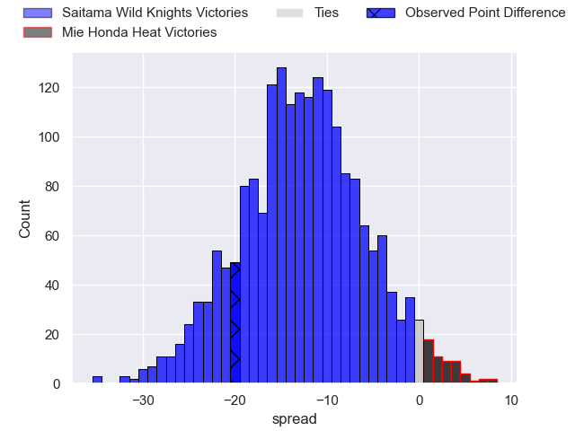
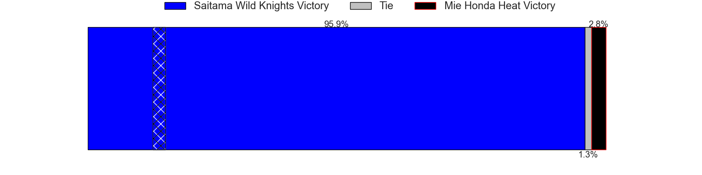

---  
layout: page  
title: Saitama Wild Knights at Mie Honda Heat; 53-33  
date: 2025-04-11 18:00:00 -0500  
categories: "Japan Rugby League One 24/25" match review  
---
# Saitama Wild Knights at Mie Honda Heat; 53-33

# Club Level Predictions

The first set of predictions treats a club as the smallest object, as the club develops its members, organizes a gameplan, and deploys its players as needed for each match. This club model has a prediction of 0.074, which translates to predicting Saitama Wild Knights to win by 22.6.

Our Over/Under is 55.5 - and combined with the spread above, we have a predicted scoreline of 39 to 16

Each club has a rating and a rating deviation (similar to a Glicko rating), and expected performances can be generated. This allows for simulated matches and spreads like the ones below.
## Projected Performances - Club Model

## Projected Spreads - Club Model

## Projected Results - Club Model

# Player Level Predictions

Treating teams instead as an entity made up of the currently active players, I have ratings for each player in an altogether different system. These can be combined to form team ratings once teamsheets are announced, weighting starters a bit higher than the reserves. After the match is played, players can be weighted by their minutes on the field, allowing for an accurate measure of the team's composition. With these compiled team ratings, we can make predictions, measure inaccuracy, and update the individual player ratings.
## Prediction without Player Minutes: Saitama Wild Knights by 18.2

Saitama Wild Knights by 21.8 on a neutral pitch

## Projected Performances - Player Model

## Projected Spreads - Player Model

## Projected Results - Player Model

|   Away Minutes | Away Player       |   Away Percentile |   Number |   Home Percentile | Home Player          |   Home Minutes |
|---------------:|:------------------|------------------:|---------:|------------------:|:---------------------|---------------:|
|             75 | Keita Inagaki     |             97.54 |        1 |             23.03 | Matthys Basson       |             27 |
|             58 | Kenji Sato        |             27.55 |        2 |             35.89 | Koki Hida            |             80 |
|             22 | Lisala Finau      |             57.9  |        3 |             20.1  | Taiki Yoshioka       |             15 |
|             80 | Liam Mitchell     |             84.62 |        4 |             22.22 | Mark Abbott          |             24 |
|             80 | Lood de Jager     |             97.34 |        5 |             92.5  | Franco Mostert       |             15 |
|             80 | Shota Fukui       |             68.16 |        6 |              4.03 | Ryota Kobayashi      |             38 |
|             64 | Ben Gunter        |             94.85 |        7 |              2.62 | Ryo Furuta           |             80 |
|             11 | Jack Cornelsen    |             97.36 |        8 |             61.79 | Tevita Tupou         |             80 |
|             80 | Yuta Takagi       |             74.03 |        9 |             59.19 | Azuma Doei           |             22 |
|             24 | Kyohei Yamasawa   |             70.75 |       10 |             18.05 | Gwangtee Oh          |             28 |
|             69 | Marika Koroibete  |             96.2  |       11 |             79.43 | Larry Steven Sulunga |              0 |
|             80 | Damian de Allende |             99.59 |       12 |             58.29 | Manu Vunipola        |             50 |
|             61 | Taniyama Hayata   |             49.24 |       13 |             10.89 | Dawid Kellerman      |             23 |
|             27 | Koki Takeyama     |             97.03 |       14 |             24.65 | Naoki Motomura       |             16 |
|             11 | Ryuji Noguchi     |             97.33 |       15 |             81.93 | Tom Banks            |             52 |

