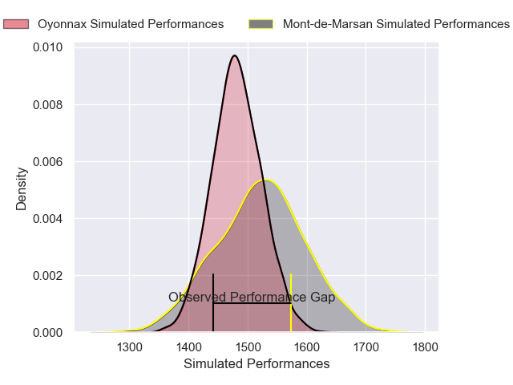
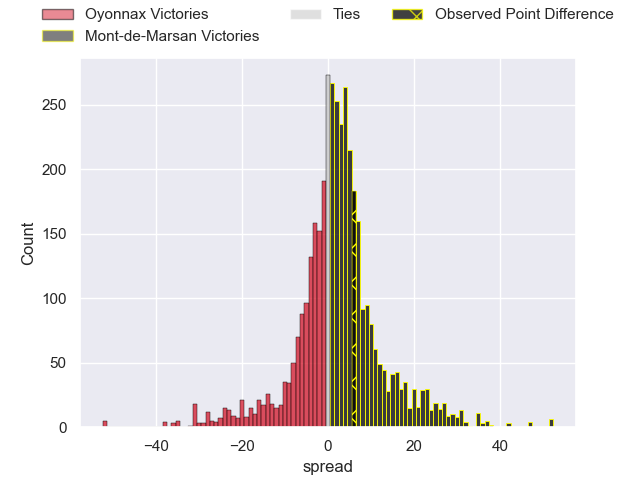
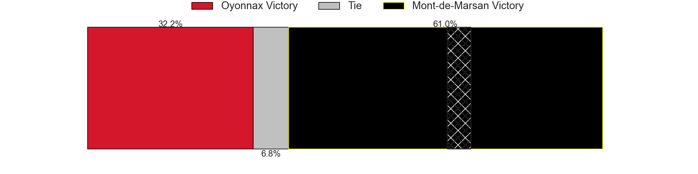
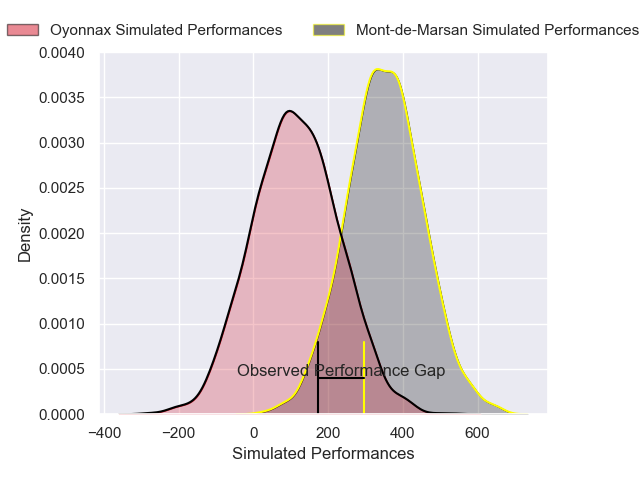
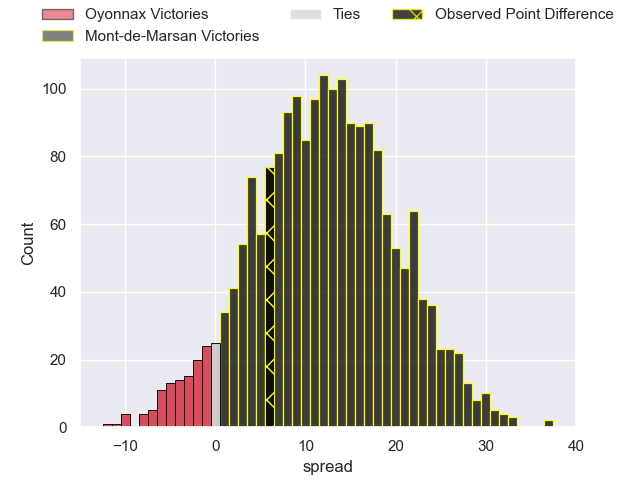
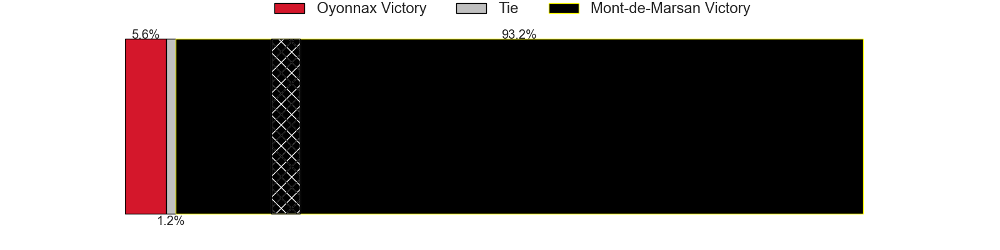

---  
layout: page  
title: Oyonnax at Mont-de-Marsan; 9-15  
date: 2025-04-11 18:00:00 -0500  
categories: "Pro D2 24/25" match review  
---
# Oyonnax at Mont-de-Marsan; 9-15

# Club Level Predictions

The first set of predictions treats a club as the smallest object, as the club develops its members, organizes a gameplan, and deploys its players as needed for each match. This club model has a prediction of 0.556, which translates to predicting Mont-de-Marsan to win by 2.0.

Our Over/Under is 57.5 - and combined with the spread above, we have a predicted scoreline of 28 to 30

Each club has a rating and a rating deviation (similar to a Glicko rating), and expected performances can be generated. This allows for simulated matches and spreads like the ones below.
## Projected Performances - Club Model

## Projected Spreads - Club Model

## Projected Results - Club Model

# Player Level Predictions

Treating teams instead as an entity made up of the currently active players, I have ratings for each player in an altogether different system. These can be combined to form team ratings once teamsheets are announced, weighting starters a bit higher than the reserves. After the match is played, players can be weighted by their minutes on the field, allowing for an accurate measure of the team's composition. With these compiled team ratings, we can make predictions, measure inaccuracy, and update the individual player ratings.
## Prediction without Player Minutes: Mont-de-Marsan by 16.9

Mont-de-Marsan by 4.1 on a neutral pitch

## Projected Performances - Player Model

## Projected Spreads - Player Model

## Projected Results - Player Model

|   Away Minutes | Away Player        |   Away Percentile |   Number |   Home Percentile | Home Player          |   Home Minutes |
|---------------:|:-------------------|------------------:|---------:|------------------:|:---------------------|---------------:|
|             15 | Antoine Abraham    |             25.88 |        1 |             41.69 | Luka Goginava        |             80 |
|             26 | Peniami Narisia    |             87.06 |        2 |             56.38 | Luka Begic           |             60 |
|             80 | Ali Oz             |             14.86 |        3 |             11.74 | Anthony Alves        |             80 |
|             80 | Phoenix Battye     |             90.87 |        4 |             35.37 | Nicolas Garrault     |             80 |
|             17 | Hugo Fabregue      |             12.04 |        5 |             11.48 | Aston Fortuin        |             80 |
|             80 | Kevin Lebreton     |             16.47 |        6 |             59.76 | Yann Brethous        |             39 |
|             64 | Wandrille Picault  |             88.9  |        7 |             79.37 | Raphaël Robic        |             20 |
|             52 | Antoine Miquel     |             19.02 |        8 |             91.21 | Ioane Iashagashvili  |             41 |
|             29 | Vasil Lobzhanidze  |              8.08 |        9 |             33.84 | Christophe Loustalot |             52 |
|             23 | Zack Holmes        |             67.35 |       10 |             90.55 | Willie du Plessis    |             12 |
|             24 | Gavin Stark        |              2.33 |       11 |             12.21 | Semi Lagivala        |             34 |
|             29 | Lucas Mensa        |              8.07 |       12 |             86.38 | Nacani Wakaya        |             33 |
|             17 | Afusipa Taumoepeau |             21.49 |       13 |             67    | Gatien Masse         |             47 |
|             27 | Karim Qadiri       |             52.84 |       14 |             53.77 | Alexandre de Nardi   |             35 |
|             51 | Martin Bogado      |             18.2  |       15 |             10.63 | Simao Bento          |             57 |
|             80 | Chris Smith        |             65.5  |       16 |             40.5  | Thomas Bultel        |             39 |
|             80 | Benjamin Geledan   |             27.03 |       17 |             11.66 | Waël Ponpon          |             39 |
|             16 | Manuel Leindekar   |              0.56 |       18 |             16    | Aurélien Lafforgue   |             28 |
|             40 | Cameron Wright     |              2.86 |       19 |             73.66 | Romain Durand        |             33 |
|             70 | Paulo Tafili       |             68.13 |       20 |             83.79 | Mattéo Lalanne       |             80 |
|              0 | Kevin Kornath      |             23.99 |       21 |             18.72 | Jules Dussutour      |             25 |
|             80 | Darren Sweetnam    |             70.55 |       22 |             20.86 | Théo Cortes          |             47 |
|             80 | Rémi Di Pietro     |            nan    |       23 |             43.43 | Baptiste Canut       |             15 |

