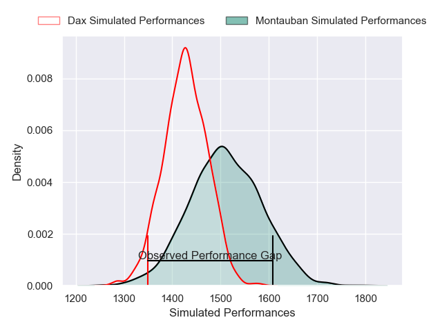
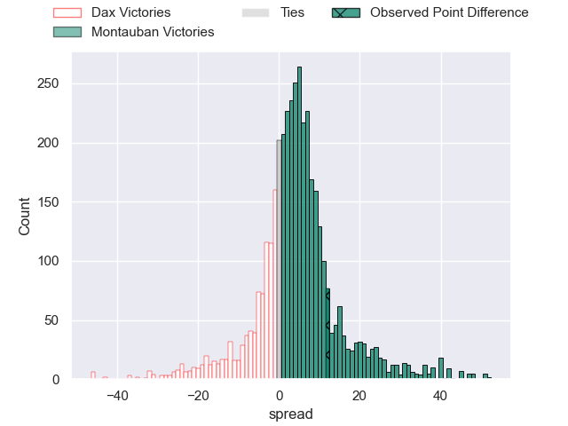
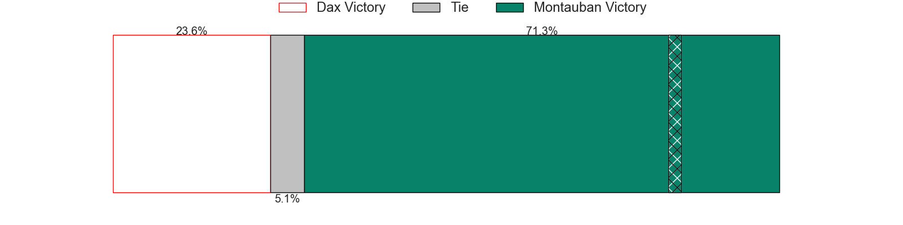
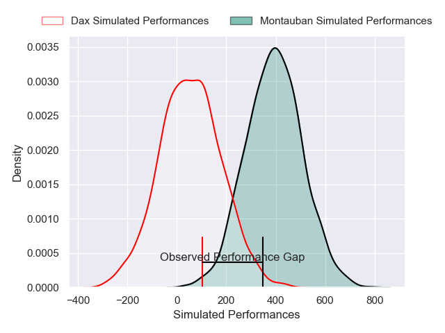
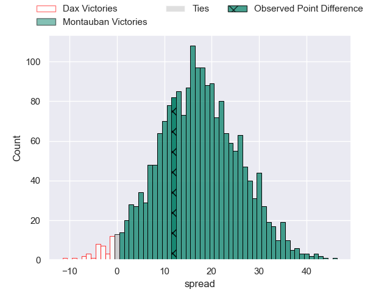
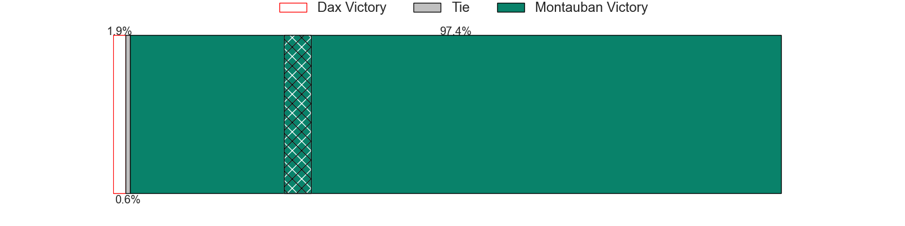

---  
layout: page  
title: Dax at Montauban; 23-35  
date: 2025-04-11 18:00:00 -0500  
categories: "Pro D2 24/25" match review  
---
# Dax at Montauban; 23-35

# Club Level Predictions

The first set of predictions treats a club as the smallest object, as the club develops its members, organizes a gameplan, and deploys its players as needed for each match. This club model has a prediction of 0.612, which translates to predicting Montauban to win by 4.0.

Our Over/Under is 52.5 - and combined with the spread above, we have a predicted scoreline of 24 to 28

Each club has a rating and a rating deviation (similar to a Glicko rating), and expected performances can be generated. This allows for simulated matches and spreads like the ones below.
## Projected Performances - Club Model

## Projected Spreads - Club Model

## Projected Results - Club Model

# Player Level Predictions

Treating teams instead as an entity made up of the currently active players, I have ratings for each player in an altogether different system. These can be combined to form team ratings once teamsheets are announced, weighting starters a bit higher than the reserves. After the match is played, players can be weighted by their minutes on the field, allowing for an accurate measure of the team's composition. With these compiled team ratings, we can make predictions, measure inaccuracy, and update the individual player ratings.
## Prediction without Player Minutes: Montauban by 16.7

Montauban by 5.5 on a neutral pitch

## Projected Performances - Player Model

## Projected Spreads - Player Model

## Projected Results - Player Model

|   Away Minutes | Away Player          |   Away Percentile |   Number |   Home Percentile | Home Player           |   Home Minutes |
|---------------:|:---------------------|------------------:|---------:|------------------:|:----------------------|---------------:|
|        9       | Louis Mary           |             56.87 |        1 |              6.63 | Lucas Seyrolle        |             46 |
|       61       | Iban Hiriart-Urruty  |             47.26 |        2 |             58.71 | Vakhtang Jintcharadze |             80 |
|       67       | Diogo Hasse Ferreira |             23.48 |        3 |             95.85 | Lucio Sordoni         |             69 |
|       54       | Mattieu Bidau        |             58.42 |        4 |             73.38 | Clément Bitz          |             63 |
|       54       | Jean-Baptiste Singer |              4.33 |        5 |             85.04 | Frank Bradshaw        |             80 |
|        0       | Arnaud Aletti        |             49.21 |        6 |             19.15 | Karl Wilkins          |             80 |
|       51       | Paul Arnaud Ausset   |             69.29 |        7 |             82.42 | Kyllian Ringuet       |             33 |
|       80       | Genesis Mamea Lemalu |             77.51 |        8 |             70.76 | Sikhumbuzo Notshe     |             80 |
|       61       | Sylvère Reteau       |             44.11 |        9 |             82.32 | Joe Powell            |             19 |
|       80       | Romuald Séguy        |             47.23 |       10 |             89.53 | Jérôme Bosviel        |             80 |
|       80       | Maxime Oltmann       |              6.15 |       11 |             65.98 | Yvan Reilhac          |             80 |
|       40       | Benjamin Puntous     |             16.75 |       12 |              4.74 | Maxime Mathy          |             80 |
|       56       | Bastien Daguerre     |             27.55 |       13 |             61.55 | Maxime Espeut         |             49 |
|       78       | Théo Gatelier        |             82.85 |       14 |             26    | Josua Vici            |             73 |
|       80       | Guillaume Bouche     |             66.05 |       15 |              6.75 | Thomas Larregain      |             55 |
|       62       | Jale Vatubua         |              0.81 |       16 |            nan    | Tomas Lezana          |             25 |
|        6.66667 | Étienne Loiret       |             63.78 |       17 |             61.58 | Leo Aouf              |             26 |
|        9.33333 | Dino Casadei         |             52.16 |       18 |             64.72 | Noa Kanika            |             19 |
|       56       | David Lolohea        |             22.84 |       19 |             19.19 | Hugo Zabalza          |             13 |
|       32       | Brice Ferrer         |             37.54 |       20 |             88.55 | Baptiste Mouchous     |             26 |
|       32       | Hugo Cerisier        |             68.38 |       21 |             83.25 | Simon Renda           |             26 |
|       55       | Paul Ravier          |             84.68 |       22 |              3.81 | Jeremie Maurouard     |             16 |
|       58       | Louis Barrere        |             39.64 |       23 |             67.41 | Facundo Pomponio      |             40 |

