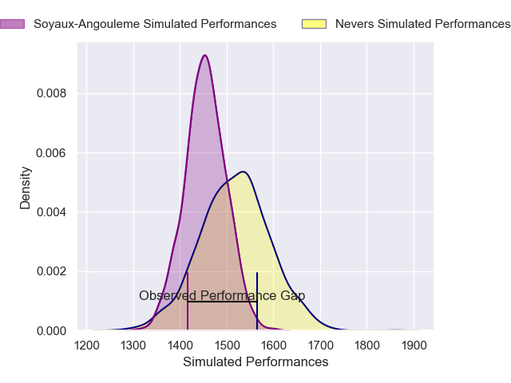
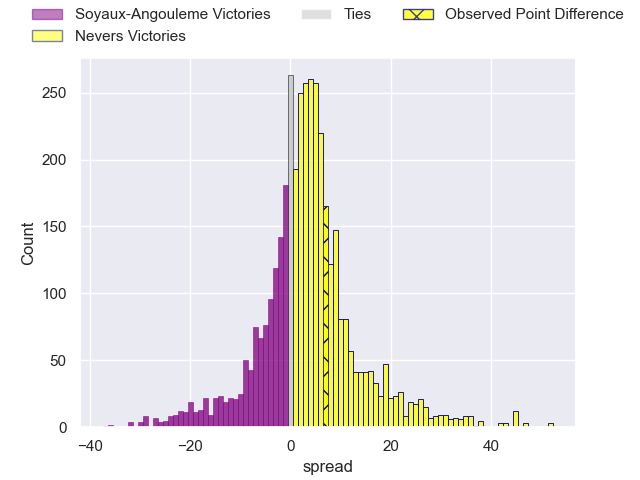
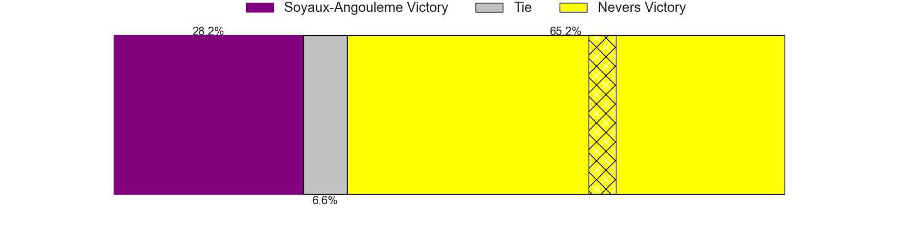
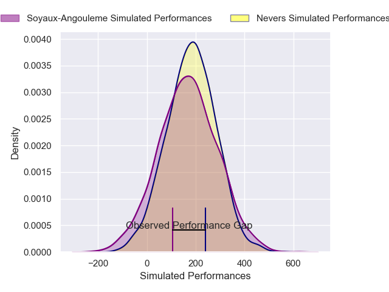
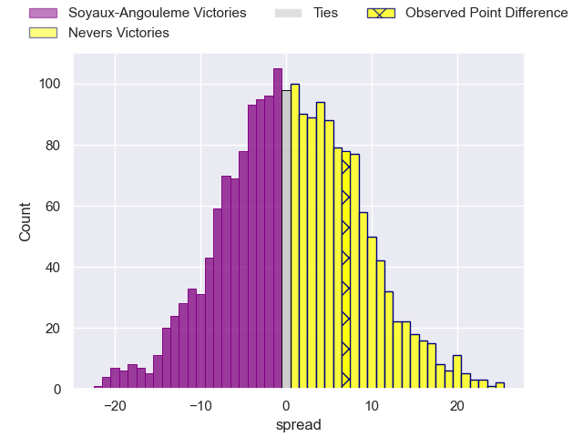

---  
layout: page  
title: Soyaux-Angouleme at Nevers; 23-30  
date: 2025-04-11 18:00:00 -0500  
categories: "Pro D2 24/25" match review  
---
# Soyaux-Angouleme at Nevers; 23-30

# Club Level Predictions

The first set of predictions treats a club as the smallest object, as the club develops its members, organizes a gameplan, and deploys its players as needed for each match. This club model has a prediction of 0.589, which translates to predicting Nevers to win by 3.1.

Our Over/Under is 51.5 - and combined with the spread above, we have a predicted scoreline of 24 to 28

Each club has a rating and a rating deviation (similar to a Glicko rating), and expected performances can be generated. This allows for simulated matches and spreads like the ones below.
## Projected Performances - Club Model

## Projected Spreads - Club Model

## Projected Results - Club Model

# Player Level Predictions

Treating teams instead as an entity made up of the currently active players, I have ratings for each player in an altogether different system. These can be combined to form team ratings once teamsheets are announced, weighting starters a bit higher than the reserves. After the match is played, players can be weighted by their minutes on the field, allowing for an accurate measure of the team's composition. With these compiled team ratings, we can make predictions, measure inaccuracy, and update the individual player ratings.
## Prediction without Player Minutes: Nevers by 3.4

Soyaux-Angouleme by 1.7 on a neutral pitch

## Projected Performances - Player Model

## Projected Spreads - Player Model

## Projected Results - Player Model

|   Away Minutes | Away Player        |   Away Percentile |   Number |   Home Percentile | Home Player                 |   Home Minutes |
|---------------:|:-------------------|------------------:|---------:|------------------:|:----------------------------|---------------:|
|             80 | Sami Zouhair       |             97.92 |        1 |             41.05 | Aitor Kitutu                |             80 |
|             80 | Rayne Barka        |             90.71 |        2 |             27.69 | Jean-Maxence Jules-Rosette  |             80 |
|             80 | Omar Dahir         |             49.6  |        3 |             61.74 | Aselo Ikahehegi             |             69 |
|             61 | Léo Labarthe       |             30.1  |        4 |             67.17 | Ugo Vignolles               |             80 |
|             61 | Sikeli Nabou       |             92.85 |        5 |             37.35 | George Smith                |             40 |
|             51 | Gautier Gibouin    |              4.44 |        6 |             59.94 | Luka Plataret               |             31 |
|             80 | Clément Sentubery  |             45.14 |        7 |             90.38 | Hugues Bastide              |             19 |
|             54 | Samuel Nollet      |             13.91 |        8 |             93.66 | Jason-Colin Fraser          |             26 |
|             61 | Adrien Bau         |              5.22 |        9 |              3.2  | Hugo Bouyssou               |             72 |
|             61 | Massimo Ortolan    |              9.65 |       10 |             17.25 | Shaun Reynolds              |             37 |
|             43 | Nathan Farissier   |             29.54 |       11 |             16.12 | Arthur Mathiron             |             61 |
|             19 | Mathis Lafon       |             62.16 |       12 |             30.68 | Atunaisa Taulanga Vaka Manu |             80 |
|             19 | François Carlo Mey |             61.35 |       13 |             61.05 | Alifereti Loaloa            |             20 |
|             11 | Matthys Gratien    |             76.42 |       14 |             47.81 | Perry Mayo                  |             34 |
|             47 | Jules Dubecq       |             56.03 |       15 |             27.4  | Dylan Jaminet               |             80 |
|             63 | Eoghan Barrett     |             45.95 |       16 |             12.96 | Simon Tarel                 |             18 |
|             80 | Paul Tailhades     |             64.3  |       17 |             69.4  | Yohan Le Bourhis            |             29 |
|             24 | Maxence Lemardelet |             81.56 |       18 |             30.75 | Louis Chanet                |             11 |
|              6 | Franck Giraudeau   |             52.27 |       19 |             48.32 | Hugo Ndiaye                 |              7 |
|             20 | Matt Beukeboom     |             17.76 |       20 |             57.54 | Rati Zazadze                |             28 |
|             27 | Seydou Diakité     |             23.16 |       21 |             60.86 | Stefan Buruiana             |             31 |
|             73 | Georgy Balakarev   |             82.99 |       22 |            nan    | Senio Toleafoa              |             29 |
|             33 | Lucas Zamora       |            nan    |       23 |            nan    | Mahamadou Coulibaly         |             49 |

