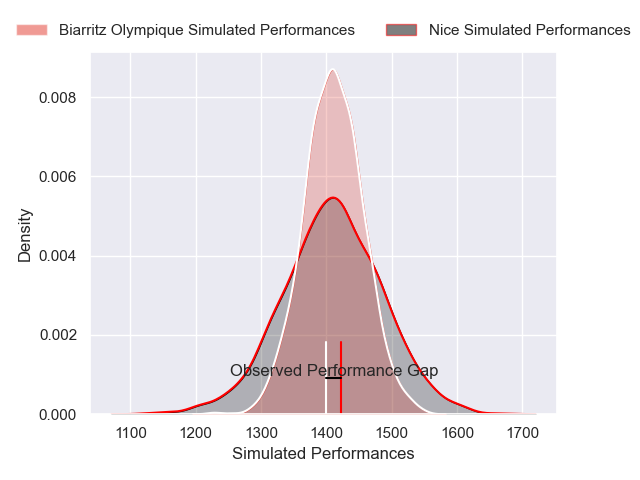
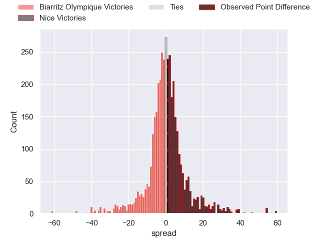
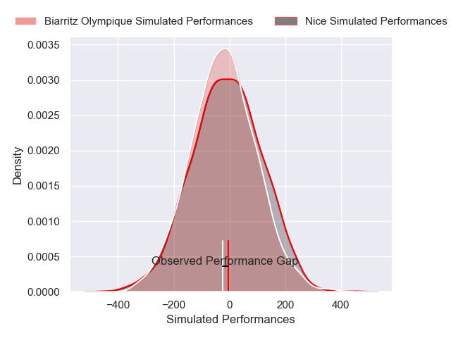
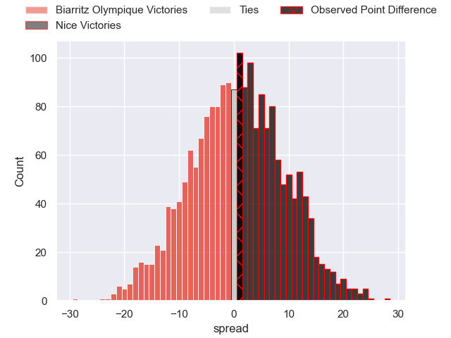

---  
layout: page  
title: Biarritz Olympique at Nice; 41-42  
date: 2025-04-11 18:00:00 -0500  
categories: "Pro D2 24/25" match review  
---
# Biarritz Olympique at Nice; 41-42

# Club Level Predictions

The first set of predictions treats a club as the smallest object, as the club develops its members, organizes a gameplan, and deploys its players as needed for each match. This club model has a prediction of 0.501, which translates to predicting Nice to win by 0.0.

Our Over/Under is 60.5 - and combined with the spread above, we have a predicted scoreline of 30 to 30

Each club has a rating and a rating deviation (similar to a Glicko rating), and expected performances can be generated. This allows for simulated matches and spreads like the ones below.
## Projected Performances - Club Model

## Projected Spreads - Club Model

## Projected Results - Club Model

# Player Level Predictions

Treating teams instead as an entity made up of the currently active players, I have ratings for each player in an altogether different system. These can be combined to form team ratings once teamsheets are announced, weighting starters a bit higher than the reserves. After the match is played, players can be weighted by their minutes on the field, allowing for an accurate measure of the team's composition. With these compiled team ratings, we can make predictions, measure inaccuracy, and update the individual player ratings.
## Prediction without Player Minutes: Nice by 7.3

Nice by 3.9 on a neutral pitch

## Projected Performances - Player Model

## Projected Spreads - Player Model

## Projected Results - Player Model

|   Away Minutes | Away Player         |   Away Percentile |   Number |   Home Percentile | Home Player       |   Home Minutes |
|---------------:|:--------------------|------------------:|---------:|------------------:|:------------------|---------------:|
|             80 | Giorgi Nutsubidze   |              2.96 |        1 |             48.96 | Fabio Gonzalez    |             51 |
|             80 | Yohan Beheregaray   |             12.31 |        2 |              5.16 | Pierre Strippoli  |             80 |
|             53 | Nikoloz Narmania    |             71.49 |        3 |              8.39 | Luvuyo Pupuma     |             20 |
|              0 | Ekain Imaz Agirre   |             20.87 |        4 |             97.36 | Tom Murday        |             80 |
|             68 | Eliande Sanderson   |             14.35 |        5 |              3.97 | Clément Chartier  |             80 |
|             45 | Aitor Hourcade      |              1.21 |        6 |              0.37 | Bastien Berenguel |             60 |
|             80 | Yoni Tuataane       |             47.2  |        7 |             85.98 | Louis Suaud       |             40 |
|             50 | Thomas Hebert       |             16.06 |        8 |             80.89 | Jordan Taufua     |             18 |
|             50 | Anoa Laurent        |             25.42 |        9 |              2.2  | Jules Gimbert     |             80 |
|             50 | Edgar Retiere       |             16.56 |       10 |             24.22 | Flavio Asquini    |             18 |
|             12 | Bastien Guillemin   |             20.35 |       11 |             38.1  | Alexis Bouton     |             60 |
|             30 | Francois Vergnaud   |              1.82 |       12 |              1.22 | Alban Conduche    |             80 |
|             53 | Yohan Tapie         |             12.16 |       13 |             13.17 | Nathan Courtade   |              0 |
|             30 | Zach Kibirige       |              2.14 |       14 |             61.62 | Andrzej Charlat   |             26 |
|             20 | Baptiste Fariscot   |             62.7  |       15 |             21.72 | Tanguy Ménoret    |             80 |
|             80 | Filimo Taofifenua   |             76.82 |       16 |              1.89 | Thibault Rey      |             80 |
|              0 | Killian Taofifenua  |             48.08 |       17 |              3.27 | Tom Ross          |             72 |
|             12 | Solomone Tukuafu    |             53.27 |       18 |              7.99 | Sacha Idoumi      |             40 |
|             75 | Kerman Aurrekoetxea |             39.83 |       19 |             20.84 | Kylian Laurans    |             62 |
|             30 | Johnny Dyer         |              0.47 |       20 |            nan    | Julien Beaufils   |             80 |
|              0 | Clement Martinez    |              7.49 |       21 |             20.4  | Martin Freytes    |             80 |
|             80 | Thomas Dolhagaray   |             26.23 |       22 |             52.88 | Jules Solinas     |             62 |
|             67 | Mathieu Acebes      |             89.87 |       23 |             25.94 | Luca Cutayar      |             80 |

