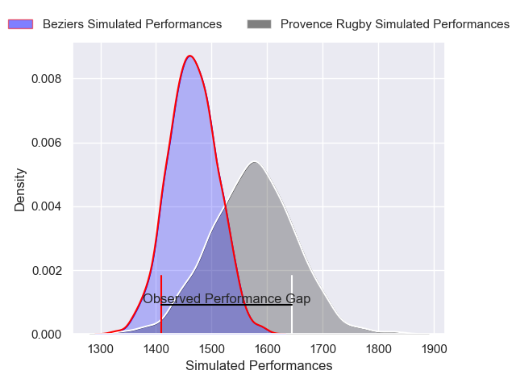
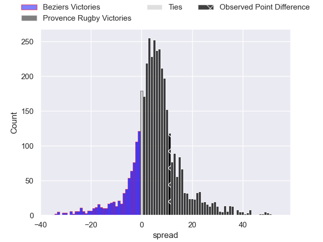
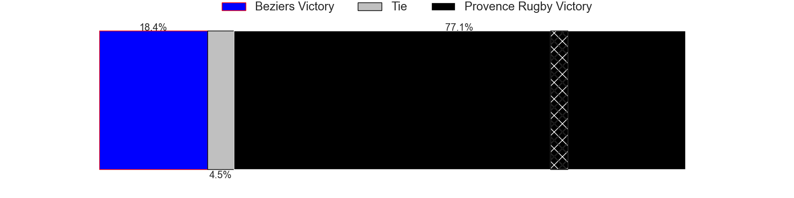
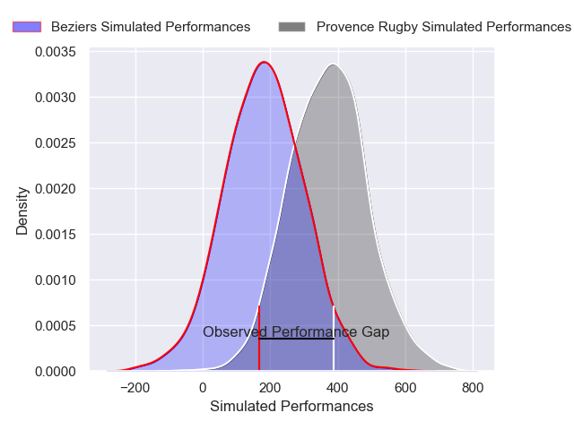
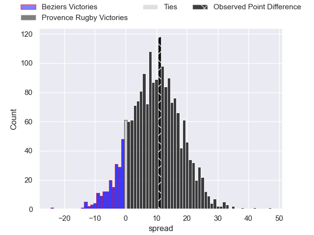
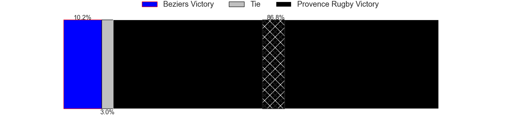

---  
layout: page  
title: Beziers at Provence Rugby; 20-31  
date: 2025-04-11 18:00:00 -0500  
categories: "Pro D2 24/25" match review  
---
# Beziers at Provence Rugby; 20-31

# Club Level Predictions

The first set of predictions treats a club as the smallest object, as the club develops its members, organizes a gameplan, and deploys its players as needed for each match. This club model has a prediction of 0.649, which translates to predicting Provence Rugby to win by 5.4.

Our Over/Under is 62.5 - and combined with the spread above, we have a predicted scoreline of 28 to 34

Each club has a rating and a rating deviation (similar to a Glicko rating), and expected performances can be generated. This allows for simulated matches and spreads like the ones below.
## Projected Performances - Club Model

## Projected Spreads - Club Model

## Projected Results - Club Model

# Player Level Predictions

Treating teams instead as an entity made up of the currently active players, I have ratings for each player in an altogether different system. These can be combined to form team ratings once teamsheets are announced, weighting starters a bit higher than the reserves. After the match is played, players can be weighted by their minutes on the field, allowing for an accurate measure of the team's composition. With these compiled team ratings, we can make predictions, measure inaccuracy, and update the individual player ratings.
## Prediction without Player Minutes: Provence Rugby by 9.6

Beziers by 0.1 on a neutral pitch

## Projected Performances - Player Model

## Projected Spreads - Player Model

## Projected Results - Player Model

|   Away Minutes | Away Player             |   Away Percentile |   Number |   Home Percentile | Home Player           |   Home Minutes |
|---------------:|:------------------------|------------------:|---------:|------------------:|:----------------------|---------------:|
|              0 | Marco Trauth            |             68.13 |        1 |             74.76 | Thomas Vernet         |             30 |
|             15 | Yvann Lalevee           |             66.56 |        2 |              7.82 | Kapeli Pifeleti       |             10 |
|             80 | Yannick Arroyo          |             77.4  |        3 |             84.35 | Paul Mallez           |             68 |
|             62 | Baptiste Abescat-Leroy  |             31.07 |        4 |              1.79 | Andres Zafra Tarazona |             43 |
|             50 | Pierre Gayraud          |             43.15 |        5 |             79.79 | Izack Rodda           |             50 |
|             62 | William van Bost        |             15.05 |        6 |             62.9  | Teimana Harrison      |             20 |
|             46 | Thomas Canaleta         |             39.63 |        7 |             78.22 | Charly Gambini        |              5 |
|             65 | Clement Doumenc         |             85.57 |        8 |              9.15 | Tornike Jalagonia     |             30 |
|             27 | Damien Añon             |             44.41 |        9 |             17.29 | Arthur Coville        |              5 |
|             50 | Victor Dreuille         |             21.33 |       10 |             90.68 | Jimmy Gopperth        |             64 |
|             18 | Aminiasi Tuimaba        |             84.76 |       11 |             90.99 | Nadir Bouhedjeur      |             80 |
|             30 | Taleta Tupuola          |             70.62 |       12 |             81.76 | Kaveinga Finau        |             30 |
|             60 | Theo Vassallo           |             21.07 |       13 |             70.72 | Atila Septar          |             56 |
|             80 | Paul Reau               |             68.31 |       14 |             10.78 | Adrien Lapegue-Lafaye |             54 |
|             80 | Harry Glynn             |             30.33 |       15 |             77.87 | Jules Soulan          |             80 |
|             80 | John Henry Fincham      |             71.57 |       16 |             64.06 | Federico Wegrzyn      |             29 |
|             27 | Youssef Amrouni         |             61.18 |       17 |             21.46 | Joseph Laget          |             80 |
|             27 | Petero Taviraki Mailulu |             24.93 |       18 |             36.58 | Eliott Yemsi          |             80 |
|             34 | Hugo Gomes Camacho      |             37.63 |       19 |            nan    | Baptiste Belhadj      |             80 |
|             80 | Paul Recor              |             62.72 |       20 |            nan    | Paul Cellio Zwiler    |             80 |
|             80 | Taylor Gontineac        |             82.78 |       21 |             31.61 | Eto Bainivalu         |             60 |
|             70 | Yanis Boulassel         |             66.06 |       22 |             82.88 | Joris Cazenave        |             80 |
|             18 | Gillian Benoy           |             10.93 |       23 |             84.14 | Yannick Youyoutte     |             37 |

