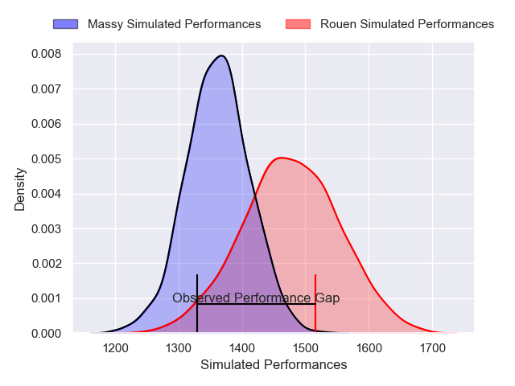
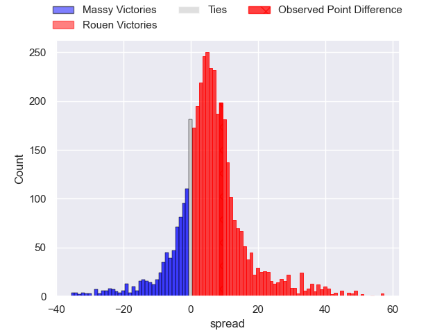
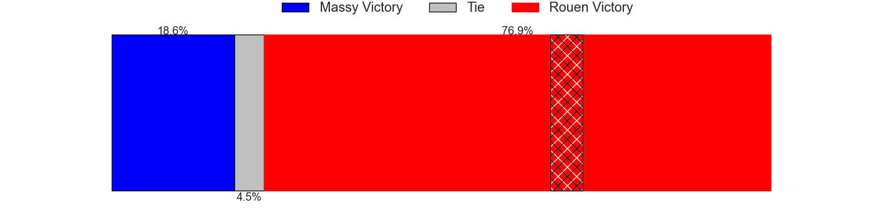
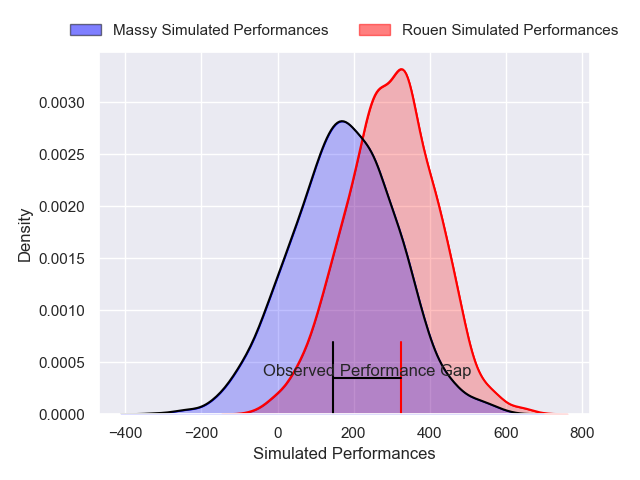
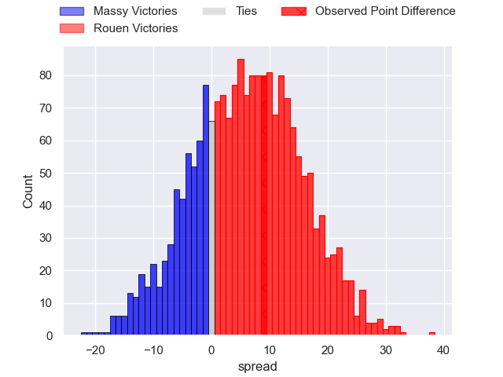

---  
layout: page  
title: Massy at Rouen; 12-21  
date: 2025-04-11 18:00:00 -0500  
categories: "Nationale 24/25" match review  
---
# Massy at Rouen; 12-21

# Club Level Predictions

The first set of predictions treats a club as the smallest object, as the club develops its members, organizes a gameplan, and deploys its players as needed for each match. This club model has a prediction of 0.655, which translates to predicting Rouen to win by 5.6.

Our Over/Under is 57.5 - and combined with the spread above, we have a predicted scoreline of 26 to 31

Each club has a rating and a rating deviation (similar to a Glicko rating), and expected performances can be generated. This allows for simulated matches and spreads like the ones below.
## Projected Performances - Club Model

## Projected Spreads - Club Model

## Projected Results - Club Model

# Player Level Predictions

Treating teams instead as an entity made up of the currently active players, I have ratings for each player in an altogether different system. These can be combined to form team ratings once teamsheets are announced, weighting starters a bit higher than the reserves. After the match is played, players can be weighted by their minutes on the field, allowing for an accurate measure of the team's composition. With these compiled team ratings, we can make predictions, measure inaccuracy, and update the individual player ratings.
## Prediction without Player Minutes: Rouen by 6.2

Rouen by 2.0 on a neutral pitch

## Projected Performances - Player Model

## Projected Spreads - Player Model

## Projected Results - Player Model

|   Away Minutes | Away Player            |   Away Percentile |   Number |   Home Percentile | Home Player          |   Home Minutes |
|---------------:|:-----------------------|------------------:|---------:|------------------:|:---------------------|---------------:|
|             80 | Robin Poipy            |             44.81 |        1 |             75.48 | Noe Khier            |             65 |
|             80 | Nolan Pienaar          |             32.11 |        2 |             67.05 | Mathieu Bonnot       |             67 |
|             15 | Tijde Visser           |             75.96 |        3 |             34.11 | Nicolas Lemaire      |             62 |
|             26 | Diego Pinheiro Ruiz    |             59.58 |        4 |             32.86 | Octave Leleu         |             80 |
|             25 | Noa Rolnin             |             36.54 |        5 |             80.26 | John-Charles Astle   |             50 |
|             54 | Tony Tissot            |             20.09 |        6 |             37.29 | Willy N'Diaye        |             56 |
|             65 | Clément Vidoni         |             57.1  |        7 |             81.12 | Lucas Costa          |             58 |
|             62 | Alexandre Loubiere     |             71.54 |        8 |             80.08 | Abdelkarim Fofana    |             27 |
|             80 | Lucas Rubio            |             39.32 |        9 |             65.93 | Florent Campeggia    |             17 |
|             49 | Gonzalo Lopez Bontempo |             31.26 |       10 |             80.75 | Maxime Javaux        |             22 |
|             18 | Ilian El Yahyaoui      |             54.55 |       11 |             40.71 | Benjamin Debetz      |             13 |
|             58 | Arthur Seigneuret      |             76.29 |       12 |             62.01 | Marin Boulier        |             80 |
|             65 | Anthony Favier         |             38.8  |       13 |             17.22 | Opetera Peleseuma    |             55 |
|             80 | Alex Preira            |             91.73 |       14 |             92.57 | Kevin Bly            |             80 |
|             80 | Giorgi Gogoladze       |             16.19 |       15 |             62.5  | Aloïs Chayla         |             54 |
|             54 | Fernandez Correa       |              2.4  |       16 |             80.19 | Sidi-Mohammed Diallo |             71 |
|             50 | Nicolas Ferrer         |             81.07 |       17 |            nan    | Maxime Cassonnet     |             26 |
|             80 | Adrien Sonzogni        |             72.88 |       18 |             86.74 | Alexis Decaux        |             80 |
|             80 | Hugo Boutin            |             49.35 |       19 |             91.21 | Julien Ruaud         |             41 |
|             15 | Julien Blanc           |             72.03 |       20 |            nan    | Kelemete Finau       |             80 |
|             80 | Alexandre Borie        |             61.68 |       21 |             82.25 | Benjamin Descamps    |             80 |
|             80 | Antonin Vidalenc       |             44.31 |       22 |            nan    | nan                  |            nan |

