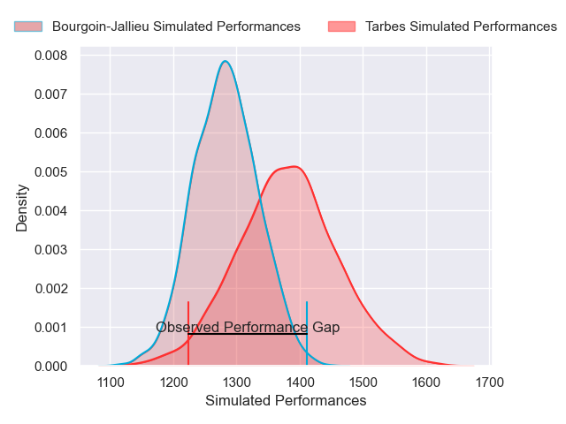
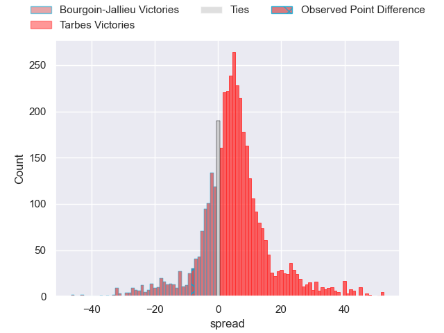
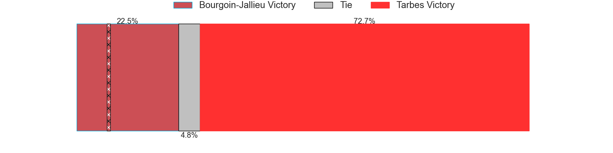
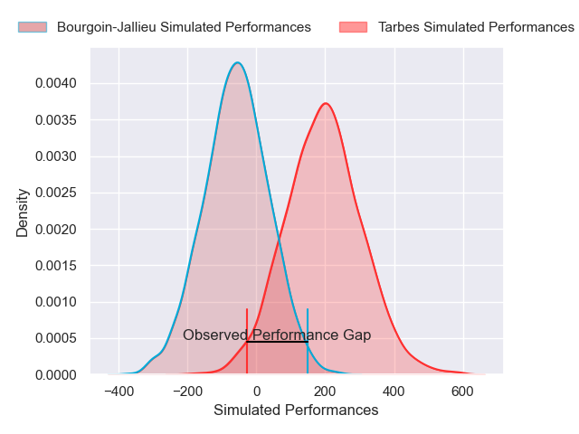
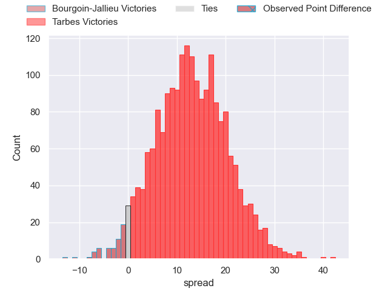
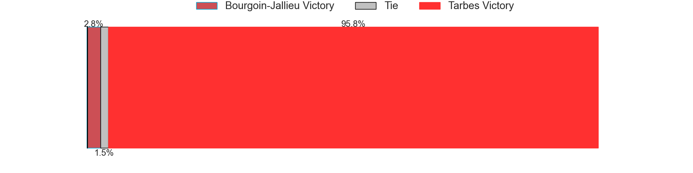

---  
layout: page  
title: Bourgoin-Jallieu at Tarbes; 24-16  
date: 2025-04-11 18:00:00 -0500  
categories: "Nationale 24/25" match review  
---
# Bourgoin-Jallieu at Tarbes; 24-16

# Club Level Predictions

The first set of predictions treats a club as the smallest object, as the club develops its members, organizes a gameplan, and deploys its players as needed for each match. This club model has a prediction of 0.631, which translates to predicting Tarbes to win by 4.7.

Our Over/Under is 40.5 - and combined with the spread above, we have a predicted scoreline of 18 to 23

Each club has a rating and a rating deviation (similar to a Glicko rating), and expected performances can be generated. This allows for simulated matches and spreads like the ones below.
## Projected Performances - Club Model

## Projected Spreads - Club Model

## Projected Results - Club Model

# Player Level Predictions

Treating teams instead as an entity made up of the currently active players, I have ratings for each player in an altogether different system. These can be combined to form team ratings once teamsheets are announced, weighting starters a bit higher than the reserves. After the match is played, players can be weighted by their minutes on the field, allowing for an accurate measure of the team's composition. With these compiled team ratings, we can make predictions, measure inaccuracy, and update the individual player ratings.
## Prediction without Player Minutes: Tarbes by 13.2

Tarbes by 2.2 on a neutral pitch

## Projected Performances - Player Model

## Projected Spreads - Player Model

## Projected Results - Player Model

|   Away Minutes | Away Player      |   Away Percentile |   Number |   Home Percentile | Home Player                |   Home Minutes |
|---------------:|:-----------------|------------------:|---------:|------------------:|:---------------------------|---------------:|
|       22.5     | Romain Favaretto |             15.34 |        1 |              4.47 | Ximun Bessonart            |             80 |
|       32       | Maxime Castant   |             60.7  |        2 |              6.47 | Florian Lamothe            |             31 |
|       25       | Keynan Knox      |             21.49 |        3 |             17.25 | Lucas Santamaria Polkowska |             34 |
|       67       | Thomas Adélaïde  |             38.95 |        4 |             18.34 | Baptiste Peytavi           |             34 |
|       55       | Robin Gascou     |             13.26 |        5 |             48.45 | Mathieu Soufflet           |             34 |
|       27       | Kevin Chaudouard |              5.46 |        6 |             91.58 | Alexis Armary              |             54 |
|       24       | Bynjamin Rabatel |             79.74 |        7 |             51.53 | Spike Salman               |             43 |
|       28       | Poutasi Luafutu  |              2.25 |        8 |              0.82 | Filipe Manu                |             80 |
|       11       | Yoan Cottin      |             69.53 |        9 |              3.37 | Thomas Millet              |             64 |
|        9.33333 | Nicolas Cachet   |              5.95 |       10 |              8.62 | Joris Pialot               |             35 |
|        6.66667 | Adrian Fugit     |             51.72 |       11 |             37.47 | Amona Artaud               |             17 |
|       26       | Isaiah Leota     |             73.86 |       12 |              5.05 | Savenaca Rawaca            |             40 |
|        9.33333 | Tom Danovaro     |             39.86 |       13 |             27.25 | Hugo Cellier               |             13 |
|        6.66667 | Paul-Hugo Champ  |              6.99 |       14 |              9.13 | Jonathan Duffau            |             26 |
|       20       | Remi Bouet       |              6.13 |       15 |              1.64 | Mathieu Berbizier          |             80 |
|       80       | Rémy Gaborit     |             20.45 |       16 |             40.18 | Enzo Baggiani              |             80 |
|        0       | Julien Ratajczak |              5.64 |       17 |             54.39 | Vincent Dolier             |             80 |
|       46       | Dimitri Tchapnga |             42.57 |       18 |             78.35 | Irakli Mirtskhulava        |             80 |
|       46       | Léandre Cotte    |              1.32 |       19 |             16.27 | Léo Estaque                |             70 |
|       46       | Morgan Eames     |              0.75 |       20 |             48.75 | Jean Guicherd              |             31 |
|       69       | Jeremy Gondrand  |             78.79 |       21 |             16.45 | Maile Mamao                |             40 |
|       75       | Aviata Silago    |              2.52 |       22 |             55.22 | Mickael Thébault           |             25 |
|       80       | Gaby Lovobalavu  |             46.62 |       23 |             22.74 | Clement Latorre            |             10 |

