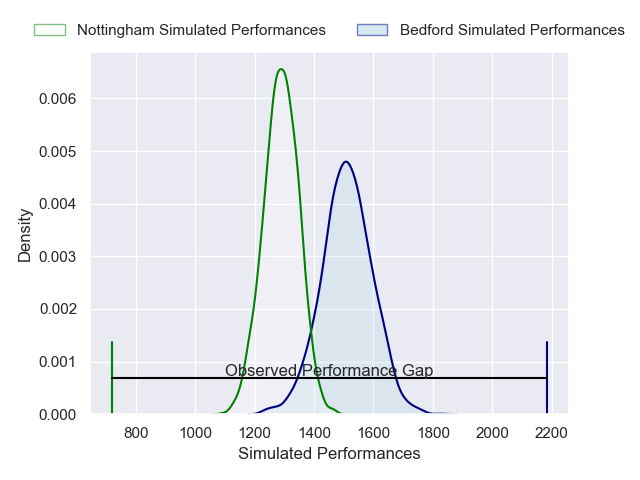
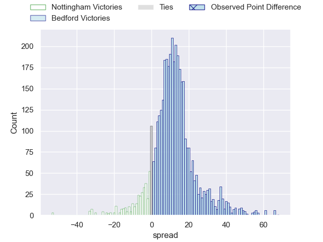
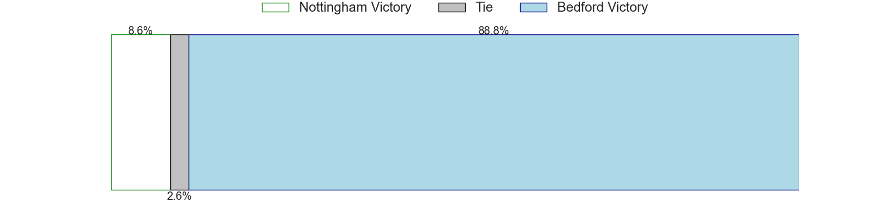
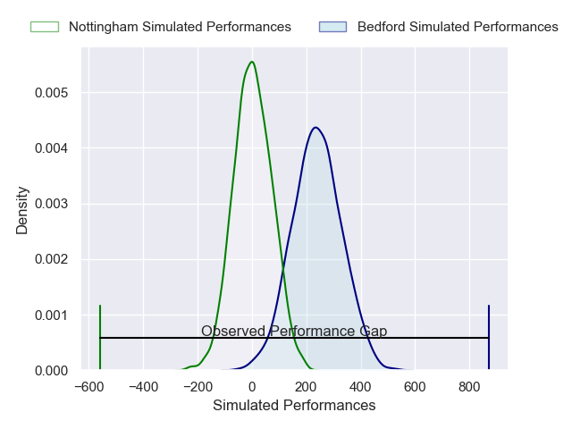
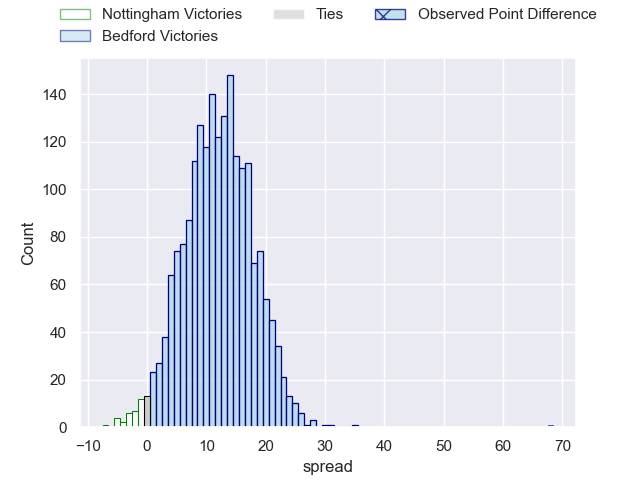
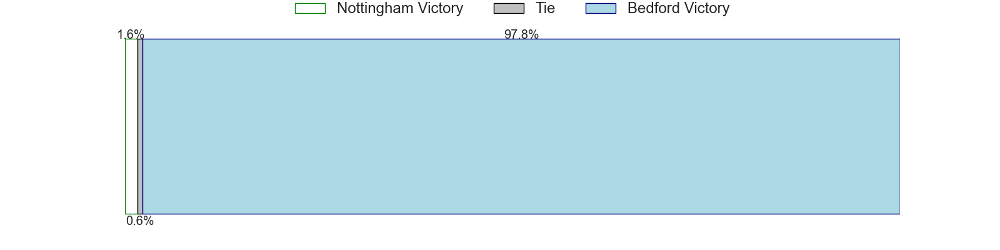

---  
layout: page  
title: Nottingham at Bedford; 19-87  
date: 2025-04-12 18:00:00 -0500  
categories: "RFU Championship 24/25" match review  
---
# Nottingham at Bedford; 19-87

# Club Level Predictions

The first set of predictions treats a club as the smallest object, as the club develops its members, organizes a gameplan, and deploys its players as needed for each match. This club model has a prediction of 0.78, which translates to predicting Bedford to win by 11.2.

Our Over/Under is 61.5 - and combined with the spread above, we have a predicted scoreline of 25 to 37

Each club has a rating and a rating deviation (similar to a Glicko rating), and expected performances can be generated. This allows for simulated matches and spreads like the ones below.
## Projected Performances - Club Model

## Projected Spreads - Club Model

## Projected Results - Club Model

# Player Level Predictions

Treating teams instead as an entity made up of the currently active players, I have ratings for each player in an altogether different system. These can be combined to form team ratings once teamsheets are announced, weighting starters a bit higher than the reserves. After the match is played, players can be weighted by their minutes on the field, allowing for an accurate measure of the team's composition. With these compiled team ratings, we can make predictions, measure inaccuracy, and update the individual player ratings.
## Prediction without Player Minutes: Bedford by 16.8

Bedford by 12.1 on a neutral pitch

## Projected Performances - Player Model

## Projected Spreads - Player Model

## Projected Results - Player Model

|   Away Minutes | Away Player             |   Away Percentile |   Number |   Home Percentile | Home Player          |   Home Minutes |
|---------------:|:------------------------|------------------:|---------:|------------------:|:---------------------|---------------:|
|             65 | Aniseko Sio             |             15.1  |        1 |             82.27 | Joey Conway          |             80 |
|             29 | Jack Dickinson          |             69.72 |        2 |             77.87 | Tommy Herman         |             80 |
|             30 | Dan Richardson          |             85.62 |        3 |             90.81 | Oisin Heffernan      |             20 |
|             40 | Sebastien Ferreira      |              2.08 |        4 |             67.52 | Ed Prowse            |             27 |
|             15 | Jack Shine              |             25.78 |        5 |             64.02 | Rory Ward            |             27 |
|             28 | Osian Thomas            |              9.91 |        6 |             15.79 | Luke Frost           |             39 |
|              9 | Seb Kelly               |             47.48 |        7 |             17.2  | Joe Howard           |             16 |
|             29 | James Cherry            |             31.91 |        8 |             10.98 | Freddie Tuilagi      |             16 |
|             46 | Josh Goodwin            |             29.49 |        9 |             92.37 | Alex Day             |             20 |
|             21 | Matthew Arden           |             68.32 |       10 |             92.34 | William Maisey       |             80 |
|              0 | Harry Graham            |             69.42 |       11 |             91.91 | Dean Adamson         |             67 |
|             80 | Gwyn Parks              |              7.4  |       12 |             74.27 | Michael Le Bourgeois |             80 |
|             60 | Kegan Christian-Goss    |             26.14 |       13 |             75.89 | Lucas Titherington   |              0 |
|             15 | Marcus Alexander Ramage |              4.37 |       14 |             87.17 | Matt Worley          |             22 |
|             23 | Jack Stapley            |              1.02 |       15 |             63.93 | Louis James          |             80 |

