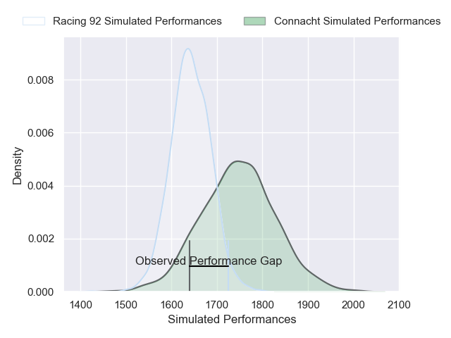
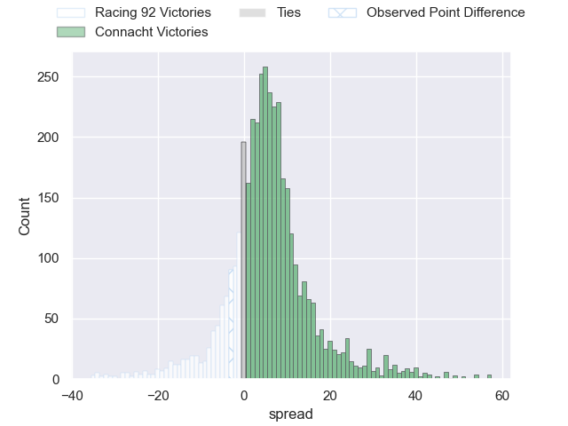
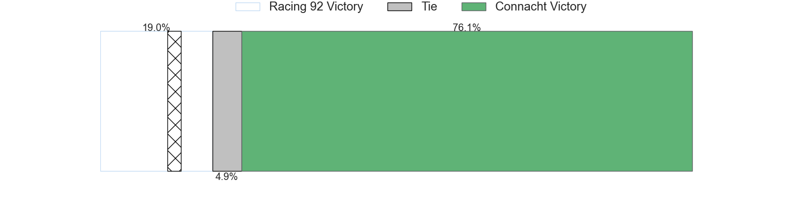
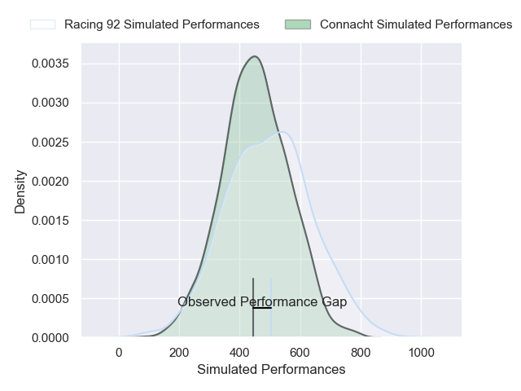
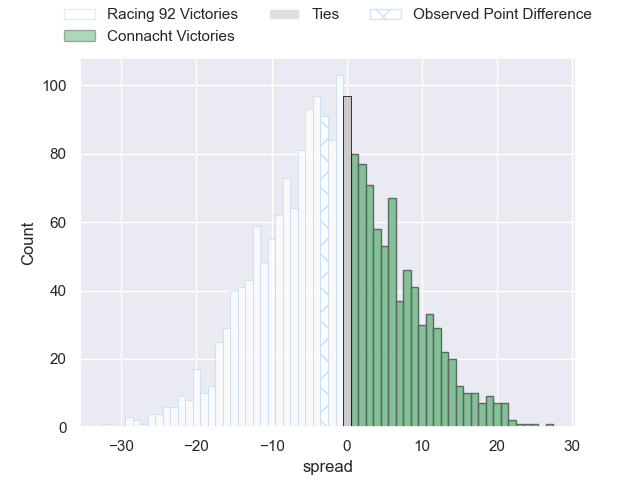

---  
layout: page  
title: Racing 92 at Connacht; 43-40  
date: 2025-04-12 18:00:00 -0500  
categories: "European Rugby Challenge Cup 24/25" match review  
---
# Racing 92 at Connacht; 43-40

# Club Level Predictions

The first set of predictions treats a club as the smallest object, as the club develops its members, organizes a gameplan, and deploys its players as needed for each match. This club model has a prediction of 0.645, which translates to predicting Connacht to win by 5.3.

Our Over/Under is 56.5 - and combined with the spread above, we have a predicted scoreline of 26 to 31

Each club has a rating and a rating deviation (similar to a Glicko rating), and expected performances can be generated. This allows for simulated matches and spreads like the ones below.
## Projected Performances - Club Model

## Projected Spreads - Club Model

## Projected Results - Club Model

# Player Level Predictions

Treating teams instead as an entity made up of the currently active players, I have ratings for each player in an altogether different system. These can be combined to form team ratings once teamsheets are announced, weighting starters a bit higher than the reserves. After the match is played, players can be weighted by their minutes on the field, allowing for an accurate measure of the team's composition. With these compiled team ratings, we can make predictions, measure inaccuracy, and update the individual player ratings.
## Prediction without Player Minutes: Connacht by 7.1

Racing 92 by 1.3 on a neutral pitch

## Projected Performances - Player Model

## Projected Spreads - Player Model

## Projected Results - Player Model

|   Away Minutes | Away Player         |   Away Percentile |   Number |   Home Percentile | Home Player           |   Home Minutes |
|---------------:|:--------------------|------------------:|---------:|------------------:|:----------------------|---------------:|
|           55   | Eddy Ben Arous      |             95.53 |        1 |             89.66 | Denis Buckley         |           80   |
|           55   | Diego Escobar       |             67.46 |        2 |             30.46 | Dave Heffernan        |           80   |
|           69   | Demba Bamba         |             92.71 |        3 |             91.61 | Finlay Bealham        |           22.5 |
|           80   | Boris Palu          |             85.97 |        4 |             92.94 | Josh Murphy           |           31   |
|           35   | Will Rowlands       |             34.01 |        5 |             93.87 | Joe Joyce             |           70   |
|           73   | Maxime Baudonne     |             77.91 |        6 |             29.61 | Cian Prendergast      |           40   |
|           59   | Junior Kpoku        |             95.42 |        7 |             54.9  | Shamus Hurley-Langton |           80   |
|           80   | Junior Kpoku        |             95.42 |        7 |             54.9  | Shamus Hurley-Langton |           80   |
|           29   | Jordan Joseph       |             84.49 |        8 |             11.02 | Sean Jansen           |           14   |
|           67   | Nolann Le Garrec    |             89.65 |        9 |             52.25 | Ben Murphy            |           28   |
|           29   | Dan Lancaster       |              2.17 |       10 |             84.65 | JJ Hanrahan           |           80   |
|           30.5 | Max Spring          |             10.12 |       11 |             57.73 | Finn Treacy           |           80   |
|           30.5 | Josua Tuisova       |             93.21 |       12 |             99.11 | Bundee Aki            |           45   |
|           80   | Vinaya Habosi       |             58.96 |       13 |             36.02 | Hugh Gavin            |           56   |
|           68   | Wame Naituvi        |             86.5  |       14 |             94.85 | Shane Jennings        |           80   |
|           49   | Sam James           |             94.77 |       15 |             82.29 | Mack Hansen           |           55   |
|           65   | Robin Couly         |            nan    |       16 |             68.26 | Dylan Tierney-Martin  |           24   |
|           71   | Guram Gogichashvili |             50.39 |       17 |             96.32 | Peter Dooley          |           36   |
|           40   | Lehopa Leota        |            nan    |       18 |             61.99 | Jack Aungier          |           30   |
|           80   | Romain Taofifenua   |             45.82 |       19 |             73.79 | Oisin Dowling         |            6   |
|           80   | Shingarai Manyarara |            nan    |       20 |             61.84 | Paul Boyle            |           80   |
|           80   | Donovan Taofifenua  |             78.44 |       21 |             51.75 | Matthew Devine        |           11   |
|           80   | Owen Farrell        |             98.82 |       22 |             83.27 | Josh Ioane            |           20   |
|           15   | Henry Chavancy      |            100    |       23 |             10.83 | Cathal Forde          |           24   |

