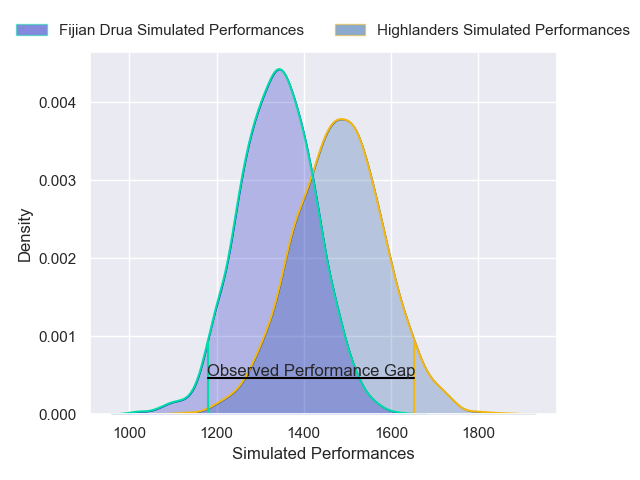
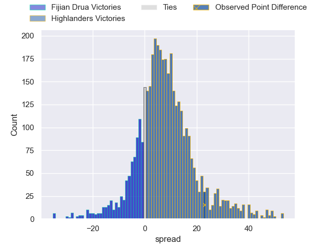
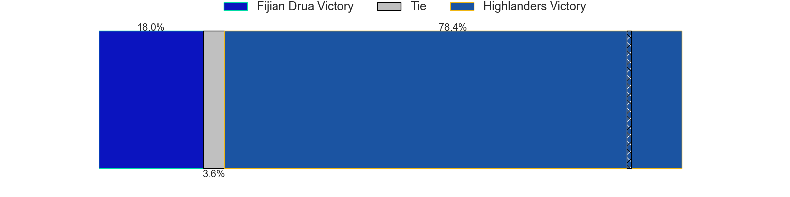
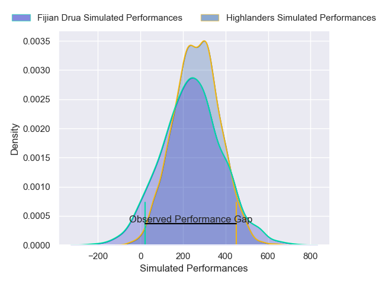
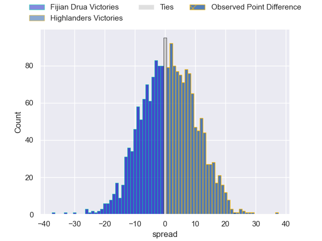

---  
layout: page  
title: Fijian Drua at Highlanders; 20-43  
date: 2025-04-12 18:00:00 -0500  
categories: "Super Rugby Pacific 2025" match review  
---
# Fijian Drua at Highlanders; 20-43

# Club Level Predictions

The first set of predictions treats a club as the smallest object, as the club develops its members, organizes a gameplan, and deploys its players as needed for each match. This club model has a prediction of 0.688, which translates to predicting Highlanders to win by 7.1.

Our Over/Under is 59.5 - and combined with the spread above, we have a predicted scoreline of 26 to 33

Each club has a rating and a rating deviation (similar to a Glicko rating), and expected performances can be generated. This allows for simulated matches and spreads like the ones below.
## Projected Performances - Club Model

## Projected Spreads - Club Model

## Projected Results - Club Model

# Player Level Predictions

Treating teams instead as an entity made up of the currently active players, I have ratings for each player in an altogether different system. These can be combined to form team ratings once teamsheets are announced, weighting starters a bit higher than the reserves. After the match is played, players can be weighted by their minutes on the field, allowing for an accurate measure of the team's composition. With these compiled team ratings, we can make predictions, measure inaccuracy, and update the individual player ratings.
## Prediction without Player Minutes: Highlanders by 3.1

Fijian Drua by 4.9 on a neutral pitch

## Projected Performances - Player Model

## Projected Spreads - Player Model

## Projected Results - Player Model

|   Away Minutes | Away Player             |   Away Percentile |   Number |   Home Percentile | Home Player                   |   Home Minutes |
|---------------:|:------------------------|------------------:|---------:|------------------:|:------------------------------|---------------:|
|             80 | Haereiti Hetet          |             82.99 |        1 |             65.91 | Ethan de Groot                |             80 |
|             54 | Mesu Dolokoto           |             67.94 |        2 |             58.53 | Henry Bell                    |             57 |
|             57 | Mesake Doge             |             27.12 |        3 |             23.04 | Sefo Kautai                   |             18 |
|             54 | Mesake Vocevoce         |             72.58 |        4 |             71.93 | Will Stodart                  |             80 |
|             80 | Isoa Nasilasila         |             64.41 |        5 |             87.27 | Fabian Holland                |             70 |
|             40 | Joseva Tamani           |             65.99 |        6 |             79.29 | Oliver Haig                   |             80 |
|             80 | Isoa Tuwai              |             25.11 |        7 |             58.3  | Veveni Lasaqa                 |             80 |
|             80 | Elia Canakaivata        |             71.63 |        8 |             11.63 | Hugh Renton                   |             56 |
|             80 | Simione Kuruvoli        |             39.57 |        9 |             78.46 | Folau Fakatava                |             80 |
|             80 | Isaiah Armstrong-Ravula |             61.02 |       10 |             69.49 | Cameron Millar                |             13 |
|             40 | Isaiah Armstrong-Ravula |             61.02 |       10 |             69.49 | Cameron Millar                |             13 |
|             35 | Isaiah Armstrong-Ravula |             61.02 |       10 |             69.49 | Cameron Millar                |             13 |
|             13 | Ponipate Loganimasi     |             51.27 |       11 |             84.72 | Jona Nareki                   |             24 |
|             80 | Inia Tabuavou           |             69    |       12 |             70.57 | Timoci Tavatavanawai          |             26 |
|             26 | Iosefo Masi             |             90.65 |       13 |             11.81 | Thomas Umaga-Jensen           |             30 |
|             76 | Selestino Ravutaumada   |             91    |       14 |             41.99 | Taniela Filimone              |             24 |
|             13 | Caleb Muntz             |             71.63 |       15 |             94.57 | Jacob Ratumaitavuki-Kneepkens |              4 |
|             64 | Zuriel Togiatama        |             33.17 |       16 |             52.79 | Jack Taylor                   |             67 |
|              1 | Peni Ravai Kovekalou    |             83.39 |       17 |            nan    | Daniel Lienert-Brown          |             46 |
|             57 | Samu Tawake             |             25.71 |       18 |             33.86 | Saula Ma'u                    |             56 |
|             13 | Ratu Rotuisolia         |             70.45 |       19 |             58.83 | Tai Cribb                     |             34 |
|             29 | Vilive Miramira         |             72.04 |       20 |             16.32 | Michael Loft                  |             55 |
|             79 | Philip Baselala         |            nan    |       21 |             50.58 | Adam Lennox                   |             20 |
|             50 | Isikeli Rabitu          |             10.46 |       22 |             29.38 | Sam Gilbert                   |             23 |
|             16 | Tuidraki Samusamuvodre  |             18.41 |       23 |             28.94 | Tanielu Tele'a                |             30 |

