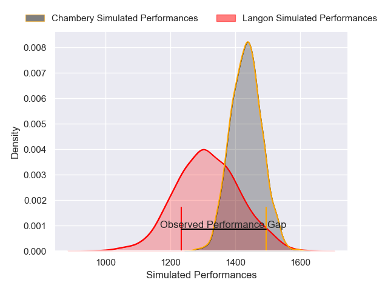
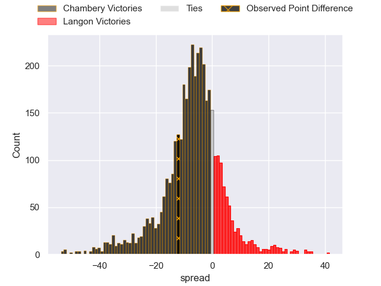
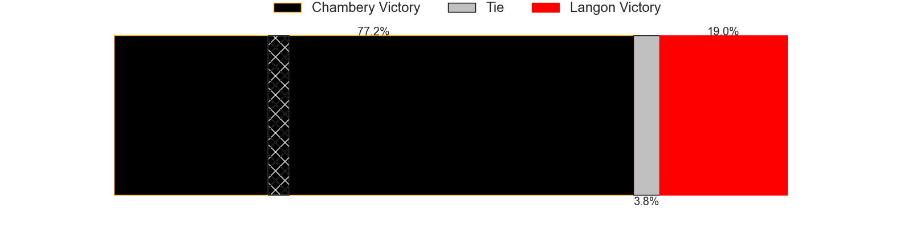
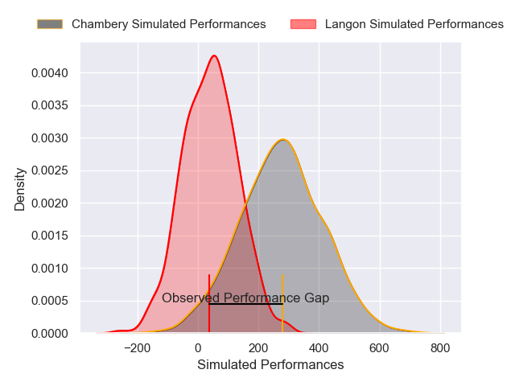
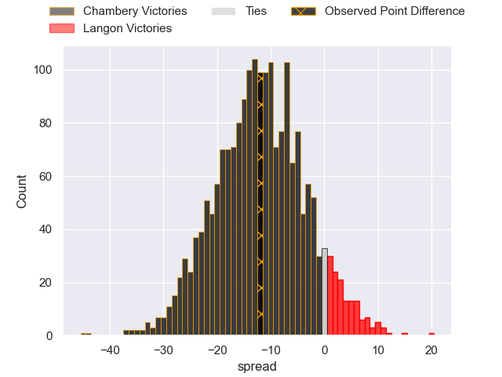
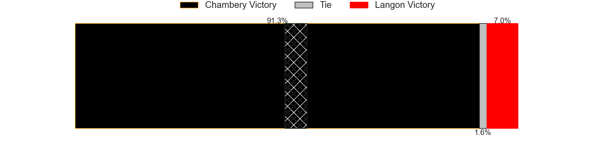

---  
layout: page  
title: Chambery at Langon; 31-19  
date: 2025-04-12 18:00:00 -0500  
categories: "Nationale 24/25" match review  
---
# Chambery at Langon; 31-19

# Club Level Predictions

The first set of predictions treats a club as the smallest object, as the club develops its members, organizes a gameplan, and deploys its players as needed for each match. This club model has a prediction of 0.34, which translates to predicting Chambery to win by 5.8.

Our Over/Under is 48.5 - and combined with the spread above, we have a predicted scoreline of 27 to 21

Each club has a rating and a rating deviation (similar to a Glicko rating), and expected performances can be generated. This allows for simulated matches and spreads like the ones below.
## Projected Performances - Club Model

## Projected Spreads - Club Model

## Projected Results - Club Model

# Player Level Predictions

Treating teams instead as an entity made up of the currently active players, I have ratings for each player in an altogether different system. These can be combined to form team ratings once teamsheets are announced, weighting starters a bit higher than the reserves. After the match is played, players can be weighted by their minutes on the field, allowing for an accurate measure of the team's composition. With these compiled team ratings, we can make predictions, measure inaccuracy, and update the individual player ratings.
## Prediction without Player Minutes: Chambery by 12.9

Chambery by 15.2 on a neutral pitch

## Projected Performances - Player Model

## Projected Spreads - Player Model

## Projected Results - Player Model

|   Away Minutes | Away Player              |   Away Percentile |   Number |   Home Percentile | Home Player              |   Home Minutes |
|---------------:|:-------------------------|------------------:|---------:|------------------:|:-------------------------|---------------:|
|             62 | Nugzar Somkhishvili      |             88.87 |        1 |             20.38 | Ratu Nailoma Vatubua     |       80       |
|             11 | Quentin Beaudaux         |             69.38 |        2 |             18.02 | Julien Graffouillère     |       46       |
|             80 | Lasha Tabidze            |             82.52 |        3 |              5.88 | Maxime Gau               |       46       |
|             80 | Jean-Baptiste Grenod     |             95.17 |        4 |             81.69 | Kemueli Lavetanakoroi    |       62       |
|             80 | Corentin Astier          |             78.53 |        5 |              8.46 | Isikili Seva Davetawalu  |       80       |
|             46 | Taniela Matakaiongo      |             58.02 |        6 |             42.62 | Thomas Bishop            |       75       |
|             29 | Colin Lebian             |             65.9  |        7 |             12.37 | Thomas Geffré            |       25       |
|             40 | Seru Uru                 |             49.86 |        8 |              2.24 | Thomas De Molder         |       32       |
|             80 | Aubin Eymeri             |             43.24 |        9 |             47.25 | Baptiste Tisne Cardeneau |       32       |
|             11 | Thibault Moreno          |             79.72 |       10 |              8.07 | Vincent Debladis         |        7       |
|             18 | Arthur Nennig            |             89.13 |       11 |             70.48 | Thomas Wallraf           |        9.33333 |
|             35 | Bastien Reymond          |             81.59 |       12 |             28.25 | Guillaume Christophe     |        6.66667 |
|             80 | Joseph Exshaw            |             61.02 |       13 |             49.51 | Yul Charrier             |       19       |
|             33 | Paul Altier              |             67.85 |       14 |             11.15 | Quentin Lefort           |       80       |
|             21 | Thomas Hecquet           |             72.03 |       15 |             26.16 | Nathan Gagnac            |       61       |
|             80 | Pierre-Nicolas Dance     |             83.04 |       16 |             59.6  | Paul Castera             |       26       |
|             80 | Yan Tabarot              |             67.78 |       17 |              8.29 | Clement Renaud           |        9.33333 |
|             69 | Enzo Segui               |             56.82 |       18 |             23.51 | Helmi Mimouna            |        6.66667 |
|             73 | Mateo Guerret            |             68.78 |       19 |             84.54 | Sionasa Vunisa           |       20       |
|             80 | Baptiste Collet          |            nan    |       20 |             27.51 | Jose Novak               |        0       |
|             63 | Fabien Witz              |             74.81 |       21 |             27.77 | Thomas Mendy             |       28       |
|             51 | Va'aufauese Apelu Maliko |             76.1  |       22 |             32.45 | Emiliano Coria Marchetti |       49       |
|             80 | Antoine Ferreira         |            nan    |       23 |            nan    | nan                      |      nan       |

