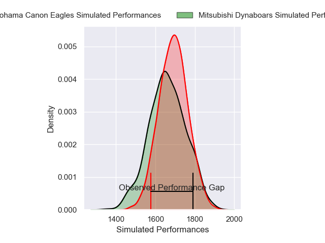
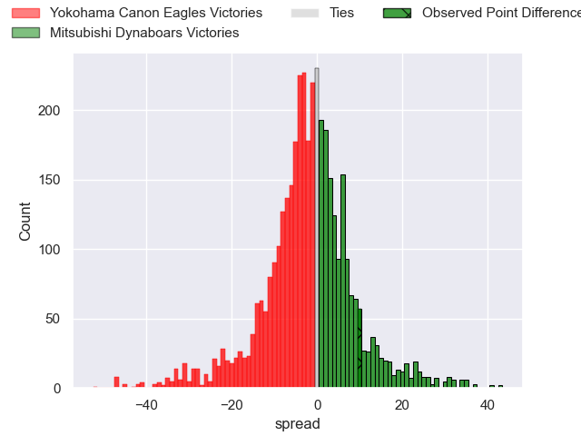
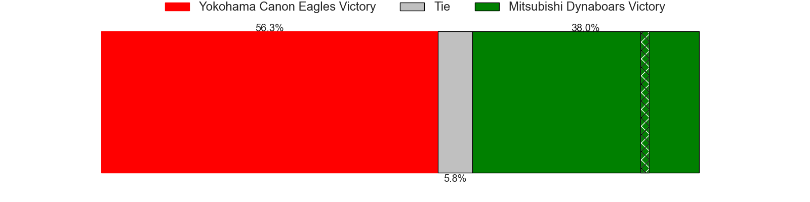
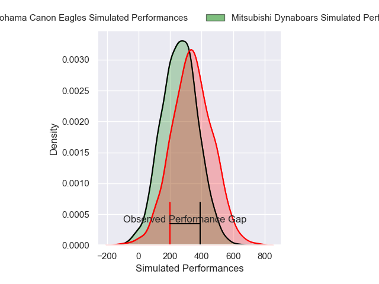
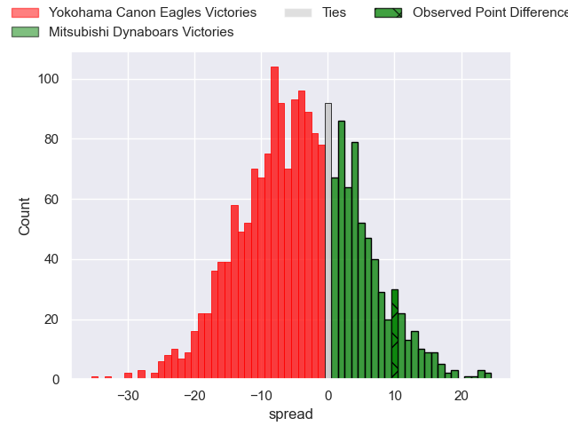
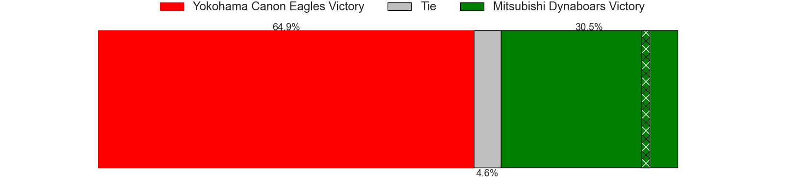

---  
layout: page  
title: Yokohama Canon Eagles at Mitsubishi Dynaboars; 28-38  
date: 2025-04-12 18:00:00 -0500  
categories: "Japan Rugby League One 24/25" match review  
---
# Yokohama Canon Eagles at Mitsubishi Dynaboars; 28-38

# Club Level Predictions

The first set of predictions treats a club as the smallest object, as the club develops its members, organizes a gameplan, and deploys its players as needed for each match. This club model has a prediction of 0.457, which translates to predicting Yokohama Canon Eagles to win by 1.5.

Our Over/Under is 71.5 - and combined with the spread above, we have a predicted scoreline of 37 to 35

Each club has a rating and a rating deviation (similar to a Glicko rating), and expected performances can be generated. This allows for simulated matches and spreads like the ones below.
## Projected Performances - Club Model

## Projected Spreads - Club Model

## Projected Results - Club Model

# Player Level Predictions

Treating teams instead as an entity made up of the currently active players, I have ratings for each player in an altogether different system. These can be combined to form team ratings once teamsheets are announced, weighting starters a bit higher than the reserves. After the match is played, players can be weighted by their minutes on the field, allowing for an accurate measure of the team's composition. With these compiled team ratings, we can make predictions, measure inaccuracy, and update the individual player ratings.
## Prediction without Player Minutes: Mitsubishi Dynaboars by 2.8

Yokohama Canon Eagles by 0.5 on a neutral pitch

## Projected Performances - Player Model

## Projected Spreads - Player Model

## Projected Results - Player Model

|   Away Minutes | Away Player         |   Away Percentile |   Number |   Home Percentile | Home Player               |   Home Minutes |
|---------------:|:--------------------|------------------:|---------:|------------------:|:--------------------------|---------------:|
|             80 | Takato Okabe        |             96.49 |        1 |             69.65 | Yuji Chae                 |             59 |
|             80 | Yusuke Niwai        |             62.73 |        2 |             77.2  | Seung Hyok Lee            |             80 |
|             80 | Ryosuke Iwaihara    |             53.67 |        3 |             63.9  | Khuthuzani Kingdom Mchunu |             40 |
|             56 | Liaki Moli          |              5.1  |        4 |             77.43 | Walt Steenkamp            |             29 |
|             80 | Matt Philip         |             24.55 |        5 |             12.56 | Daniel Linde              |             11 |
|              5 | Jeandre Labuschagne |             13.46 |        6 |             95.05 | Friedle Olivier           |             20 |
|             80 | Masato Furukawa     |             29.91 |        7 |             66.17 | Kohki Sato                |             80 |
|             28 | Billy Harmon        |             36.99 |        8 |             77.44 | Kyo Yoshida               |             40 |
|             46 | Kafazumi Yamasuga   |             60    |        9 |             84.41 | Kota Iwamura              |             80 |
|             80 | Yu Tamura           |             81.78 |       10 |             93.17 | Jack Stratton             |             67 |
|             80 | Chihito Matsui      |             45.91 |       11 |             83.36 | Honeti Taumoha'apai       |             11 |
|             67 | Naoya Minamihashi   |             57.14 |       12 |             95.44 | Charlie Lawrence          |             80 |
|             51 | Jesse Kriel         |             98.07 |       13 |             63.93 | Matt Vaega                |             80 |
|             64 | Kippei Ishida       |             21.38 |       14 |             74.44 | Naco Joape                |             77 |
|             80 | Jumpei Ogura        |             97.54 |       15 |             74.59 | Satoshi Koizumi           |             80 |
|             50 | Viliame Takayawa    |             92.38 |       16 |              9.42 | Hayato Hosoda             |             80 |
|             56 | Amanaki Mafi        |             93.09 |       17 |             42.86 | James Grayson             |             13 |
|             75 | Brendan Owen        |             90.78 |       18 |            nan    | Timote Tavalea            |              3 |
|             30 | Tatsuro Sugimoto    |              6.55 |       19 |             96.33 | Tomoaki Ishii             |             26 |
|             24 | Shunta Nakamura     |             78.87 |       20 |             73.71 | Yoshimitsu Yasue          |             23 |
|             24 | Tomoki Minami       |            nan    |       21 |            nan    | Cho Song Yu               |             10 |
|             16 | Toshiki Amano       |            nan    |       22 |            nan    | Haniteli Vailea           |             52 |
|             59 | Cormac Daly         |             58.36 |       23 |            nan    | nan                       |            nan |

