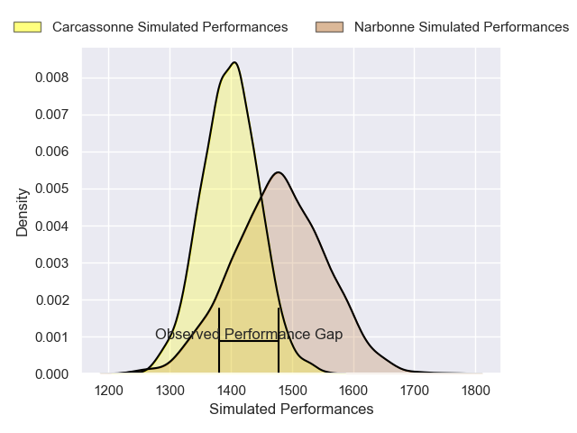
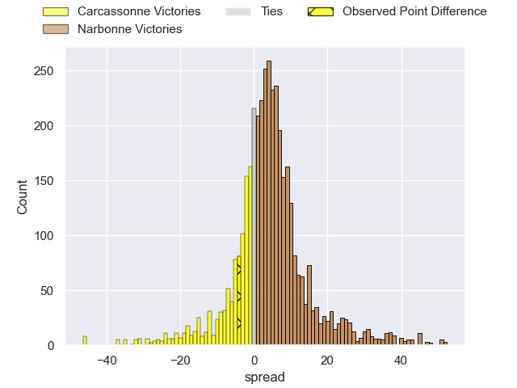
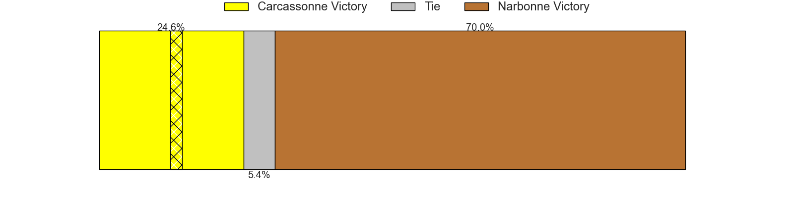
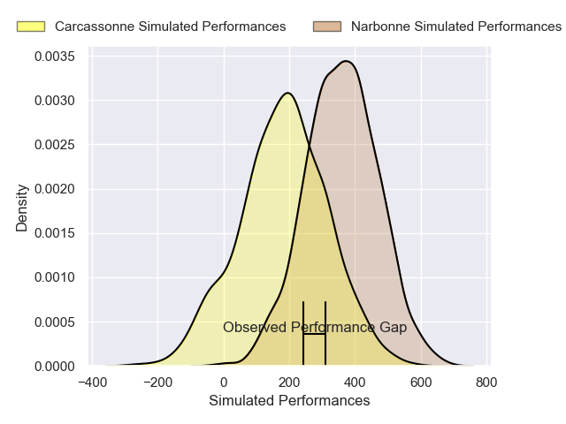
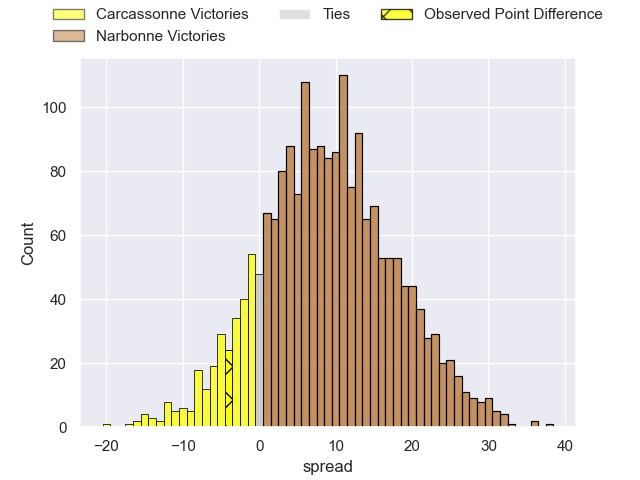
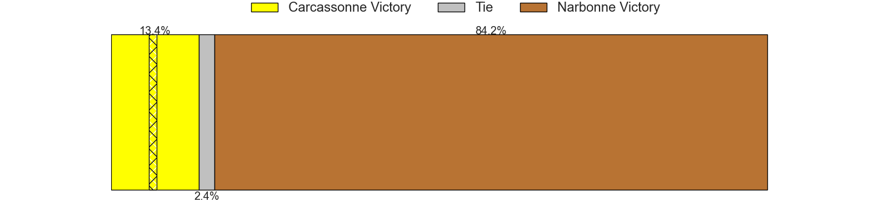

---  
layout: page  
title: Carcassonne at Narbonne; 17-13  
date: 2025-04-12 18:00:00 -0500  
categories: "Nationale 24/25" match review  
---
# Carcassonne at Narbonne; 17-13

# Club Level Predictions

The first set of predictions treats a club as the smallest object, as the club develops its members, organizes a gameplan, and deploys its players as needed for each match. This club model has a prediction of 0.612, which translates to predicting Narbonne to win by 4.0.

Our Over/Under is 47.5 - and combined with the spread above, we have a predicted scoreline of 22 to 26

Each club has a rating and a rating deviation (similar to a Glicko rating), and expected performances can be generated. This allows for simulated matches and spreads like the ones below.
## Projected Performances - Club Model

## Projected Spreads - Club Model

## Projected Results - Club Model

# Player Level Predictions

Treating teams instead as an entity made up of the currently active players, I have ratings for each player in an altogether different system. These can be combined to form team ratings once teamsheets are announced, weighting starters a bit higher than the reserves. After the match is played, players can be weighted by their minutes on the field, allowing for an accurate measure of the team's composition. With these compiled team ratings, we can make predictions, measure inaccuracy, and update the individual player ratings.
## Prediction without Player Minutes: Narbonne by 8.2

Carcassonne by 5.0 on a neutral pitch

## Projected Performances - Player Model

## Projected Spreads - Player Model

## Projected Results - Player Model

|   Away Minutes | Away Player       |   Away Percentile |   Number |   Home Percentile | Home Player               |   Home Minutes |
|---------------:|:------------------|------------------:|---------:|------------------:|:--------------------------|---------------:|
|             77 | Yan Arnold        |             66.29 |        1 |             19.73 | Gregory Fichten           |             51 |
|             59 | Raphael Carbou    |             59.07 |        2 |             12.98 | Clément Esteriola         |             16 |
|             59 | Théo Sauzaret     |             59.35 |        3 |             31.71 | Mohammed Loukia           |              6 |
|             40 | Romain Manchia    |             39.75 |        4 |             65.91 | Marius Antonescu          |             28 |
|             80 | Marius Iftimiciuc |             16.05 |        5 |              7.93 | Leva Fifita               |             29 |
|             59 | Maxime Millan     |             67.1  |        6 |             62.62 | Thibault Clauzade         |             19 |
|             68 | Etienne Herjean   |             82.8  |        7 |              3.46 | Paul Belzons              |             11 |
|             50 | Thomas Hoarau     |             21.34 |        8 |             75.61 | Luke Nakobukobua          |             59 |
|             28 | Gaetan Pichon     |             34.58 |        9 |              5.42 | Pierrick Nova             |             51 |
|             80 | Johnny McPhillips |             80.33 |       10 |              3.11 | Gilles Bosch              |             80 |
|             32 | Clement Egiziano  |             91.36 |       11 |             77.79 | Clément Clavières         |             51 |
|             66 | Jordan Puletua    |             13.88 |       12 |             47.72 | Parataiso Silafai-Lea'ana |             80 |
|             80 | Sefa Naivalu      |             98.89 |       13 |             99.59 | Peter Betham              |             51 |
|             80 | Paul Gadea        |             34.94 |       14 |             13.75 | Pierre-Hugo Ducom         |             80 |
|             64 | Maxime Gianet     |             89.55 |       15 |              0.41 | Boris Goutard             |             51 |
|             80 | Florent Lorenzon  |            nan    |       16 |             77.24 | Théo Castinel             |             29 |
|             55 | Fabien Lorenzon   |             83.47 |       17 |             84.69 | Mehdi Boundjema           |             80 |
|             80 | Baptiste Moreno   |            nan    |       18 |             26.6  | Chris Talakai             |             59 |
|             50 | Clément Fontaine  |             53.82 |       19 |             23.61 | Dennis Visser             |             80 |
|             18 | Valentin Sese     |             12.52 |       20 |             58.97 | Arthur Christienne        |             32 |
|             19 | Gary Graham       |             78.79 |       21 |             70    | Pablo Barbaste            |             51 |
|             80 | Nils Chalies      |             22.95 |       22 |             23.4  | Tom Chauvet               |             64 |
|             21 | Naim Ben Alla     |             35.87 |       23 |             61.43 | Daniel Ikpefan            |             35 |

