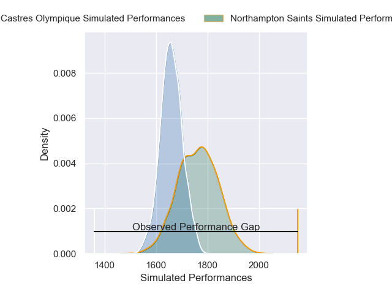
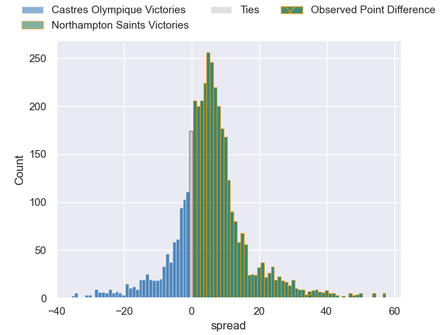
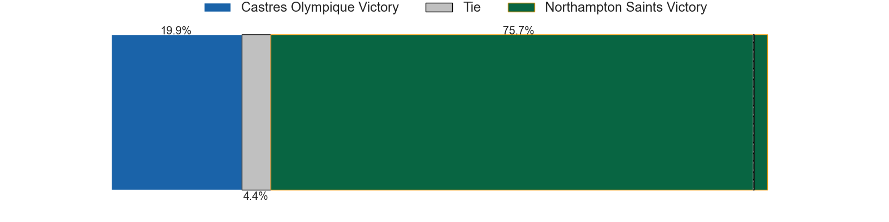
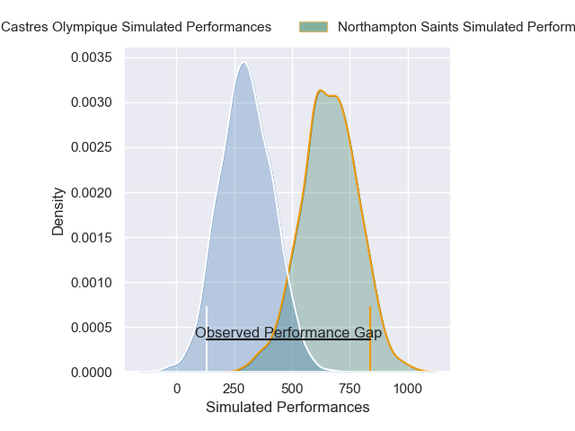
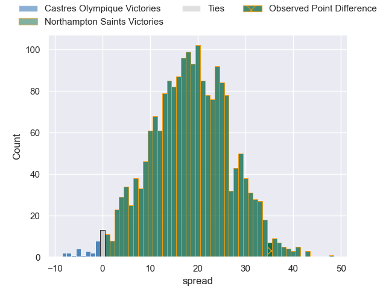
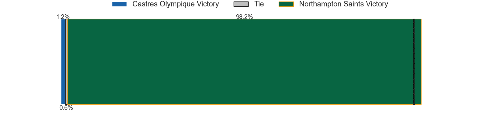

---  
layout: page  
title: Castres Olympique at Northampton Saints; 16-51  
date: 2025-04-12 18:00:00 -0500  
categories: "European Rugby Champions Cup 24/25" match review  
---
# Castres Olympique at Northampton Saints; 16-51

# Club Level Predictions

The first set of predictions treats a club as the smallest object, as the club develops its members, organizes a gameplan, and deploys its players as needed for each match. This club model has a prediction of 0.64, which translates to predicting Northampton Saints to win by 5.0.

Our Over/Under is 53.5 - and combined with the spread above, we have a predicted scoreline of 24 to 29

Each club has a rating and a rating deviation (similar to a Glicko rating), and expected performances can be generated. This allows for simulated matches and spreads like the ones below.
## Projected Performances - Club Model

## Projected Spreads - Club Model

## Projected Results - Club Model

# Player Level Predictions

Treating teams instead as an entity made up of the currently active players, I have ratings for each player in an altogether different system. These can be combined to form team ratings once teamsheets are announced, weighting starters a bit higher than the reserves. After the match is played, players can be weighted by their minutes on the field, allowing for an accurate measure of the team's composition. With these compiled team ratings, we can make predictions, measure inaccuracy, and update the individual player ratings.
## Prediction without Player Minutes: Northampton Saints by 12.9

Castres Olympique by 2.2 on a neutral pitch

## Projected Performances - Player Model

## Projected Spreads - Player Model

## Projected Results - Player Model

|   Away Minutes | Away Player           |   Away Percentile |   Number |   Home Percentile | Home Player         |   Home Minutes |
|---------------:|:----------------------|------------------:|---------:|------------------:|:--------------------|---------------:|
|           75   | Quentin Walcker       |             62.15 |        1 |             24.84 | Emmanuel Iyogun     |           28   |
|           75   | Gaetan Barlot         |             83.25 |        2 |             89.15 | Curtis Langdon      |           80   |
|           75   | Gaetan Barlot         |             83.25 |        2 |             89.15 | Curtis Langdon      |           13   |
|           75   | Gaetan Barlot         |             83.25 |        2 |             89.15 | Curtis Langdon      |           29   |
|           75   | Gaetan Barlot         |             83.25 |        2 |             89.15 | Curtis Langdon      |           26   |
|           15   | Will Collier          |             87.77 |        3 |              0.78 | Trevor Davison      |           14   |
|           56   | Gauthier Maravat      |             13.1  |        4 |             97.68 | Temo Mayanavanua    |           29   |
|           27.5 | Leone Nakarawa        |             96.38 |        5 |             10.04 | Alex Coles          |           52   |
|           41   | Mathieu Babillot      |             57.93 |        6 |              5.41 | Josh Kemeny         |           45   |
|           50   | Baptiste Delaporte    |             90.74 |        7 |             94.5  | Henry Pollock       |           34   |
|           41   | Abraham Papali'i      |             70    |        8 |             61.02 | Juarno Augustus     |           80   |
|           67   | Jeremy Fernandez      |             89.98 |        9 |             97.16 | Alex Mitchell       |           38   |
|           69   | Louis Le Brun         |             81.89 |       10 |             64.17 | Fin Smith           |           80   |
|           66   | Remy Baget            |             94.19 |       11 |             94.75 | George Hendy        |           18   |
|           80   | Jack Goodhue          |             92.62 |       12 |             75.2  | Fraser Dingwall     |           46   |
|           80   | Vilimoni Botitu       |             78.05 |       13 |             85.33 | Burger Odendaal     |           67   |
|            0   | Geoffrey Palis        |             98.41 |       14 |             96.44 | Tommy Freeman       |           80   |
|           62   | Theo Chabouni         |             51.91 |       15 |             53.72 | James Ramm          |           60   |
|           39   | Loris Zarantonello    |             16.75 |       16 |             79.27 | Henry Walker        |           60   |
|           11   | Lois Guerois-Galisson |             71.39 |       17 |             77.04 | Tom West            |            0   |
|           28   | Lois Guerois-Galisson |             71.39 |       17 |             77.04 | Tom West            |            0   |
|           18   | Aurelien Azar         |            nan    |       18 |             87.93 | Elliot Millar Mills |           65   |
|           12   | Simon Meka            |             74.06 |       19 |             45.72 | Tom Lockett         |           20.5 |
|           38   | Romain Macurdy        |            nan    |       20 |             97.16 | Tom Pearson         |           62   |
|           29   | Baptiste Cope         |             48.3  |       21 |             78.3  | Tom James           |           29   |
|           11   | Santiago Arata        |             59.43 |       22 |             85.63 | Rory Hutchinson     |            0   |
|           60   | Julien Dumora         |             78.47 |       23 |             97.59 | George Furbank      |           11   |

