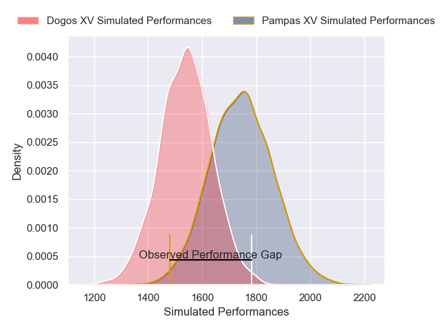
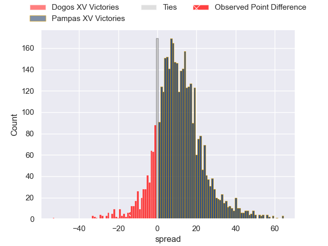
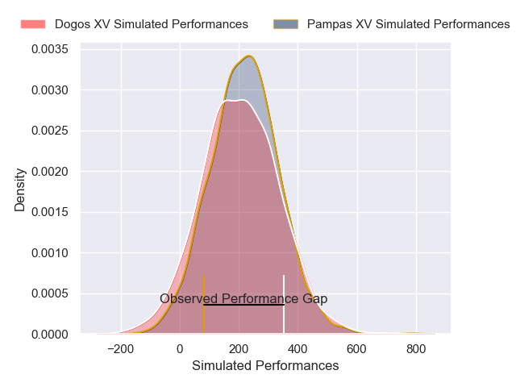
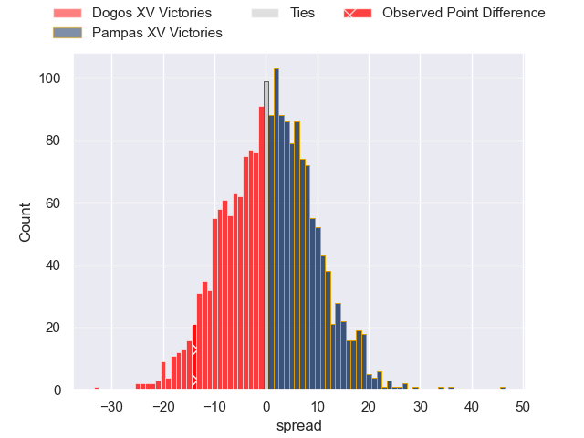

---  
layout: page  
title: Dogos XV at Pampas XV; 22-8  
date: 2025-04-12 18:00:00 -0500  
categories: "Super Rugby Americas 2025" match review  
---
# Dogos XV at Pampas XV; 22-8

# Club Level Predictions

The first set of predictions treats a club as the smallest object, as the club develops its members, organizes a gameplan, and deploys its players as needed for each match. This club model has a prediction of 0.755, which translates to predicting Pampas XV to win by 10.2.

Our Over/Under is 43.5 - and combined with the spread above, we have a predicted scoreline of 17 to 27

Each club has a rating and a rating deviation (similar to a Glicko rating), and expected performances can be generated. This allows for simulated matches and spreads like the ones below.
## Projected Performances - Club Model

## Projected Spreads - Club Model

## Projected Results - Club Model

# Player Level Predictions

Treating teams instead as an entity made up of the currently active players, I have ratings for each player in an altogether different system. These can be combined to form team ratings once teamsheets are announced, weighting starters a bit higher than the reserves. After the match is played, players can be weighted by their minutes on the field, allowing for an accurate measure of the team's composition. With these compiled team ratings, we can make predictions, measure inaccuracy, and update the individual player ratings.
## Prediction without Player Minutes: Pampas XV by 1.0

Dogos XV by 1.4 on a neutral pitch

## Projected Performances - Player Model

## Projected Spreads - Player Model

## Projected Results - Player Model

|   Away Minutes | Away Player                 |   Away Percentile |   Number |   Home Percentile | Home Player               |   Home Minutes |
|---------------:|:----------------------------|------------------:|---------:|------------------:|:--------------------------|---------------:|
|             20 | Boris Wenger                |             85.54 |        1 |             82.83 | Matias Medrano            |             72 |
|             80 | Leonel Oviedo               |             84.25 |        2 |             32.01 | Ramiro Gurovich           |             57 |
|             24 | Pedro Delgado               |             75    |        3 |             73.72 | Tomas Rapetti             |             76 |
|             60 | Lautaro Simes               |             85.23 |        4 |             64.91 | Franco Carrera            |             80 |
|             35 | Federico Albrisi            |             60.49 |        5 |             12.42 | Federico Ignacio Lavanini |             80 |
|             50 | Aitor Bildosola             |             70.77 |        6 |             61.33 | Manuel Bernstein          |             63 |
|             65 | Valentin Cabral             |             77.34 |        7 |             65.59 | Joaquin Moro              |             59 |
|             80 | Gennaro Fissore             |             54.81 |        8 |             11.45 | Juan Cruz Perez Rachel    |             60 |
|             65 | Agustin Moyano              |             90.07 |        9 |             51.01 | Ignacio Inchauspe         |             80 |
|             65 | Juan Baronio                |             65.09 |       10 |             10.68 | Estanislao Renthel        |             73 |
|              7 | Lautaro Cipriani            |             64.49 |       11 |             31.03 | Nahuel Clausen            |             65 |
|             35 | Faustino Sánchez Valarolo   |             91.42 |       12 |             86.78 | Justo Piccardo            |             55 |
|             54 | Leonardo Gea Salim          |             81.03 |       13 |             65.39 | Bruno Heit                |             35 |
|             66 | Mateo Soler                 |             85.93 |       14 |             82.29 | Ramon Fuentes             |             23 |
|             80 | Mateo Sanchez               |             38.85 |       15 |             21.06 | Francisco Quinn           |             21 |
|             80 | Ignacio Jose Gandini        |            nan    |       16 |             19.92 | Jeronimo Solveyra         |             30 |
|             80 | Nicolas Revol               |             63.74 |       17 |             90.69 | Leo Mazzini               |             21 |
|             54 | Juan Cruz Caballero         |             41.1  |       18 |             76.97 | Nicolas Damorim           |             34 |
|              9 | Julian Ignacio Hernandez    |             76.18 |       19 |             86.17 | Juan Penoucos             |              7 |
|             80 | Conrado Iglesias Quintana   |            nan    |       20 |             59.11 | Emir Gael Galvan          |             80 |
|              8 | Juan Ignacio Greising Revol |             74.79 |       21 |             24.58 | Eliseo Morales Abraham    |             80 |
|             80 | Felipe Mallia               |             70.53 |       22 |             15.73 | Javier Corvalan           |             27 |
|             80 | Juan Lovell                 |            nan    |       23 |             89.22 | Ignacio Bottazzini        |             15 |

