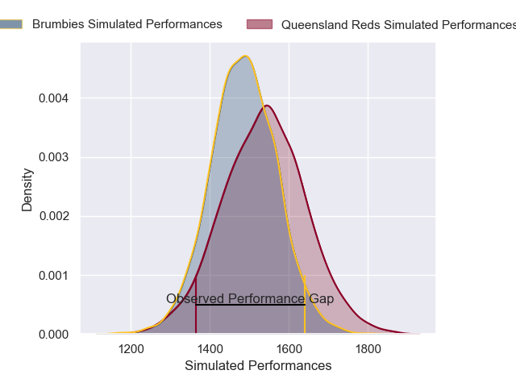
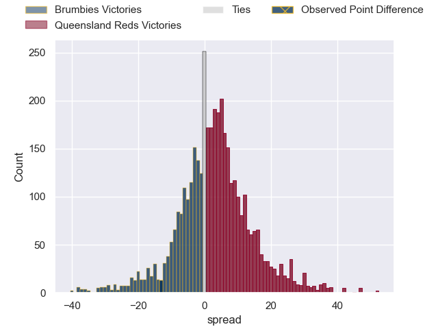
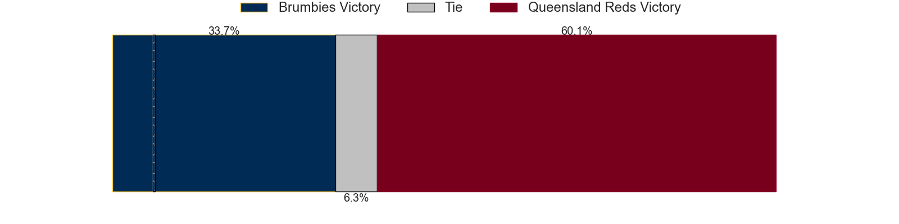
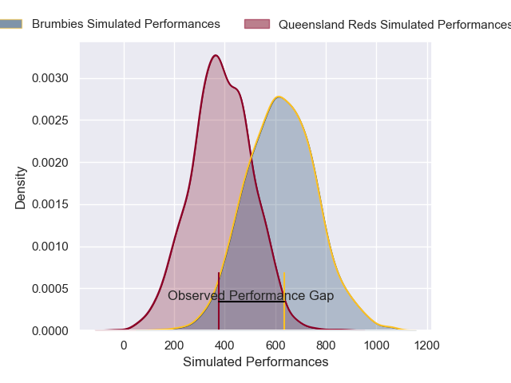
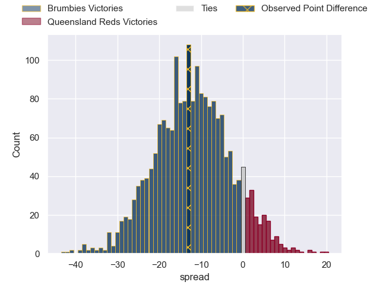

---  
layout: page  
title: Brumbies at Queensland Reds; 39-26  
date: 2025-04-12 18:00:00 -0500  
categories: "Super Rugby Pacific 2025" match review  
---
# Brumbies at Queensland Reds; 39-26

# Club Level Predictions

The first set of predictions treats a club as the smallest object, as the club develops its members, organizes a gameplan, and deploys its players as needed for each match. This club model has a prediction of 0.574, which translates to predicting Queensland Reds to win by 2.7.

Our Over/Under is 49.5 - and combined with the spread above, we have a predicted scoreline of 23 to 26

Each club has a rating and a rating deviation (similar to a Glicko rating), and expected performances can be generated. This allows for simulated matches and spreads like the ones below.
## Projected Performances - Club Model

## Projected Spreads - Club Model

## Projected Results - Club Model

# Player Level Predictions

Treating teams instead as an entity made up of the currently active players, I have ratings for each player in an altogether different system. These can be combined to form team ratings once teamsheets are announced, weighting starters a bit higher than the reserves. After the match is played, players can be weighted by their minutes on the field, allowing for an accurate measure of the team's composition. With these compiled team ratings, we can make predictions, measure inaccuracy, and update the individual player ratings.
## Prediction without Player Minutes: Brumbies by 5.0

Brumbies by 13.2 on a neutral pitch

## Projected Performances - Player Model

## Projected Spreads - Player Model

## Projected Results - Player Model

|   Away Minutes | Away Player         |   Away Percentile |   Number |   Home Percentile | Home Player          |   Home Minutes |
|---------------:|:--------------------|------------------:|---------:|------------------:|:---------------------|---------------:|
|             80 | James Slipper       |             97.73 |        1 |             60.34 | Sef Fa'agase         |             68 |
|             30 | James Slipper       |             97.73 |        1 |             60.34 | Sef Fa'agase         |             68 |
|             59 | James Slipper       |             97.73 |        1 |             60.34 | Sef Fa'agase         |             68 |
|             19 | James Slipper       |             97.73 |        1 |             60.34 | Sef Fa'agase         |             68 |
|             80 | Billy Pollard       |             78.15 |        2 |             70.33 | Matt Faessler        |             80 |
|             76 | Allan Alaalatoa     |             96    |        3 |             75.94 | Zane Nonggorr        |             49 |
|             80 | Nick Frost          |             64.31 |        4 |             21.75 | Josh Canham          |             57 |
|             21 | Tom Hooper          |             77.97 |        5 |              7.53 | Lukhan Salakaia-Loto |             80 |
|             80 | Rob Valetini        |             98.17 |        6 |             49.86 | Seru Uru             |             61 |
|             59 | Rory Scott          |             74.79 |        7 |             94.78 | Fraser McReight      |             40 |
|             23 | Tuaina Taii Tualima |             68.78 |        8 |             40    | Joe Brial            |             80 |
|             24 | Ryan Lonergan       |             83.97 |        9 |             78.63 | Tate McDermott       |             80 |
|             33 | Noah Lolesio        |             86.02 |       10 |             86.42 | Tom Lynagh           |             33 |
|             40 | Corey Toole         |             65.04 |       11 |             17.24 | Tim Ryan             |             26 |
|             26 | David Feliuai       |             34.65 |       12 |             74.9  | Hunter Paisami       |             33 |
|             29 | Len Ikitau          |             80.61 |       13 |             39.96 | Dre Pakeho           |             33 |
|             80 | Andy Muirhead       |             95.41 |       14 |             54.64 | Lachie Anderson      |             32 |
|             50 | Tom Wright          |             77.87 |       15 |             10.66 | Heremaia Murray      |             28 |
|             30 | Lachlan Lonergan    |            nan    |       16 |            nan    | Richie Asiata        |             59 |
|             20 | Blake Schoupp       |             48.98 |       17 |             71.55 | Alex Hodgman         |             48 |
|             15 | Feao Fotuaika       |             68.57 |       18 |             90.83 | Jeff Toomaga-Allen   |             68 |
|             23 | Lachlan Shaw        |            nan    |       19 |             92.29 | Angus Blyth          |             80 |
|              0 | Luke Reimer         |            nan    |       20 |             57.96 | John Bryant          |             62 |
|             33 | Harrison Goddard    |             25.54 |       21 |             81.3  | Kalani Thomas        |             80 |
|             34 | Declan Meredith     |            nan    |       22 |            nan    | Jude Gibbs           |             40 |
|             18 | Ollie Sapsford      |             93.06 |       23 |             77.67 | Jock Campbell        |             16 |

