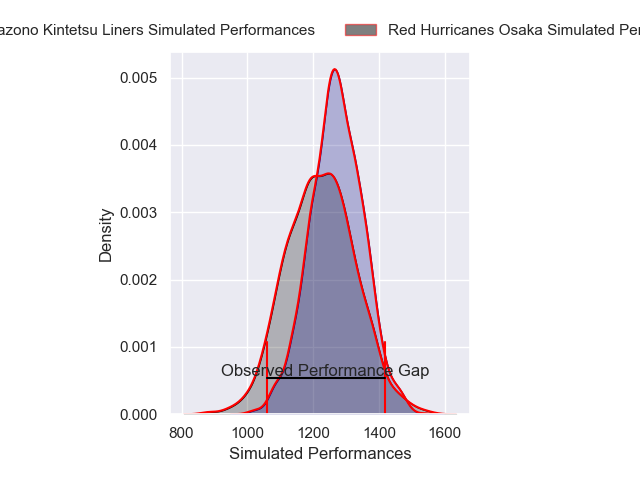
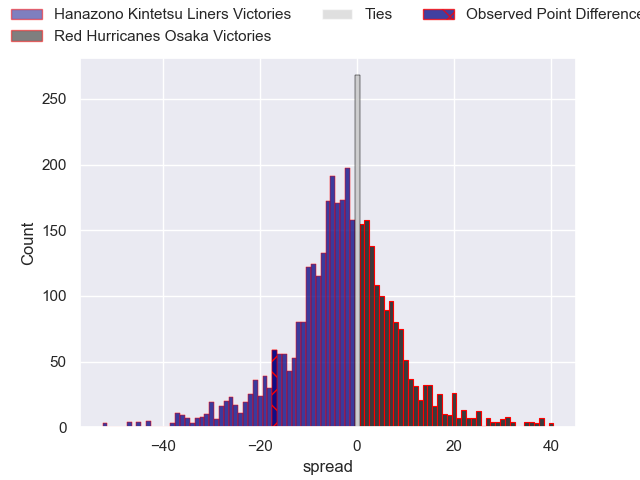
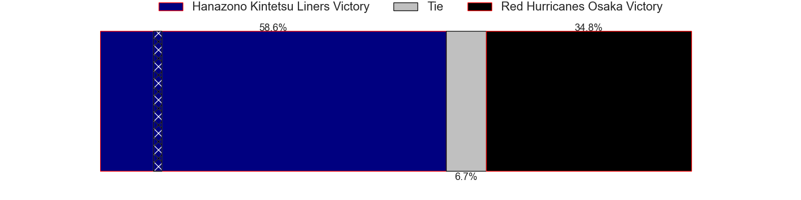
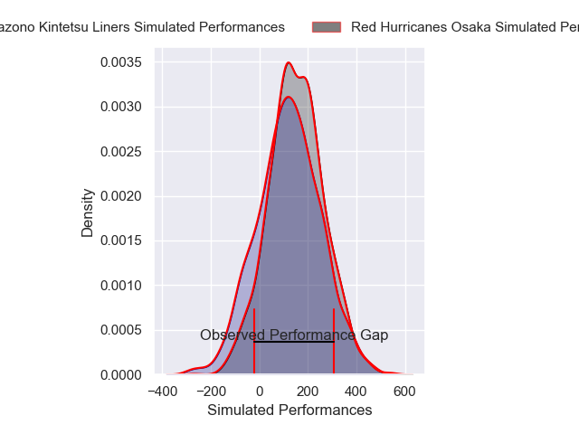
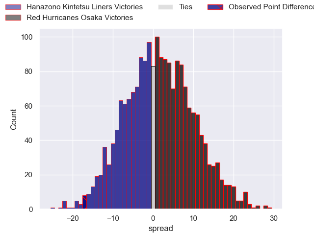
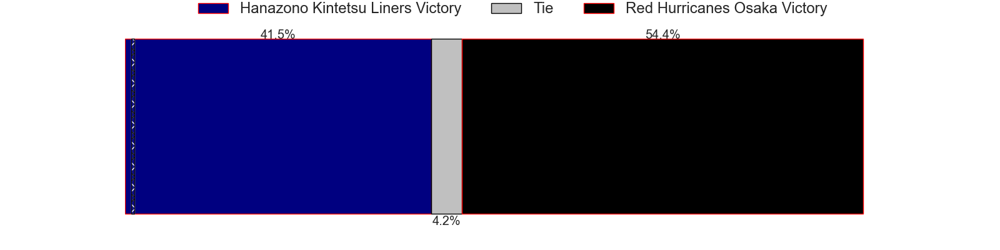

---  
layout: page  
title: Hanazono Kintetsu Liners at Red Hurricanes Osaka; 48-31  
date: 2025-04-12 18:00:00 -0500  
categories: "Japan Rugby League One D2 24/25" match review  
---
# Hanazono Kintetsu Liners at Red Hurricanes Osaka; 48-31

# Club Level Predictions

The first set of predictions treats a club as the smallest object, as the club develops its members, organizes a gameplan, and deploys its players as needed for each match. This club model has a prediction of 0.43, which translates to predicting Hanazono Kintetsu Liners to win by 2.5.

Our Over/Under is 41.5 - and combined with the spread above, we have a predicted scoreline of 22 to 20

Each club has a rating and a rating deviation (similar to a Glicko rating), and expected performances can be generated. This allows for simulated matches and spreads like the ones below.
## Projected Performances - Club Model

## Projected Spreads - Club Model

## Projected Results - Club Model

# Player Level Predictions

Treating teams instead as an entity made up of the currently active players, I have ratings for each player in an altogether different system. These can be combined to form team ratings once teamsheets are announced, weighting starters a bit higher than the reserves. After the match is played, players can be weighted by their minutes on the field, allowing for an accurate measure of the team's composition. With these compiled team ratings, we can make predictions, measure inaccuracy, and update the individual player ratings.
## Prediction without Player Minutes: Hanazono Kintetsu Liners by 0.2

Hanazono Kintetsu Liners by 4.0 on a neutral pitch

## Projected Performances - Player Model

## Projected Spreads - Player Model

## Projected Results - Player Model

|   Away Minutes | Away Player       |   Away Percentile |   Number |   Home Percentile | Home Player          |   Home Minutes |
|---------------:|:------------------|------------------:|---------:|------------------:|:---------------------|---------------:|
|             80 | Shintaro Okamoto  |             81.9  |        1 |              6.35 | Hiromichi Sakamoto   |             56 |
|             80 | Kazuma Matsuda    |             41.63 |        2 |             20.1  | Hisamitsu Shimada    |             80 |
|             62 | Lata Tangimana    |             15.44 |        3 |             41.22 | Munekata Sashida     |              9 |
|             62 | Sam Jeffries      |             97.03 |        4 |              7.9  | Toru Sugishita       |              0 |
|             24 | Sanaila Waqa      |             93.49 |        5 |              9.48 | Tatsunari Fujita     |             28 |
|             30 | Patrick Tafa      |              3.21 |        6 |             47.75 | Isono Kaito          |             40 |
|             16 | Takahito Sugahara |              0.37 |        7 |             79.93 | Blake Gibson         |              5 |
|             35 | Jed Brown         |             14.49 |        8 |             85.1  | Jack O'Sullivan      |             80 |
|             58 | Will Genia        |             91.65 |        9 |              6.51 | Akira Inoue          |             80 |
|             45 | Quade Cooper      |             99.02 |       10 |             43.5  | Fumiya Dobashi       |             50 |
|             72 | Semisi Masirewa   |             16.4  |       11 |              6.09 | Kanta Yamamoto       |             80 |
|             80 | Koji Okamura      |              6.79 |       12 |              2.95 | Mifiposeti Paea      |             80 |
|             67 | Tom Hendrickson   |             61.22 |       13 |             11.02 | Henry Taefu          |             30 |
|              0 | Ryosuke Kataoka   |             60.45 |       14 |             11.9  | Kouki Shigeno        |             21 |
|             25 | Hiroki Kumoyama   |             64.59 |       15 |             42.86 | Taiki Yamaguchi      |             80 |
|             63 | Takehito Ekawa    |             61.67 |       16 |            nan    | Yo Sato              |             24 |
|             80 | Yushi Inoue       |             47.1  |       17 |            nan    | Toshihiro Yamamouchi |             30 |
|             46 | Rintaro Maruyama  |            nan    |       18 |            nan    | Shosuke Fukasawa     |             24 |
|             80 | Kota Mitake       |             19.51 |       19 |            nan    | Masaki Kobayashi     |             24 |
|             42 | Daiki Miyashita   |              5.22 |       20 |            nan    | Kanta Kurahashi      |             80 |
|             80 | Shu Umemura       |            nan    |       21 |            nan    | Yuma Fujino          |             74 |
|             80 | Reiya Ueyama      |             49.44 |       22 |             85.69 | Elliott Stooke       |             63 |
|             80 | Keitaro Hitora    |            nan    |       23 |            nan    | nan                  |            nan |

