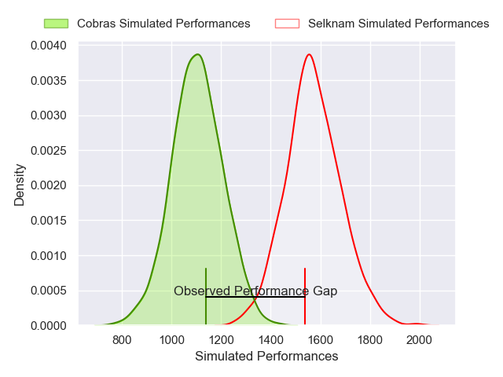
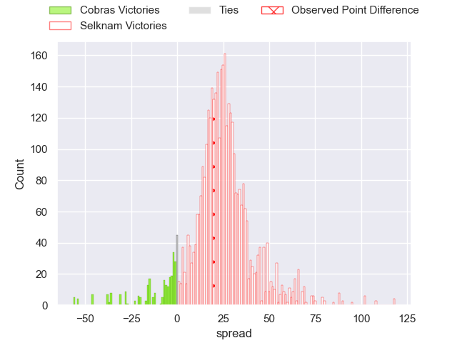
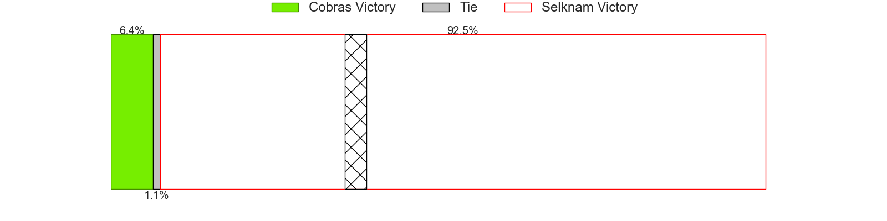
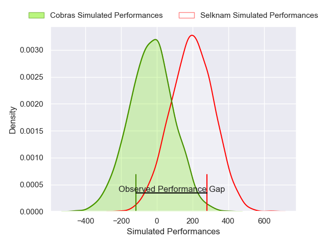
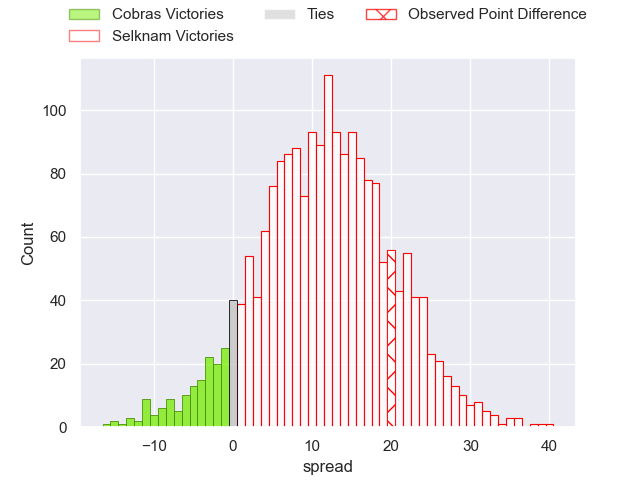
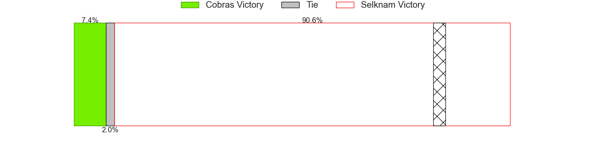

---  
layout: page  
title: Cobras at Selknam; 19-39  
date: 2025-04-12 18:00:00 -0500  
categories: "Super Rugby Americas 2025" match review  
---
# Cobras at Selknam; 19-39

# Club Level Predictions

The first set of predictions treats a club as the smallest object, as the club develops its members, organizes a gameplan, and deploys its players as needed for each match. This club model has a prediction of 0.926, which translates to predicting Selknam to win by 23.1.

Our Over/Under is 59.5 - and combined with the spread above, we have a predicted scoreline of 18 to 42

Each club has a rating and a rating deviation (similar to a Glicko rating), and expected performances can be generated. This allows for simulated matches and spreads like the ones below.
## Projected Performances - Club Model

## Projected Spreads - Club Model

## Projected Results - Club Model

# Player Level Predictions

Treating teams instead as an entity made up of the currently active players, I have ratings for each player in an altogether different system. These can be combined to form team ratings once teamsheets are announced, weighting starters a bit higher than the reserves. After the match is played, players can be weighted by their minutes on the field, allowing for an accurate measure of the team's composition. With these compiled team ratings, we can make predictions, measure inaccuracy, and update the individual player ratings.
## Prediction without Player Minutes: Selknam by 13.2

Selknam by 10.5 on a neutral pitch

## Projected Performances - Player Model

## Projected Spreads - Player Model

## Projected Results - Player Model

|   Away Minutes | Away Player               |   Away Percentile |   Number |   Home Percentile | Home Player             |   Home Minutes |
|---------------:|:--------------------------|------------------:|---------:|------------------:|:------------------------|---------------:|
|             59 | Vicente Galvao            |             36.18 |        1 |             86.18 | Javier Carrasco         |             80 |
|             67 | Endy Willian              |             10.65 |        2 |             62.06 | Salvador Lues Soto      |             53 |
|             51 | Tiago Gonçalves           |             42.49 |        3 |             77.88 | Nahuel Debiassi         |             60 |
|             56 | Adrio Melo                |             45.51 |        4 |             83.19 | Santiago Pedrero Poduje |             53 |
|             80 | Gabriel Paganini          |              1.51 |        5 |              1.04 | Agustin Toth            |             29 |
|             80 | Matheus Claudio           |              6.64 |        6 |             70.37 | Martin Sigren           |             18 |
|             24 | Cleber Dias               |              4.67 |        7 |             60.93 | Raimundo Martinez Amar  |             57 |
|             80 | Andre Arruda              |              3.25 |        8 |             86.38 | Joaquin Milesi          |              9 |
|             43 | Felipe Goncalves Cunha    |             49.32 |        9 |              6.95 | Marcelo Torrealba       |             27 |
|             29 | Thiago Oviedo             |             38.72 |       10 |             74.12 | Juan Cruz Reyes         |             27 |
|             33 | Widson Nascimento         |             36.99 |       11 |             77.04 | Frederico Kennedy       |             52 |
|             29 | Robert Tenorio            |              6.38 |       12 |             64.24 | Tomas Baguley           |             26 |
|              3 | Lorenzo Temer Massari     |             29.48 |       13 |             75.48 | Nicolas Saab            |             74 |
|             80 | Robson Morais             |             11.8  |       14 |             48.7  | Benjamin Videla         |             80 |
|             37 | Lucas Tranquez            |              5.94 |       15 |             59.84 | Tomas Salas Walther     |              9 |
|             29 | Gabriel Oliveira          |             22.29 |       16 |             58.15 | Baltazar Gurruchaga     |             27 |
|             21 | Henrique Ribeiro Ferreira |             15.31 |       17 |             21.8  | Augusto Bohme Alemparte |             29 |
|             21 | Henrique Ribeiro Ferreira |             15.31 |       17 |             21.8  | Augusto Bohme Alemparte |             21 |
|             80 | Manuel Todaro             |             69.81 |       18 |            nan    | Emilio Shea             |             51 |
|             41 | Renato Santos             |            nan    |       19 |             71.29 | Bruno Saez              |             80 |
|             80 | Rodolfo Martins           |             35.77 |       20 |             49.54 | Felipe Mendez           |             51 |
|             60 | Andrei Santana            |             45.63 |       21 |            nan    | Norman Aguayo           |             74 |
|             80 | Aquiles Schulter          |             42.73 |       22 |            nan    | Marco Alvano            |             80 |
|            nan | nan                       |            nan    |       23 |            nan    | Santiago Valenzuela     |             80 |

