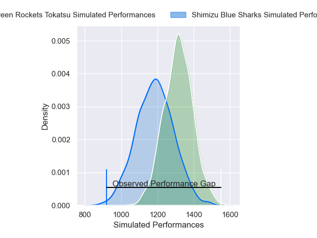
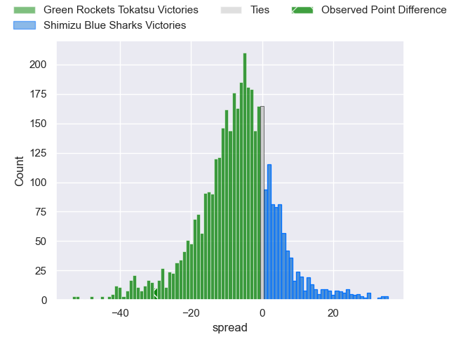
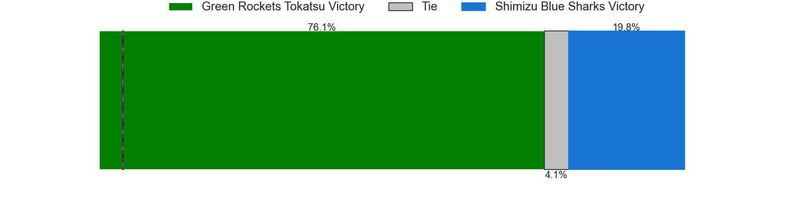
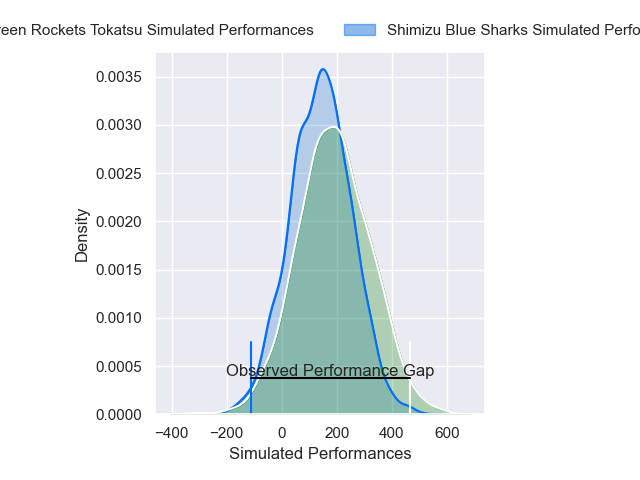
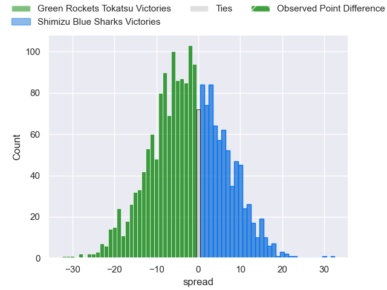
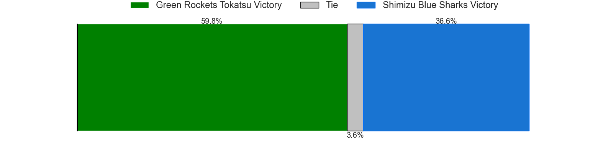

---  
layout: page  
title: Green Rockets Tokatsu at Shimizu Blue Sharks; 45-15  
date: 2025-04-12 18:00:00 -0500  
categories: "Japan Rugby League One D2 24/25" match review  
---
# Green Rockets Tokatsu at Shimizu Blue Sharks; 45-15

# Club Level Predictions

The first set of predictions treats a club as the smallest object, as the club develops its members, organizes a gameplan, and deploys its players as needed for each match. This club model has a prediction of 0.327, which translates to predicting Green Rockets Tokatsu to win by 6.5.

Our Over/Under is 52.5 - and combined with the spread above, we have a predicted scoreline of 30 to 23

Each club has a rating and a rating deviation (similar to a Glicko rating), and expected performances can be generated. This allows for simulated matches and spreads like the ones below.
## Projected Performances - Club Model

## Projected Spreads - Club Model

## Projected Results - Club Model

# Player Level Predictions

Treating teams instead as an entity made up of the currently active players, I have ratings for each player in an altogether different system. These can be combined to form team ratings once teamsheets are announced, weighting starters a bit higher than the reserves. After the match is played, players can be weighted by their minutes on the field, allowing for an accurate measure of the team's composition. With these compiled team ratings, we can make predictions, measure inaccuracy, and update the individual player ratings.
## Prediction without Player Minutes: Green Rockets Tokatsu by 3.1

Green Rockets Tokatsu by 5.8 on a neutral pitch

## Projected Performances - Player Model

## Projected Spreads - Player Model

## Projected Results - Player Model

|   Away Minutes | Away Player              |   Away Percentile |   Number |   Home Percentile | Home Player         |   Home Minutes |
|---------------:|:-------------------------|------------------:|---------:|------------------:|:--------------------|---------------:|
|             80 | Kosei Yamamoto           |             93.26 |        1 |             59.56 | Sanshiro Nomura     |             50 |
|             29 | Ash Dixon                |             98.25 |        2 |             33.01 | Naomichi Tatekawa   |             26 |
|             80 | Keisuke Kikuta           |             93.1  |        3 |             71    | Uha Lee             |             54 |
|             70 | Daiki Yamagiwa           |             80.95 |        4 |             15.15 | Sosiceni Tokoqio    |             12 |
|             80 | Edward Annandale         |             20.72 |        5 |             34.76 | Ed Holmes           |             40 |
|             14 | Geoff Cridge             |             88.82 |        6 |             13.84 | Tetsunori Osaki     |             80 |
|             14 | Ryoi Kamei               |             66.64 |        7 |             25.48 | Josh Basham         |             68 |
|             50 | Mitieli Tuinakauvadra    |             85.71 |        8 |              9.8  | Michael Va'a Toloke |             38 |
|             59 | Tatsuya Fujii            |             22.87 |        9 |             30.38 | Reijiro Usui        |             12 |
|              6 | Rhys Patchell            |             97.83 |       10 |             54.13 | Hayden Cripps       |             21 |
|             80 | Kenta Omata              |             90.35 |       11 |             76.76 | John-Ben Kotze      |             21 |
|             80 | Nathanael Tupou          |             75.79 |       12 |             92.72 | Lima Sopoaga        |             80 |
|             45 | Maritino Nemani          |              5.12 |       13 |             34.06 | Tatsuya Fujioka     |             30 |
|             68 | Teruya Goto              |              7.87 |       14 |             26.71 | Essendon Tuitupou   |             65 |
|             80 | Keagan Faria             |             67.2  |       15 |             68.01 | Coenie van Wyk      |             40 |
|             51 | Ren Osawa                |             33.49 |       16 |             14.39 | Ryo Sato            |             45 |
|             80 | Suliasi Tolu             |            nan    |       17 |             18.21 | Terrence Hepetema   |             66 |
|             80 | Sera Hwang               |            nan    |       18 |             12.6  | Kaito Tamori        |             55 |
|             30 | Shinnosuke Tafotikau Oka |            nan    |       19 |            nan    | Koudai Takahashi    |             80 |
|             68 | Viliami Lutua Ahofono    |             81.21 |       20 |             48.21 | Koyo Adachi         |             20 |
|             54 | Koichi Matsura           |            nan    |       21 |            nan    | Jui Nakamori        |             80 |
|             15 | Ko Yoshimura             |             46.46 |       22 |              6.89 | Soichiro Kuwata     |             80 |
|             58 | Danjalo Ahsui            |            nan    |       23 |            nan    | Daiki Shimura       |             80 |

