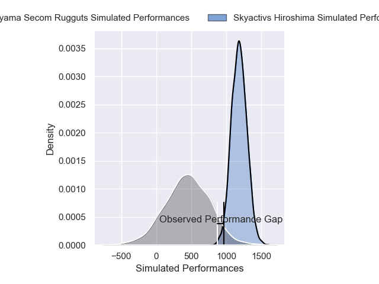
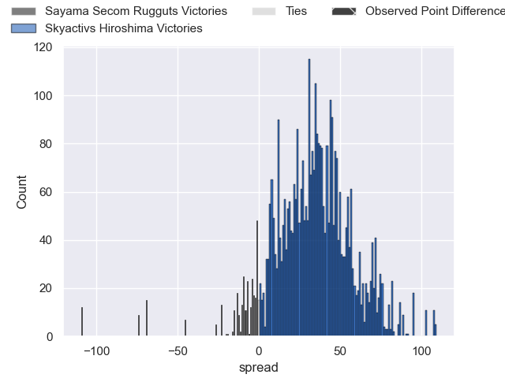
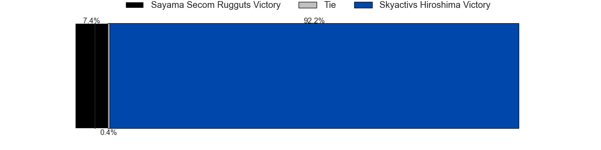
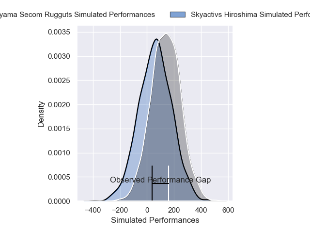
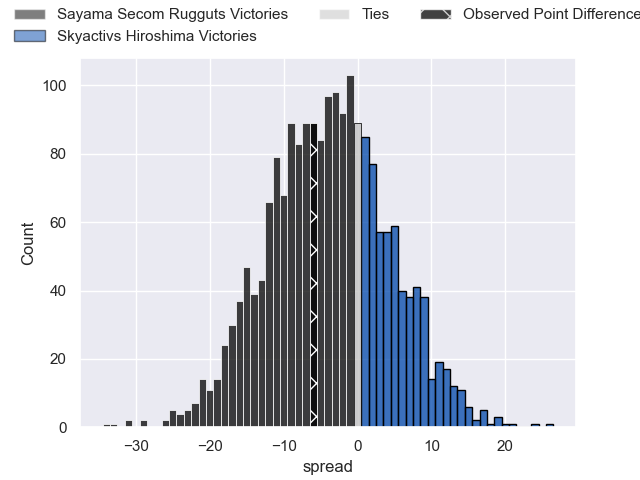
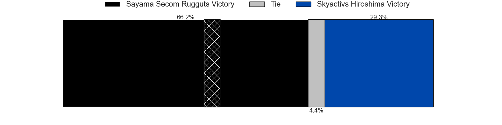

---  
layout: page  
title: Sayama Secom Rugguts at Skyactivs Hiroshima; 41-35  
date: 2025-04-12 18:00:00 -0500  
categories: "Japan Rugby League One D3 24/25" match review  
---
# Sayama Secom Rugguts at Skyactivs Hiroshima; 41-35

# Club Level Predictions

The first set of predictions treats a club as the smallest object, as the club develops its members, organizes a gameplan, and deploys its players as needed for each match. This club model has a prediction of 0.951, which translates to predicting Skyactivs Hiroshima to win by 36.7.

Our Over/Under is 38.5 - and combined with the spread above, we have a predicted scoreline of 1 to 37

Each club has a rating and a rating deviation (similar to a Glicko rating), and expected performances can be generated. This allows for simulated matches and spreads like the ones below.
## Projected Performances - Club Model

## Projected Spreads - Club Model

## Projected Results - Club Model

# Player Level Predictions

Treating teams instead as an entity made up of the currently active players, I have ratings for each player in an altogether different system. These can be combined to form team ratings once teamsheets are announced, weighting starters a bit higher than the reserves. After the match is played, players can be weighted by their minutes on the field, allowing for an accurate measure of the team's composition. With these compiled team ratings, we can make predictions, measure inaccuracy, and update the individual player ratings.
## Prediction without Player Minutes: Sayama Secom Rugguts by 7.9

Sayama Secom Rugguts by 10.6 on a neutral pitch

## Projected Performances - Player Model

## Projected Spreads - Player Model

## Projected Results - Player Model

|   Away Minutes | Away Player      |   Away Percentile |   Number |   Home Percentile | Home Player        |   Home Minutes |
|---------------:|:-----------------|------------------:|---------:|------------------:|:-------------------|---------------:|
|             80 | Kentaro Ueno     |             57.37 |        1 |              5.64 | Koshi Kato         |             59 |
|             80 | Tatsuki Tanina   |             65.71 |        2 |             85.49 | Yusuke Kitabayashi |             27 |
|             40 | Naoto Shirakawa  |             51.02 |        3 |              5.8  | Tomoya Otake       |             80 |
|             38 | Cory Hill        |             98.98 |        4 |             82.43 | Tye Nash           |             66 |
|             40 | Troy Callander   |             83.92 |        5 |             28.16 | Andrew Davidson    |             80 |
|             40 | Ash Parker       |              7.7  |        6 |             66.82 | Jackson Pugh       |             80 |
|             15 | Koki Iida        |             64.62 |        7 |              1.83 | Tomoki Ashida      |             80 |
|              0 | Whetu Douglas    |             73.27 |        8 |              6.53 | Tevin Ferris       |             14 |
|             70 | Rikuya Takashima |             63.44 |        9 |             45.41 | Taiyo Fukuyama     |             44 |
|              4 | Shota Kutsuna    |             57.68 |       10 |             69.69 | Issen Kano         |             42 |
|             60 | Musashi Matsuda  |             46.02 |       11 |             13.4  | Hayato Kanamuru    |             47 |
|             10 | Chase Tiatia     |             80.81 |       12 |              5.91 | Clinton Knox       |             74 |
|             50 | Fisipuna Tuiaki  |             25.1  |       13 |             81.2  | Jacob Abel         |             27 |
|             26 | Yushi Okuda      |             56.42 |       14 |             12.46 | Yuto Nakamura      |             27 |
|             17 | Yudai Ishii      |             43.86 |       15 |              0.2  | Ginjiro Sakiguchi  |             80 |
|             34 | Haruya Nakasu    |             42.22 |       16 |            nan    | Ryoto Tomita       |             80 |
|             12 | Eito Tsutsumi    |            nan    |       17 |            nan    | Tomohiro Takeda    |             57 |
|             29 | Toshiki Sato     |            nan    |       18 |             79.47 | Tadatsugu Kanayama |              0 |
|             61 | Makoto Kurata    |            nan    |       19 |             28.84 | Kaito Sasaoka      |             45 |
|             61 | Itsuki Fujii     |             44.89 |       20 |             62.64 | Yutaro Tanaka      |             80 |
|             76 | Shota Okuno      |            nan    |       21 |             85.04 | Hitaka Inoue       |             54 |
|             80 | Yosuke Okuma     |            nan    |       22 |             89.32 | Syoya Maeda        |             80 |
|             66 | Kento Mizutani   |            nan    |       23 |             83.41 | Iori Suzuki        |             19 |

