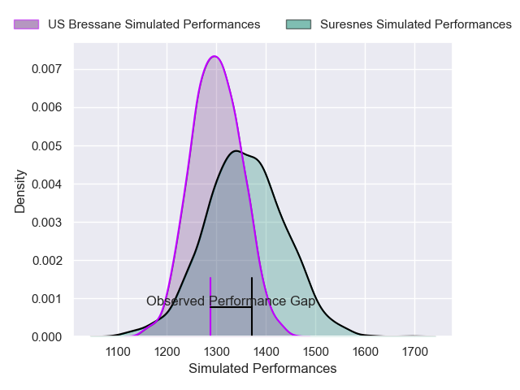
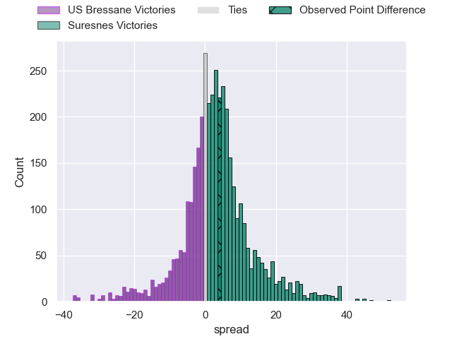
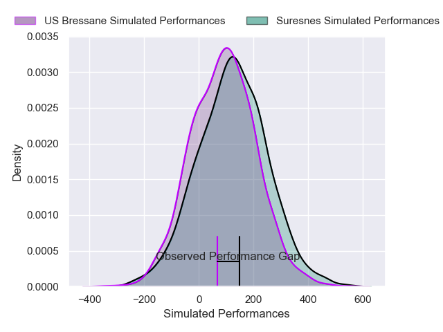
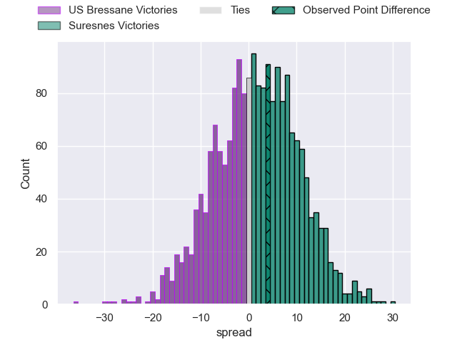

---  
layout: page  
title: US Bressane at Suresnes; 21-25  
date: 2025-04-12 18:00:00 -0500  
categories: "Nationale 24/25" match review  
---
# US Bressane at Suresnes; 21-25

# Club Level Predictions

The first set of predictions treats a club as the smallest object, as the club develops its members, organizes a gameplan, and deploys its players as needed for each match. This club model has a prediction of 0.581, which translates to predicting Suresnes to win by 2.9.

Our Over/Under is 43.5 - and combined with the spread above, we have a predicted scoreline of 20 to 23

Each club has a rating and a rating deviation (similar to a Glicko rating), and expected performances can be generated. This allows for simulated matches and spreads like the ones below.
## Projected Performances - Club Model

## Projected Spreads - Club Model

## Projected Results - Club Model

# Player Level Predictions

Treating teams instead as an entity made up of the currently active players, I have ratings for each player in an altogether different system. These can be combined to form team ratings once teamsheets are announced, weighting starters a bit higher than the reserves. After the match is played, players can be weighted by their minutes on the field, allowing for an accurate measure of the team's composition. With these compiled team ratings, we can make predictions, measure inaccuracy, and update the individual player ratings.
## Prediction without Player Minutes: Suresnes by 0.2

US Bressane by 3.3 on a neutral pitch

## Projected Performances - Player Model

## Projected Spreads - Player Model

## Projected Results - Player Model

|   Away Minutes | Away Player          |   Away Percentile |   Number |   Home Percentile | Home Player             |   Home Minutes |
|---------------:|:---------------------|------------------:|---------:|------------------:|:------------------------|---------------:|
|             52 | Erich de Jager       |             51.76 |        1 |             68.21 | Elias Coulibaly         |             80 |
|             28 | Arnaud Feltrin       |             13.98 |        2 |             29.95 | Antoine Marty-Rybak     |              0 |
|             54 | Vazha Kapanadze      |             39.14 |        3 |             17.33 | Guiterembi Vickos       |              0 |
|             80 | Quentin Witt         |             12.18 |        4 |             53.73 | Leo Vallee              |             80 |
|             78 | Josh Peters          |              6.14 |        5 |             23.32 | Yakine Mohamed Djebarri |             50 |
|             62 | Nail Ait Naceur      |             73.74 |        6 |             72.62 | Jean-Baptiste Lachaise  |             80 |
|             42 | Pierre Reynaud       |             71.4  |        7 |              9.16 | Florian Desbordes       |             65 |
|             35 | Loic Baradel         |             86.99 |        8 |             69.31 | Lakisipone Lee          |             80 |
|             59 | Jeremie Martin       |             55.25 |        9 |             16.1  | Théo Bachiri            |             71 |
|             61 | Aaron Stafford       |             28.99 |       10 |             55.28 | Jean Chezeau            |             80 |
|             50 | Élie De Fleurian     |             20.07 |       11 |             90.43 | Faraj Fartass           |             80 |
|             20 | Maxime Vacquier      |             38.91 |       12 |              2.03 | JJ Taulagi              |             59 |
|             39 | Joe Margetts         |             50.15 |       13 |             73.86 | Victor Barnier          |             30 |
|             40 | Alexandre Badet      |             21.84 |       14 |              6.97 | Yohan Fournier          |             13 |
|             80 | Florent Massip       |             80.33 |       15 |              5.33 | Thomas Baudy            |             78 |
|              0 | Louis Dasalmartini   |             25.79 |       16 |            nan    | Anthime Gobeaux         |             80 |
|             80 | Lucas Lyons          |             87.94 |       17 |             36.02 | Nail Audoire            |             45 |
|             26 | Nathan Azais         |             22.75 |       18 |             24.42 | Gauthier Wolf           |             61 |
|             80 | Teo Bordenave        |             56.71 |       19 |             49.07 | Tanguy Lacoste          |             80 |
|             80 | Atonio Ulutuipalelei |             15.58 |       20 |             50.24 | Yanis Trabelsi          |             48 |
|             31 | Jeremy Valencot      |             80.85 |       21 |            nan    | nan                     |            nan |
|             15 | Grégoire Demangel    |            nan    |       22 |            nan    | nan                     |            nan |
|             32 | Jules Margarit       |             31.15 |       23 |            nan    | nan                     |            nan |

