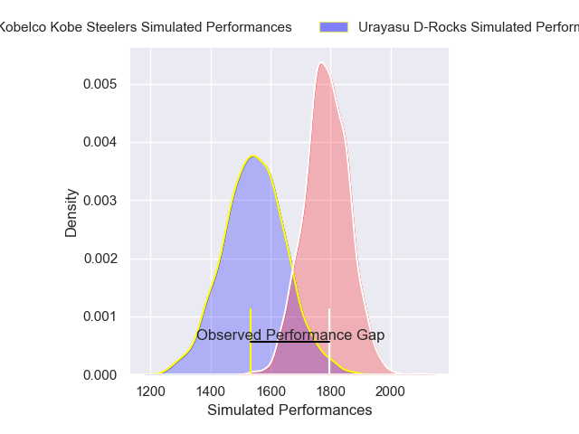
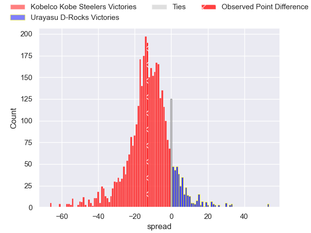
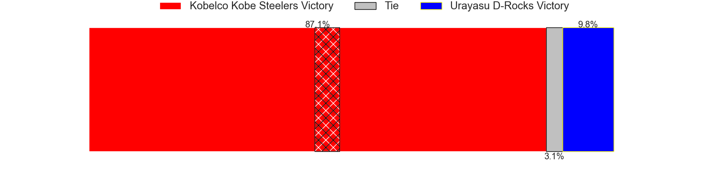
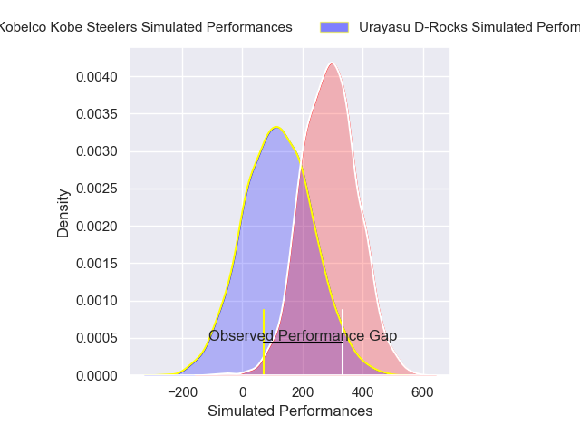
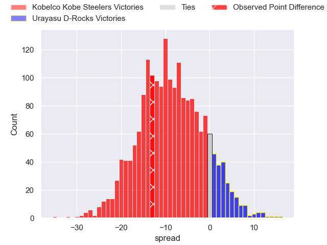
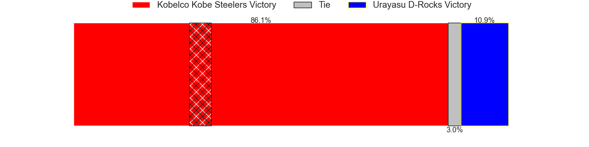

---  
layout: page  
title: Kobelco Kobe Steelers at Urayasu D-Rocks; 33-20  
date: 2025-04-12 18:00:00 -0500  
categories: "Japan Rugby League One 24/25" match review  
---
# Kobelco Kobe Steelers at Urayasu D-Rocks; 33-20

# Club Level Predictions

The first set of predictions treats a club as the smallest object, as the club develops its members, organizes a gameplan, and deploys its players as needed for each match. This club model has a prediction of 0.212, which translates to predicting Kobelco Kobe Steelers to win by 11.7.

Our Over/Under is 65.5 - and combined with the spread above, we have a predicted scoreline of 38 to 27

Each club has a rating and a rating deviation (similar to a Glicko rating), and expected performances can be generated. This allows for simulated matches and spreads like the ones below.
## Projected Performances - Club Model

## Projected Spreads - Club Model

## Projected Results - Club Model

# Player Level Predictions

Treating teams instead as an entity made up of the currently active players, I have ratings for each player in an altogether different system. These can be combined to form team ratings once teamsheets are announced, weighting starters a bit higher than the reserves. After the match is played, players can be weighted by their minutes on the field, allowing for an accurate measure of the team's composition. With these compiled team ratings, we can make predictions, measure inaccuracy, and update the individual player ratings.
## Prediction without Player Minutes: Kobelco Kobe Steelers by 10.3

Kobelco Kobe Steelers by 14.5 on a neutral pitch

## Projected Performances - Player Model

## Projected Spreads - Player Model

## Projected Results - Player Model

|   Away Minutes | Away Player          |   Away Percentile |   Number |   Home Percentile | Home Player          |   Home Minutes |
|---------------:|:---------------------|------------------:|---------:|------------------:|:---------------------|---------------:|
|           80   | Shigure Takao        |             74.2  |        1 |              4.07 | Hidetomo Nabeshima   |             62 |
|           28   | George Turner        |             99.67 |        2 |             62.4  | Shokei Kin           |             80 |
|           28   | Hiroshi Yamashita    |             97.2  |        3 |             53.19 | Kim Ryom             |             28 |
|           15   | Gerard Cowley-Tuioti |             88.76 |        4 |             48.25 | Uwe Helu             |             11 |
|           63   | Brodie Retallick     |            100    |        5 |             71.1  | Lourens Erasmus      |             18 |
|           21   | Tiennan Costley      |             82.52 |        6 |             76.92 | Tom Parsons          |             12 |
|           80   | Solomone Funaki      |             63.18 |        7 |             27.48 | Tetta Shigemitsu     |             15 |
|           78   | Amanaki Saumaki      |             74.8  |        8 |             92.28 | Tone Tukufuka        |             15 |
|           25   | Atsushi Hiwasa       |             91.69 |        9 |             30    | Ren Iinuma           |             80 |
|           25   | Bryn Gatland         |             94    |       10 |             57.14 | Otere Black          |             80 |
|           24   | Kenta Matsunaga      |             75.09 |       11 |             86.06 | Takuhei Yasuda       |             80 |
|           16   | Seungsin Lee         |              3.75 |       12 |             96.05 | Samu Kerevi          |              0 |
|           22.5 | Michael Little       |             79.33 |       13 |             19.96 | Shane Gates          |             52 |
|           46   | Ataata Moeakiola     |             51.67 |       14 |             57.71 | Soma Matsumoto       |             46 |
|           52   | Rakuhei Yamashita    |             95.08 |       15 |             11.89 | Israel Folau         |             34 |
|           21   | Kenta Matsuoka       |             72.38 |       16 |             81.78 | Yu Tamura            |             25 |
|           17   | Kauvaka Kaivelata    |             53.75 |       17 |              5.91 | Shuhei Takeuchi      |             60 |
|           30   | Koo Ji-won           |              5.03 |       18 |            nan    | Sekonaia Pole        |             20 |
|           52   | Waisake Raratubua    |             83.54 |       19 |            nan    | Junichiro Matsushita |             80 |
|           35   | Timothy Lafaele      |             60.49 |       20 |            nan    | James Moore          |             80 |
|            2   | Kazuma Ueda          |            nan    |       21 |             90.46 | Shingo Nakashima     |             67 |
|           34   | Itsuki Kamimura      |             36.44 |       22 |            nan    | Brody MacAskill      |             80 |
|           28   | Willie Potgieter     |             35.79 |       23 |              1.19 | Norifumi Hashimoto   |             80 |

