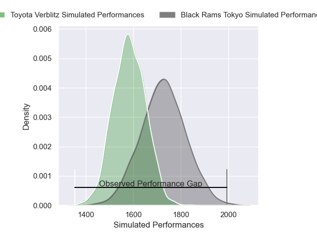
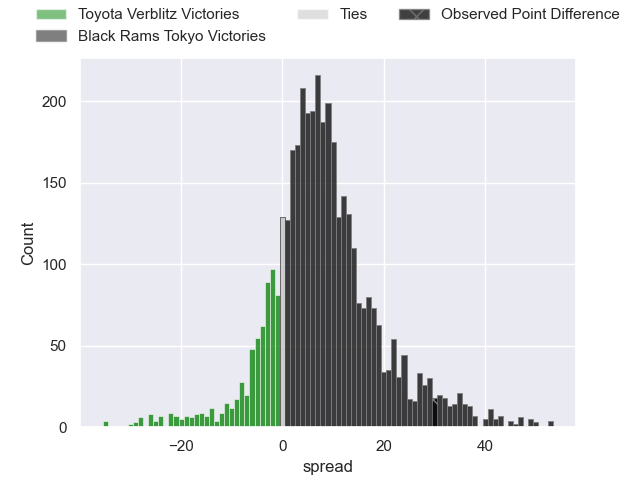
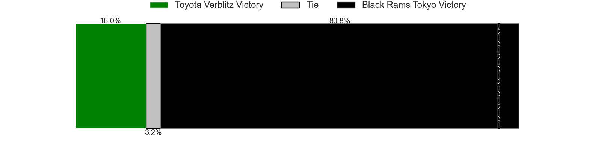
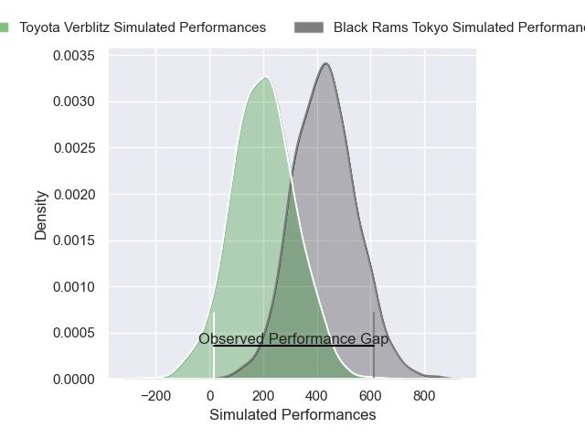
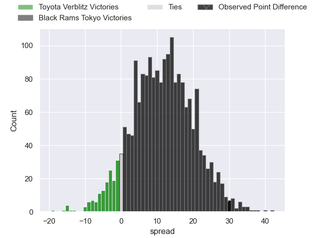
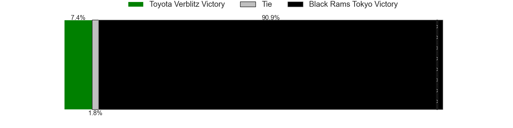

---  
layout: page  
title: Toyota Verblitz at Black Rams Tokyo; 7-37  
date: 2025-04-13 18:00:00 -0500  
categories: "Japan Rugby League One 24/25" match review  
---
# Toyota Verblitz at Black Rams Tokyo; 7-37

# Club Level Predictions

The first set of predictions treats a club as the smallest object, as the club develops its members, organizes a gameplan, and deploys its players as needed for each match. This club model has a prediction of 0.694, which translates to predicting Black Rams Tokyo to win by 7.3.

Our Over/Under is 57.5 - and combined with the spread above, we have a predicted scoreline of 25 to 32

Each club has a rating and a rating deviation (similar to a Glicko rating), and expected performances can be generated. This allows for simulated matches and spreads like the ones below.
## Projected Performances - Club Model

## Projected Spreads - Club Model

## Projected Results - Club Model

# Player Level Predictions

Treating teams instead as an entity made up of the currently active players, I have ratings for each player in an altogether different system. These can be combined to form team ratings once teamsheets are announced, weighting starters a bit higher than the reserves. After the match is played, players can be weighted by their minutes on the field, allowing for an accurate measure of the team's composition. With these compiled team ratings, we can make predictions, measure inaccuracy, and update the individual player ratings.
## Prediction without Player Minutes: Black Rams Tokyo by 4.0

Toyota Verblitz by 0.2 on a neutral pitch

## Projected Performances - Player Model

## Projected Spreads - Player Model

## Projected Results - Player Model

|   Away Minutes | Away Player         |   Away Percentile |   Number |   Home Percentile | Home Player       |   Home Minutes |
|---------------:|:--------------------|------------------:|---------:|------------------:|:------------------|---------------:|
|             23 | Shogo Miura         |             84.87 |        1 |             39.5  | Taishi Tsumura    |       26       |
|             10 | Yoshikatsu Hikosaka |             88.2  |        2 |             70.81 | Shin Ouchi        |       80       |
|             26 | Yusuke Kizu         |             67.16 |        3 |             98.98 | Paddy Ryan        |       76       |
|             26 | Yusuke Kizu         |             67.16 |        3 |             98.98 | Paddy Ryan        |       48       |
|             26 | Yusuke Kizu         |             67.16 |        3 |             98.98 | Paddy Ryan        |       52       |
|             20 | Josh Dickson        |             25.28 |        4 |              2.51 | Mike Stolberg     |       13       |
|             80 | Daichi Akiyama      |             54.18 |        5 |             29.46 | Harrison Fox      |       26       |
|             67 | Keito Aoki          |             26.76 |        6 |             53.16 | Brodi McCurran    |       13       |
|             80 | Michael Hooper      |             99.45 |        7 |             78.37 | Liam Gill         |       54       |
|             80 | Kazuki Himeno       |             62.86 |        8 |              5.92 | Amato Fakatava    |       80       |
|             80 | Aaron Smith         |             95.49 |        9 |             96.99 | TJ Perenara       |       48       |
|             25 | Shinya Komura       |             25.98 |       10 |             29.92 | Ichigo Nakakusu   |       26       |
|             24 | Viliame Tuidraki    |             84.82 |       11 |             44.52 | Semisi Tupou      |       16       |
|             80 | Dick Wilson         |             11.22 |       12 |             49.02 | Yuki Ikeda        |        9.33333 |
|             66 | Siosaia Fifita      |              0.69 |       13 |             40.55 | Penieli Jr Latu   |       70       |
|             80 | Joseph Manu         |              9    |       14 |             63.26 | Taira Main        |       65       |
|             80 | Taichi Takahashi    |             81.89 |       15 |             29.18 | Kotaro Ito        |       19       |
|             22 | Ryunosuke Momoji    |             15.52 |       16 |             59.97 | Masaaki Onishi    |       24       |
|             34 | Ryusei Kato         |             47.37 |       17 |             73.24 | Isaac Lucas       |        0       |
|             54 | Shunsuke Asaoka     |             27.74 |       18 |             47.02 | Kazuma Nishi      |       80       |
|             30 | Adre Smith          |             59.94 |       19 |             65.45 | Ryohei Isoda      |       80       |
|             26 | Kaito Shigeno       |             33.22 |       20 |             69.66 | Shuhei Matsuhashi |       80       |
|             65 | Matt McGahan        |             72.64 |       21 |            nan    | Daigo Sasagawa    |       26       |
|             14 | Akito Okui          |             22.04 |       22 |             54.37 | Reijiro Yamamoto  |       17       |
|             34 | Yuki Okada          |             90.06 |       23 |             67.95 | Toshiya Takahashi |       40       |

