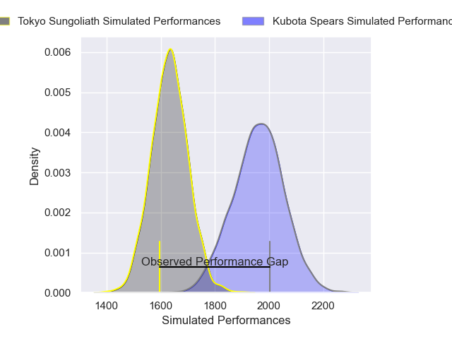
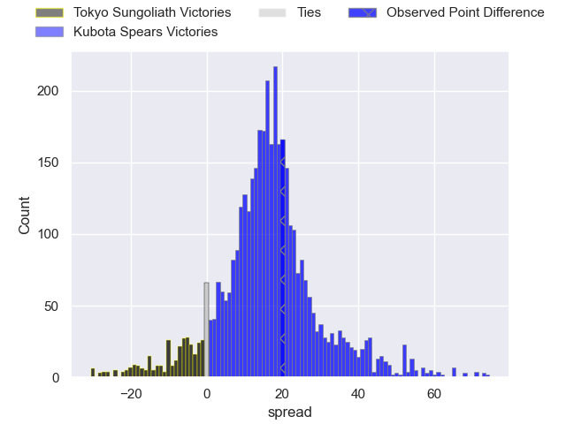
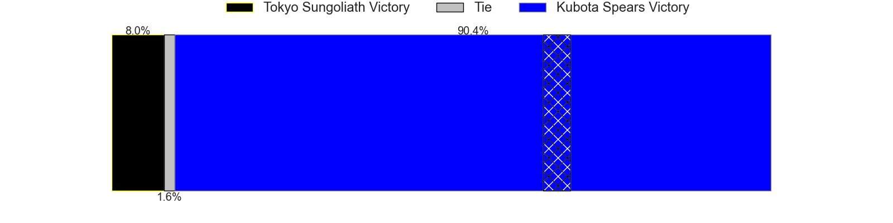
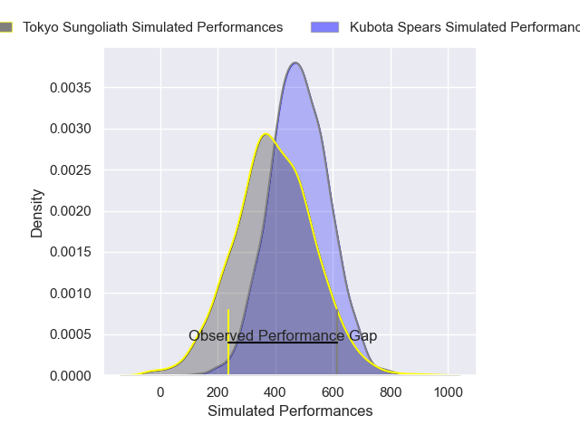
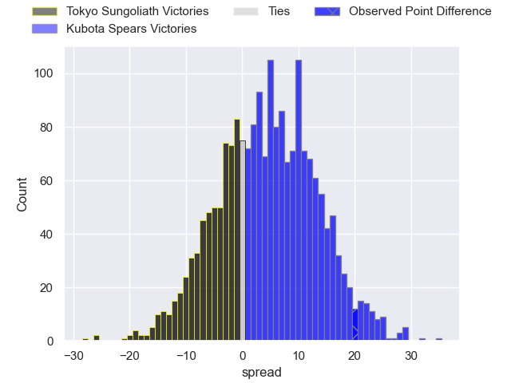
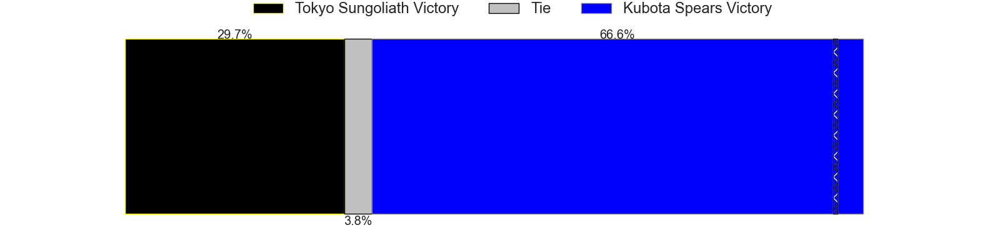

---  
layout: page  
title: Tokyo Sungoliath at Kubota Spears; 10-30  
date: 2025-04-13 18:00:00 -0500  
categories: "Japan Rugby League One 24/25" match review  
---
# Tokyo Sungoliath at Kubota Spears; 10-30

# Club Level Predictions

The first set of predictions treats a club as the smallest object, as the club develops its members, organizes a gameplan, and deploys its players as needed for each match. This club model has a prediction of 0.864, which translates to predicting Kubota Spears to win by 16.4.

Our Over/Under is 61.5 - and combined with the spread above, we have a predicted scoreline of 23 to 39

Each club has a rating and a rating deviation (similar to a Glicko rating), and expected performances can be generated. This allows for simulated matches and spreads like the ones below.
## Projected Performances - Club Model

## Projected Spreads - Club Model

## Projected Results - Club Model

# Player Level Predictions

Treating teams instead as an entity made up of the currently active players, I have ratings for each player in an altogether different system. These can be combined to form team ratings once teamsheets are announced, weighting starters a bit higher than the reserves. After the match is played, players can be weighted by their minutes on the field, allowing for an accurate measure of the team's composition. With these compiled team ratings, we can make predictions, measure inaccuracy, and update the individual player ratings.
## Prediction without Player Minutes: Kubota Spears by 12.7

Kubota Spears by 8.5 on a neutral pitch

## Projected Performances - Player Model

## Projected Spreads - Player Model

## Projected Results - Player Model

|   Away Minutes | Away Player       |   Away Percentile |   Number |   Home Percentile | Home Player         |   Home Minutes |
|---------------:|:------------------|------------------:|---------:|------------------:|:--------------------|---------------:|
|             25 | Kenta Kobayashi   |             67.65 |        1 |             82.11 | Yota Kamimori       |             55 |
|             80 | Kosuke Horikoshi  |             46.42 |        2 |            100    | Malcolm Marx        |             80 |
|             55 | Kan Nakano        |             15.73 |        3 |             94.73 | Opeti Helu          |             40 |
|             80 | Sam Jeffries      |             94.9  |        4 |             66.48 | David Van Zeeland   |             54 |
|             80 | Harry Hockings    |             98.39 |        5 |             89.71 | David Bulbring      |              0 |
|             80 | Kanji Shimokawa   |             73.55 |        6 |             98.79 | Tyler Paul          |             55 |
|             42 | Sam Cane          |             98.22 |        7 |             94.67 | Takeo Suenaga       |              4 |
|             38 | Ryuga Hashimoto   |             57.52 |        8 |             88.01 | Faulua Makisi       |             80 |
|             75 | Yutaka Nagare     |             59.32 |        9 |             86.61 | Shinobu Fujiwara    |             80 |
|             80 | Mikiya Takamoto   |             51.76 |       10 |            100    | Bernard Foley       |             40 |
|             61 | Cheslin Kolbe     |             99.44 |       11 |             93.96 | Koga Nezuka         |             50 |
|             80 | Shogo Nakano      |              6.79 |       12 |             90.07 | Harumichi Tatekawa  |             11 |
|             47 | Isaiah Punivai    |             40.93 |       13 |             63.22 | Rikus Pretorius     |             17 |
|             58 | Seiya Ozaki       |             90.8  |       14 |             90.06 | Halatoa Vailea      |             58 |
|             80 | Ryosuke Kawase    |             14.55 |       15 |             79.1  | Atsushi Oshikawa    |             52 |
|             17 | Kenta Fukuda      |             71.53 |       16 |             75.7  | Merwe Olivier       |             18 |
|             69 | Kotaro Matsushima |             95.7  |       17 |             94.39 | Lappies Labuschagne |             33 |
|             40 | Sione Lavemai     |             78.66 |       18 |             87.85 | Finau Tupa          |             22 |
|             21 | Ryoto Nakamura    |             93.01 |       19 |             93.69 | Kota Kaishi         |             50 |
|             80 | Yukio Morikawa    |             92.17 |       20 |             79.7  | Hayate Era          |             12 |
|             80 | Trevor Hosea      |             27.38 |       21 |             96.78 | Bryn Hall           |             60 |
|             30 | Kotaro Hosoki     |             37.94 |       22 |            nan    | Esi Sword           |             60 |
|             70 | Tatsuya Miyazaki  |             18.14 |       23 |             69    | Yuya Hirose         |             80 |

