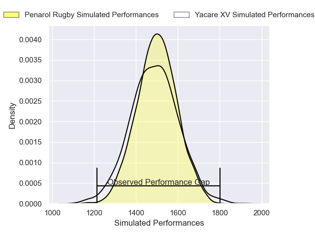
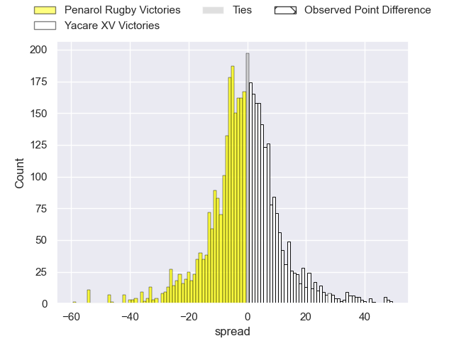
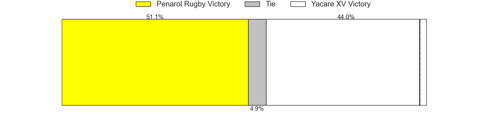
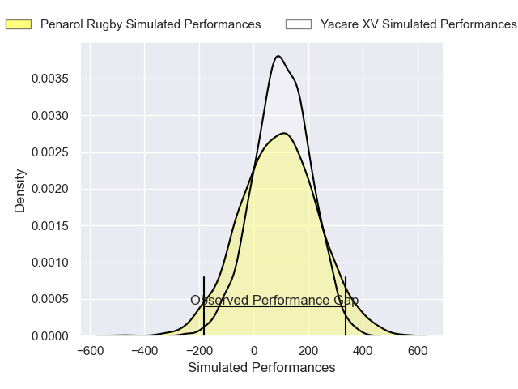
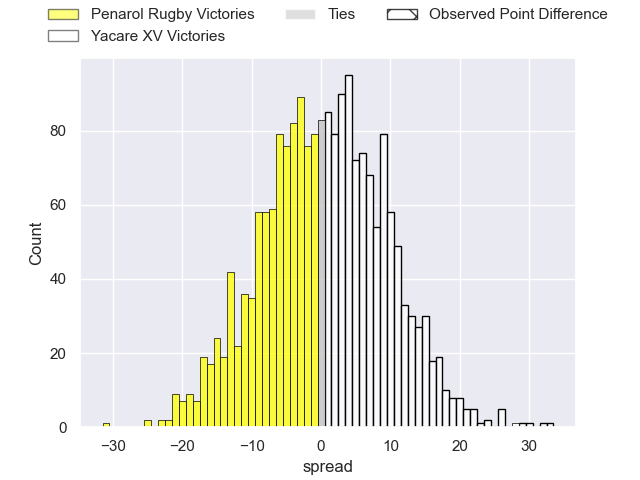

---  
layout: page  
title: Penarol Rugby at Yacare XV; 8-36  
date: 2025-04-13 18:00:00 -0500  
categories: "Super Rugby Americas 2025" match review  
---
# Penarol Rugby at Yacare XV; 8-36

# Club Level Predictions

The first set of predictions treats a club as the smallest object, as the club develops its members, organizes a gameplan, and deploys its players as needed for each match. This club model has a prediction of 0.488, which translates to predicting Penarol Rugby to win by 0.4.

Our Over/Under is 60.5 - and combined with the spread above, we have a predicted scoreline of 31 to 30

Each club has a rating and a rating deviation (similar to a Glicko rating), and expected performances can be generated. This allows for simulated matches and spreads like the ones below.
## Projected Performances - Club Model

## Projected Spreads - Club Model

## Projected Results - Club Model

# Player Level Predictions

Treating teams instead as an entity made up of the currently active players, I have ratings for each player in an altogether different system. These can be combined to form team ratings once teamsheets are announced, weighting starters a bit higher than the reserves. After the match is played, players can be weighted by their minutes on the field, allowing for an accurate measure of the team's composition. With these compiled team ratings, we can make predictions, measure inaccuracy, and update the individual player ratings.
## Prediction without Player Minutes: Yacare XV by 3.7

Yacare XV by 1.4 on a neutral pitch

## Projected Performances - Player Model

## Projected Spreads - Player Model

## Projected Results - Player Model

|   Away Minutes | Away Player                     |   Away Percentile |   Number |   Home Percentile | Home Player                      |   Home Minutes |
|---------------:|:--------------------------------|------------------:|---------:|------------------:|:---------------------------------|---------------:|
|              0 | Mateo Perillo                   |             59.09 |        1 |             74.22 | Mariano Muntaner                 |             25 |
|             20 | Mateo Sanguinetti               |              1.12 |        2 |             14.19 | Axel Zapata                      |             30 |
|             80 | Juan Francisco Aguirre Gallardo |             28.61 |        3 |             36.6  | Luis Enrique Quinteros           |             56 |
|             80 | Felipe Aliaga                   |             31.88 |        4 |             11.8  | Mariano Garcete Elli             |              0 |
|             80 | Manuel Rosmarino                |             21    |        5 |             99.26 | Lucas Sommer                     |             30 |
|             80 | Santiago Civetta                |             22.91 |        6 |              8.16 | Ariel Nunez Lesme                |             57 |
|             34 | Lucas Bianchi                   |             60.22 |        7 |              6.42 | Felipe Puertas                   |             55 |
|             50 | Manuel Diana                    |              3.27 |        8 |             93.06 | Santiago Ruiz                    |             59 |
|             80 | Santiago Alvarez                |             41.07 |        9 |             10.35 | Juan Cruz Strada                 |             14 |
|             80 | Felipe Etcheverry               |             21.06 |       10 |             93.31 | Joaquin Lamas                    |             55 |
|             55 | Justo Ferrario                  |             34.02 |       11 |              7.03 | Juan Gonzalez                    |             73 |
|             56 | Bautista Farisé                 |             51.67 |       12 |              8.96 | Sebastian Urbieta Liegard        |             10 |
|             80 | Alfonso Perillo Albarracin      |             24.21 |       13 |             33.76 | Ramiro Amarilla                  |             80 |
|             30 | Bautista Basso                  |             14.53 |       14 |             47.52 | Arturo Lopez                     |             55 |
|             80 | Baltazar Amaya                  |             18.91 |       15 |             15.29 | Julian Quetglas                  |             65 |
|             46 | Francisco Landauer              |            nan    |       16 |            nan    | Jordi Chavez                     |             80 |
|             80 | Sebastian Perez                 |            nan    |       17 |             41.34 | Valentino Dicapua                |             48 |
|             32 | Bautista Viero                  |             35.04 |       18 |            nan    | Enzo Egea Bordon                 |             50 |
|             80 | Tomas Di Biase                  |             75.79 |       19 |            nan    | Gonzalo Bareiro Ochipinti        |             37 |
|             80 | Carlos Deus                     |             47.49 |       20 |             23.79 | Ignacio Martinez                 |             59 |
|             55 | Francsico Suarez                |            nan    |       21 |            nan    | Gianfranco Parodi                |             50 |
|             50 | Federico De Los Santos          |            nan    |       22 |            nan    | Francisco Luis Bareiro Ochipinti |             21 |
|             70 | Bautista Vidal                  |             51.72 |       23 |            nan    | nan                              |            nan |

