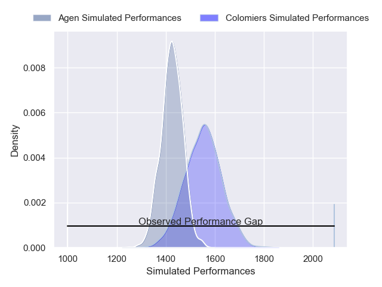
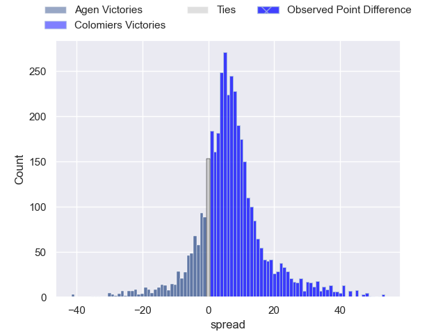
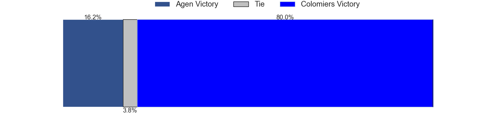
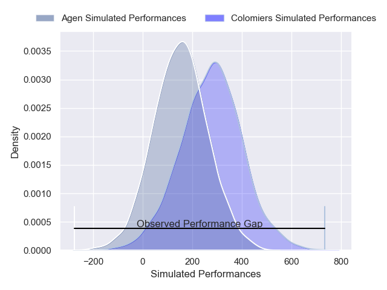
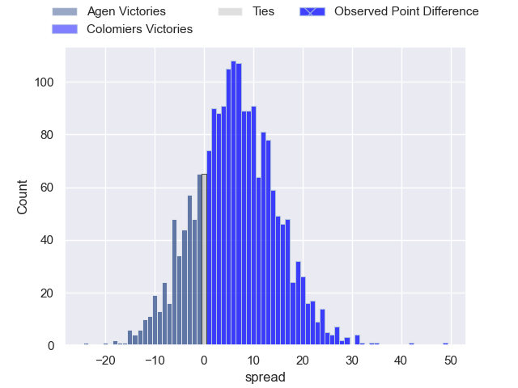
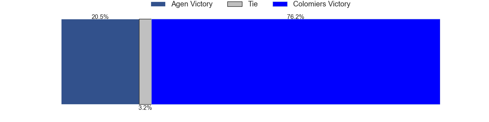

---  
layout: page  
title: Agen at Colomiers; 10-59  
date: 2025-04-17 18:00:00 -0500  
categories: "Pro D2 24/25" match review  
---
# Agen at Colomiers; 10-59

# Club Level Predictions

The first set of predictions treats a club as the smallest object, as the club develops its members, organizes a gameplan, and deploys its players as needed for each match. This club model has a prediction of 0.671, which translates to predicting Colomiers to win by 6.3.

Our Over/Under is 55.5 - and combined with the spread above, we have a predicted scoreline of 24 to 31

Each club has a rating and a rating deviation (similar to a Glicko rating), and expected performances can be generated. This allows for simulated matches and spreads like the ones below.
## Projected Performances - Club Model

## Projected Spreads - Club Model

## Projected Results - Club Model

# Player Level Predictions

Treating teams instead as an entity made up of the currently active players, I have ratings for each player in an altogether different system. These can be combined to form team ratings once teamsheets are announced, weighting starters a bit higher than the reserves. After the match is played, players can be weighted by their minutes on the field, allowing for an accurate measure of the team's composition. With these compiled team ratings, we can make predictions, measure inaccuracy, and update the individual player ratings.
## Prediction without Player Minutes: Colomiers by 9.3

Agen by 3.2 on a neutral pitch

## Projected Performances - Player Model

## Projected Spreads - Player Model

## Projected Results - Player Model

|   Away Minutes | Away Player         |   Away Percentile |   Number |   Home Percentile | Home Player         |   Home Minutes |
|---------------:|:--------------------|------------------:|---------:|------------------:|:--------------------|---------------:|
|             55 | Luca Tabarot        |             54.31 |        1 |             51.8  | Hugo Pirlet         |             46 |
|             26 | Santiago Socino     |             88.04 |        2 |             77.67 | Pablo Dimcheff      |             48 |
|             40 | Alex Burin          |             29.23 |        3 |             67.55 | Marco Fepulea'i     |             72 |
|              5 | William Demotte     |             71.28 |        4 |             46.1  | Jean Thomas         |             32 |
|             34 | John Madigan        |             13.66 |        5 |             41.82 | Maxime Granouillet  |             40 |
|             46 | Julien Lebian       |             14.94 |        6 |             26.86 | Anthony Coletta     |             40 |
|             35 | Fotu Lokotui        |              3.12 |        7 |             68.29 | Gregoire Bazin      |             54 |
|             39 | Matthieu Bonnet     |             38.57 |        8 |             81.02 | Aldric Lescure      |             70 |
|             65 | Jack Maunder        |             73.12 |        9 |             69.12 | Sadek Deghmache     |             80 |
|             17 | Emile Dayral        |              9.65 |       10 |             66.34 | Max Auriac          |             58 |
|             80 | Lucas Martins       |             74.7  |       11 |             44.42 | Anzelo Tuitavuki    |             80 |
|             40 | Clement Garrigues   |             16.04 |       12 |             37.11 | Ray Nu'u            |             27 |
|             68 | Peyo Muscarditz     |             67.13 |       13 |             96.06 | Rodrigo Marta       |             60 |
|             48 | Henry Purdy         |             88.19 |       14 |             13.59 | Martin Alonso Munoz |             29 |
|             32 | Loris Tolot         |              0.4  |       15 |             87.53 | Vincent Pinto       |             79 |
|             54 | Franck Pourteau     |             92.32 |       16 |             56.5  | Michael Simutoga    |             80 |
|             40 | Tomasi Fineanganofo |             44.82 |       17 |              7.81 | Theo Lachaud        |             69 |
|             46 | Mamuka Mstoiani     |             33.46 |       18 |             18.18 | Elias El Ansari     |             51 |
|             40 | Lasha Macharashvili |             66.77 |       19 |             29    | Janse Roux          |             80 |
|             80 | Vincent Farre       |             26.67 |       20 |              0.2  | Brett Herron        |             63 |
|             80 | Theo Belan          |             62.2  |       21 |             31.22 | Caleb Timu          |             80 |
|             32 | Dorian Bellot       |             66.61 |       22 |             12.6  | Martin Dulon        |             72 |
|             51 | Hayam El Bibouji    |             82.78 |       23 |             61.77 | Natan Culinat       |             29 |

