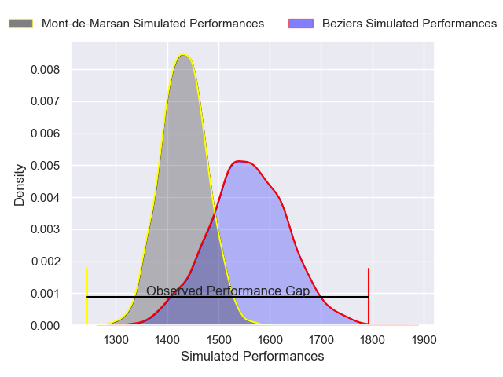
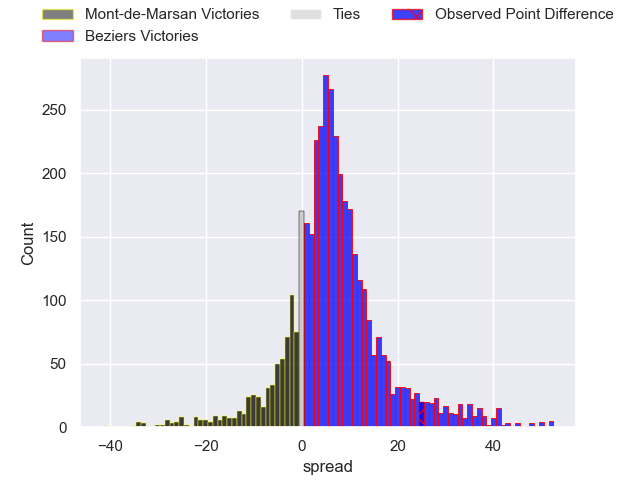
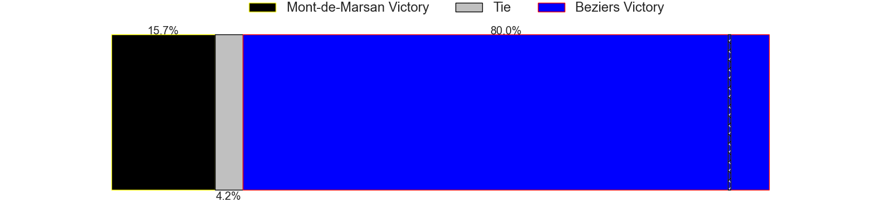
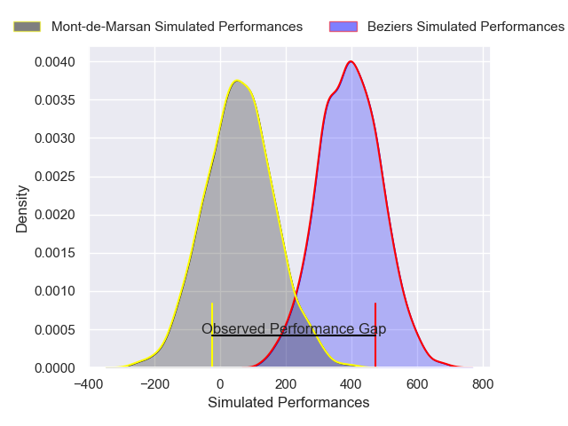
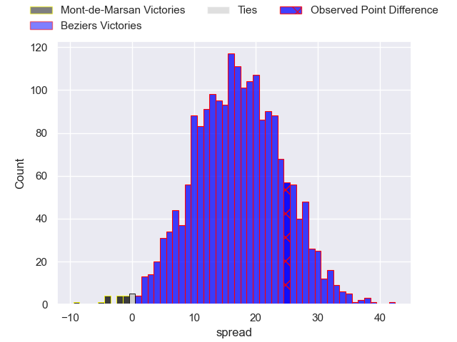
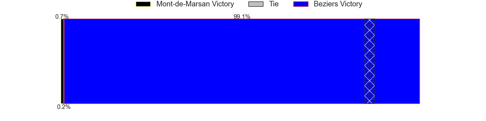

---  
layout: page  
title: Mont-de-Marsan at Beziers; 12-37  
date: 2025-04-18 18:00:00 -0500  
categories: "Pro D2 24/25" match review  
---
# Mont-de-Marsan at Beziers; 12-37

# Club Level Predictions

The first set of predictions treats a club as the smallest object, as the club develops its members, organizes a gameplan, and deploys its players as needed for each match. This club model has a prediction of 0.67, which translates to predicting Beziers to win by 6.2.

Our Over/Under is 61.5 - and combined with the spread above, we have a predicted scoreline of 28 to 34

Each club has a rating and a rating deviation (similar to a Glicko rating), and expected performances can be generated. This allows for simulated matches and spreads like the ones below.
## Projected Performances - Club Model

## Projected Spreads - Club Model

## Projected Results - Club Model

# Player Level Predictions

Treating teams instead as an entity made up of the currently active players, I have ratings for each player in an altogether different system. These can be combined to form team ratings once teamsheets are announced, weighting starters a bit higher than the reserves. After the match is played, players can be weighted by their minutes on the field, allowing for an accurate measure of the team's composition. With these compiled team ratings, we can make predictions, measure inaccuracy, and update the individual player ratings.
## Prediction without Player Minutes: Beziers by 16.4

Beziers by 2.2 on a neutral pitch

## Projected Performances - Player Model

## Projected Spreads - Player Model

## Projected Results - Player Model

|   Away Minutes | Away Player           |   Away Percentile |   Number |   Home Percentile | Home Player                 |   Home Minutes |
|---------------:|:----------------------|------------------:|---------:|------------------:|:----------------------------|---------------:|
|        33      | Thomas Bultel         |             28.34 |        1 |             59.88 | Youssef Amrouni             |             34 |
|        20.6667 | Samuel Lagrange       |             27.42 |        2 |             66.05 | Wilmar Arnoldi              |             22 |
|        75      | Anthony Alves         |             12.44 |        3 |             71.25 | Christian Judge             |             47 |
|        25      | Jules Dussutour       |             67.46 |        4 |             70.21 | Cam Dodson                  |             50 |
|        22      | Romain Durand         |             69.35 |        5 |              0.57 | Shahn Eru                   |             47 |
|        49      | Waël Ponpon           |              9.19 |        6 |             89.87 | Clement Doumenc             |             50 |
|         5      | Nicolas Garrault      |             39.49 |        7 |             11.08 | Gillian Benoy               |             19 |
|        22      | Raphaël Robic         |             78.51 |        8 |             69.63 | Sias Koen                   |             80 |
|        22      | Christophe Loustalot  |             36.92 |        9 |             56.58 | Damien Añon                 |             80 |
|        35      | Patricio Fernandez    |             63.94 |       10 |             92.24 | Tim Nanai-Williams          |             33 |
|        20      | Pierre Sayerse        |             91.38 |       11 |             31.82 | Theo Vassallo               |             47 |
|        49      | Baptiste Grulovic     |             40.97 |       12 |             87.89 | Taylor Gontineac            |             33 |
|        17      | Semi Lagivala         |             12.42 |       13 |             63.86 | Paul Recor                  |             31 |
|        80      | Alexandre de Nardi    |             53.88 |       14 |             15.06 | Pierre Courtaud             |             17 |
|        80      | Théo Cortes           |             17.08 |       15 |             89.09 | Gabin Lorre                 |             80 |
|        18      | Nacani Wakaya         |             88.4  |       16 |             23.69 | Victor Dreuille             |             33 |
|        65      | Yoann Laousse Azpiazu |             19.96 |       17 |             38.63 | Hugo Gomes Camacho          |             31 |
|        80      | Luka Begic            |             63.88 |       18 |             71.74 | Yvann Lalevee               |             13 |
|        80      | Ali-Amjad Osman-Bosch |             50.74 |       19 |             25.52 | Petero Taviraki Mailulu     |             50 |
|        40      | Gheorghe Gajion       |             82.45 |       20 |             70.76 | John Henry Fincham          |             50 |
|        69      | Ewan Bertheau         |              1.89 |       21 |             43.55 | Baptiste Abescat-Leroy      |             53 |
|        26      | Albert Mataele        |             65.18 |       22 |              4.28 | Francisco Fernandes Moreira |             50 |
|        28      | Nicolas Darquier      |             29.74 |       23 |             21.59 | William van Bost            |             30 |

