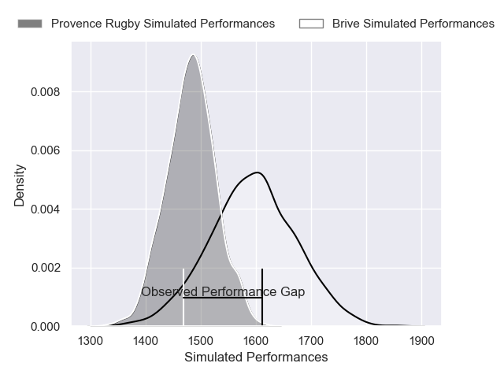
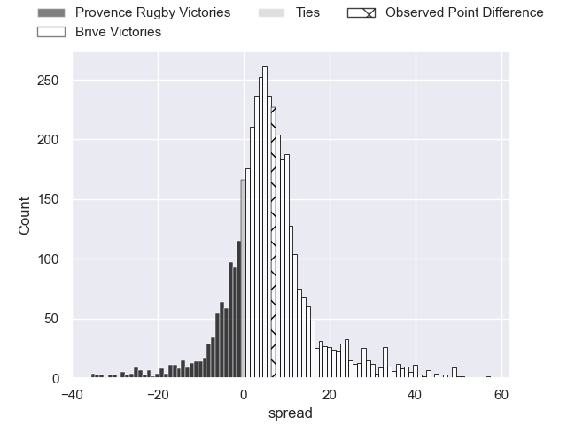
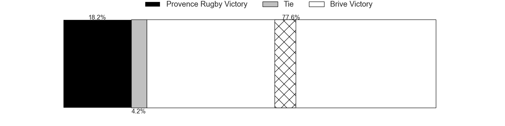
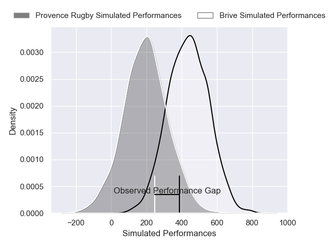
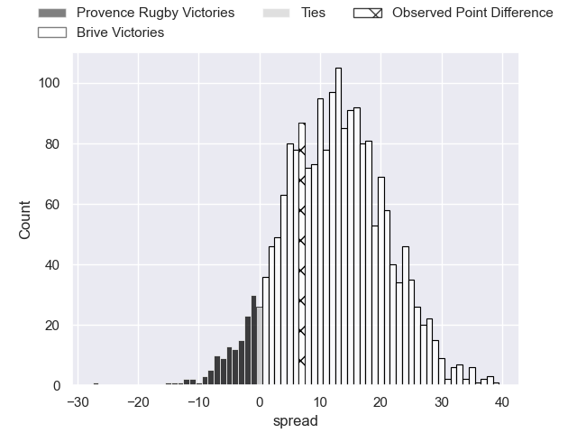
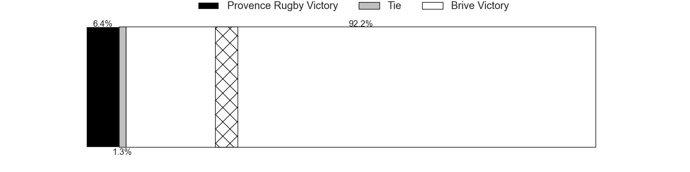

---  
layout: page  
title: Provence Rugby at Brive; 17-24  
date: 2025-04-18 18:00:00 -0500  
categories: "Pro D2 24/25" match review  
---
# Provence Rugby at Brive; 17-24

# Club Level Predictions

The first set of predictions treats a club as the smallest object, as the club develops its members, organizes a gameplan, and deploys its players as needed for each match. This club model has a prediction of 0.655, which translates to predicting Brive to win by 5.6.

Our Over/Under is 50.5 - and combined with the spread above, we have a predicted scoreline of 23 to 28

Each club has a rating and a rating deviation (similar to a Glicko rating), and expected performances can be generated. This allows for simulated matches and spreads like the ones below.
## Projected Performances - Club Model

## Projected Spreads - Club Model

## Projected Results - Club Model

# Player Level Predictions

Treating teams instead as an entity made up of the currently active players, I have ratings for each player in an altogether different system. These can be combined to form team ratings once teamsheets are announced, weighting starters a bit higher than the reserves. After the match is played, players can be weighted by their minutes on the field, allowing for an accurate measure of the team's composition. With these compiled team ratings, we can make predictions, measure inaccuracy, and update the individual player ratings.
## Prediction without Player Minutes: Brive by 12.5

Provence Rugby by 0.5 on a neutral pitch

## Projected Performances - Player Model

## Projected Spreads - Player Model

## Projected Results - Player Model

|   Away Minutes | Away Player           |   Away Percentile |   Number |   Home Percentile | Home Player             |   Home Minutes |
|---------------:|:----------------------|------------------:|---------:|------------------:|:------------------------|---------------:|
|           80   | Federico Wegrzyn      |             62.69 |        1 |             15.24 | Simon-Pierre Chauvac    |             40 |
|           61   | Thomas Sauveterre     |             76.09 |        2 |             45.65 | Lucas da Silva          |             80 |
|           25   | Tomas Francis         |             99.09 |        3 |              8.81 | Marcel van der Merwe    |             62 |
|           74   | Yannick Youyoutte     |             86.72 |        4 |             80.27 | Retief Marais           |             69 |
|           55   | Izack Rodda           |             82.16 |        5 |             89.85 | Asier Usarraga          |             53 |
|           15   | Guillaume Piazzoli    |             83.52 |        6 |             79.36 | Asaeli Tuivuaka         |             80 |
|            0   | Charly Gambini        |             80.68 |        7 |             97.25 | Courtney Lawes          |              6 |
|           80   | Teimana Harrison      |             68.8  |        8 |             38.84 | Rahboni Warren-Vosayaco |             80 |
|           80   | Kevin Viallard        |             22.39 |        9 |             52.48 | Mathis Ferté            |             19 |
|           18   | Jimmy Gopperth        |             91.4  |       10 |             93.08 | Stuart Olding           |              0 |
|           80   | Paul Cellio Zwiler    |             56.16 |       11 |             85.51 | Erwan Dridi             |             55 |
|           25   | George North          |             99.49 |       12 |             52.46 | Georges Shvelidze       |             80 |
|           80   | Eto Bainivalu         |             35.73 |       13 |             97.02 | Matias Moroni           |             80 |
|           12.5 | Adrien Lapegue-Lafaye |             12.97 |       14 |             79.07 | Maxence Biasotto        |             18 |
|           80   | Jules Soulan          |             80.04 |       15 |             86.42 | Curwin Bosch            |             25 |
|           62   | Tornike Jalagonia     |              8.88 |       16 |             65.44 | Samuel Maximin          |             80 |
|           80   | Arthur Coville        |             20    |       17 |              4.44 | Hugo Verdu              |             80 |
|           80   | Kaveinga Finau        |             83.68 |       18 |             50.82 | Nathan Fraissenon       |             15 |
|           25   | Léo Drouet            |             77.75 |       19 |             67.89 | Issam Hamel             |             25 |
|           62   | Kapeli Pifeleti       |             10.54 |       20 |             81.05 | Vakh Abdaladze          |             65 |
|            0   | Thomas Vernet         |             76.77 |       21 |              6.07 | Konstantin Mikautadze   |             25 |
|           55   | Jérôme Dufour         |             85.96 |       22 |             28.23 | Paul Pimienta           |             65 |
|          nan   | nan                   |            nan    |       23 |             39.05 | Taniela Sadrugu         |             19 |

