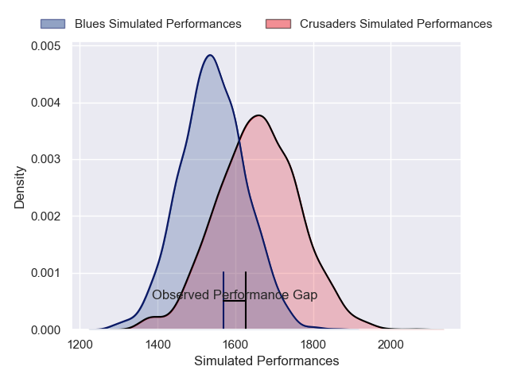
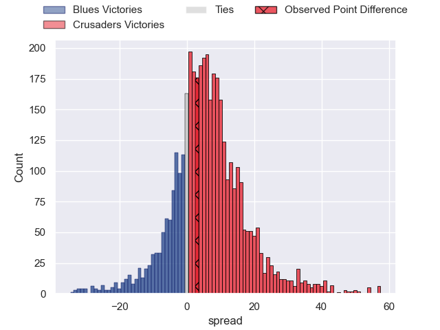
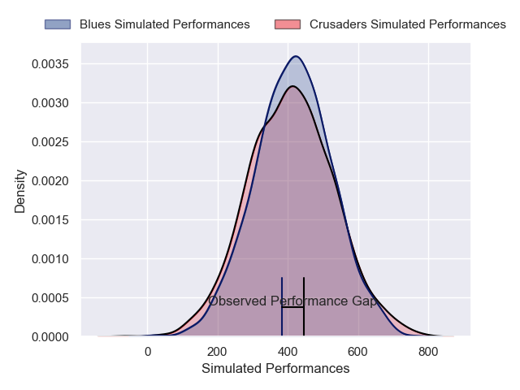
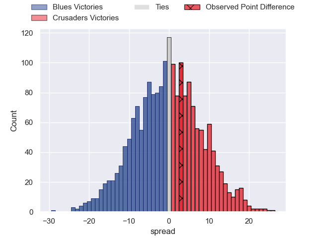

---  
layout: page  
title: Blues at Crusaders; 22-25  
date: 2025-04-18 18:00:00 -0500  
categories: "Super Rugby Pacific 2025" match review  
---
# Blues at Crusaders; 22-25

# Club Level Predictions

The first set of predictions treats a club as the smallest object, as the club develops its members, organizes a gameplan, and deploys its players as needed for each match. This club model has a prediction of 0.654, which translates to predicting Crusaders to win by 5.7.

Our Over/Under is 55.5 - and combined with the spread above, we have a predicted scoreline of 25 to 31

Each club has a rating and a rating deviation (similar to a Glicko rating), and expected performances can be generated. This allows for simulated matches and spreads like the ones below.
## Projected Performances - Club Model

## Projected Spreads - Club Model

## Projected Results - Club Model

# Player Level Predictions

Treating teams instead as an entity made up of the currently active players, I have ratings for each player in an altogether different system. These can be combined to form team ratings once teamsheets are announced, weighting starters a bit higher than the reserves. After the match is played, players can be weighted by their minutes on the field, allowing for an accurate measure of the team's composition. With these compiled team ratings, we can make predictions, measure inaccuracy, and update the individual player ratings.
## Prediction without Player Minutes: Crusaders by 0.1

Blues by 7.5 on a neutral pitch

## Projected Performances - Player Model

## Projected Spreads - Player Model

## Projected Results - Player Model

|   Away Minutes | Away Player        |   Away Percentile |   Number |   Home Percentile | Home Player           |   Home Minutes |
|---------------:|:-------------------|------------------:|---------:|------------------:|:----------------------|---------------:|
|             34 | Josh Fusitu'a      |             85.11 |        1 |             90.6  | Tamaiti Williams      |             58 |
|              0 | Ricky Riccitelli   |             77.83 |        2 |             98.41 | Codie Taylor          |             80 |
|             35 | Angus Ta'avao      |             97.18 |        3 |              5.56 | Fletcher Newell       |             80 |
|              1 | Patrick Tuipulotu  |             92.66 |        4 |             96.19 | Scott Barrett         |             34 |
|             26 | Patrick Tuipulotu  |             92.66 |        4 |             96.19 | Scott Barrett         |             34 |
|             29 | Josh Beehre        |             84.76 |        5 |             14.41 | Antonio Shalfoon      |             80 |
|             15 | Anton Segner       |             65.72 |        6 |             88.27 | Cullen Grace          |             35 |
|             80 | Dalton Papalii     |             99.08 |        7 |             97.53 | Ethan Blackadder      |             46 |
|             80 | Hoskins Sotutu     |             97.35 |        8 |             77.35 | Christian Lio-Willie  |             80 |
|             34 | Finlay Christie    |             82.8  |        9 |             84.81 | Noah Hotham           |             71 |
|             29 | Beauden Barrett    |             99.61 |       10 |             20.28 | Taha Kemara           |             80 |
|             11 | Cole Forbes        |             85.75 |       11 |             88.38 | Sevu Reece            |             80 |
|              0 | AJ Lam             |             83.17 |       12 |             91.63 | David Havili          |             51 |
|             30 | Rieko Ioane        |             79.33 |       13 |             82.48 | Levi Aumua            |             39 |
|             22 | Mark Tele'a        |              0.19 |       14 |             43.49 | Chay Fihaki           |             39 |
|             80 | Zarn Sullivan      |             79.28 |       15 |             96.78 | Will Jordan           |             46 |
|             80 | Kurt Eklund        |             92.03 |       16 |             25.68 | Ioane Moananu         |             69 |
|             69 | Mason Tupaea       |            nan    |       17 |             13.64 | George Bower          |             32 |
|             48 | Hamdahn Tuipulotu  |            nan    |       18 |            nan    | Kershawl Sykes-Martin |             57 |
|             80 | Laghlan McWhannell |             95.72 |       19 |             17.84 | Jamie Hannah          |             41 |
|             50 | Cameron Suafoa     |             72.65 |       20 |             41.98 | Corey Kellow          |             41 |
|             80 | Adrian Choat       |             83.78 |       21 |             76.13 | Kyle Preston          |             41 |
|             39 | Taufa Funaki       |             45.24 |       22 |            nan    | James O'Connor        |             80 |
|             35 | Harry Plummer      |             94.69 |       23 |             65.94 | Dallas McLeod         |             35 |

