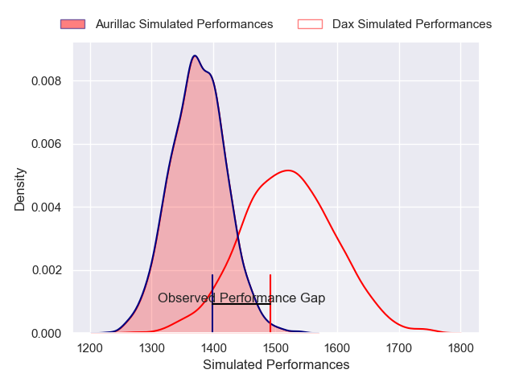
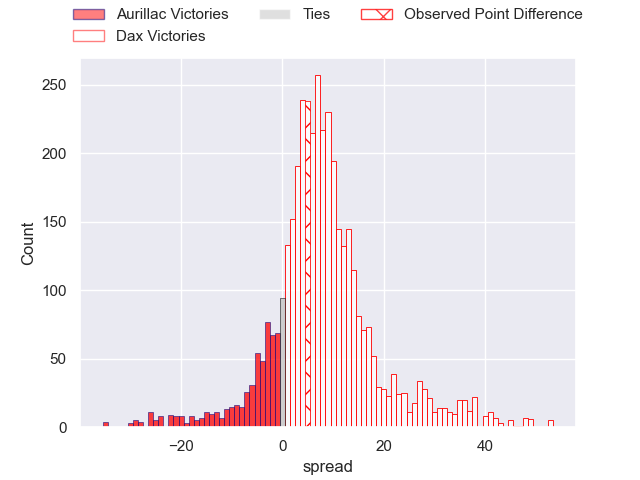
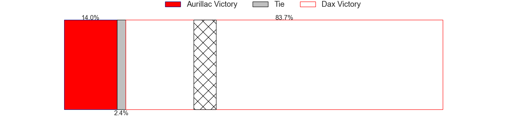
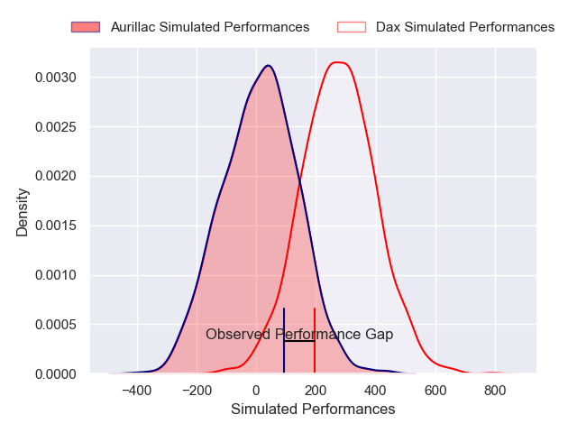
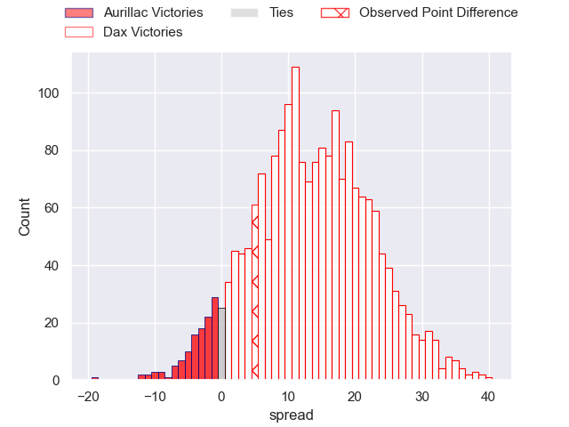
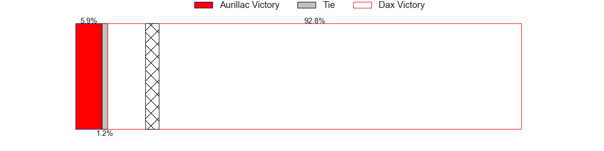

---  
layout: page  
title: Aurillac at Dax; 21-26  
date: 2025-04-18 18:00:00 -0500  
categories: "Pro D2 24/25" match review  
---
# Aurillac at Dax; 21-26

# Club Level Predictions

The first set of predictions treats a club as the smallest object, as the club develops its members, organizes a gameplan, and deploys its players as needed for each match. This club model has a prediction of 0.694, which translates to predicting Dax to win by 7.2.

Our Over/Under is 51.5 - and combined with the spread above, we have a predicted scoreline of 22 to 29

Each club has a rating and a rating deviation (similar to a Glicko rating), and expected performances can be generated. This allows for simulated matches and spreads like the ones below.
## Projected Performances - Club Model

## Projected Spreads - Club Model

## Projected Results - Club Model

# Player Level Predictions

Treating teams instead as an entity made up of the currently active players, I have ratings for each player in an altogether different system. These can be combined to form team ratings once teamsheets are announced, weighting starters a bit higher than the reserves. After the match is played, players can be weighted by their minutes on the field, allowing for an accurate measure of the team's composition. With these compiled team ratings, we can make predictions, measure inaccuracy, and update the individual player ratings.
## Prediction without Player Minutes: Dax by 12.6

Dax by 0.4 on a neutral pitch

## Projected Performances - Player Model

## Projected Spreads - Player Model

## Projected Results - Player Model

|   Away Minutes | Away Player             |   Away Percentile |   Number |   Home Percentile | Home Player           |   Home Minutes |
|---------------:|:------------------------|------------------:|---------:|------------------:|:----------------------|---------------:|
|              0 | Irakli Mtchedlidze      |             45.2  |        1 |             16.22 | David Lolohea         |             19 |
|             34 | Ronan Loughnane         |             27.89 |        2 |             38.1  | Iban Hiriart-Urruty   |             61 |
|             80 | Dominic Robertson-McCoy |             35.03 |        3 |             18.08 | Diogo Hasse Ferreira  |             11 |
|             80 | Heath Backhouse         |             73.99 |        4 |             50.87 | Mattieu Bidau         |             46 |
|             61 | Abongile Nonkontwana    |              1.35 |        5 |              3.56 | Jean-Baptiste Singer  |             61 |
|             80 | Théo Cambon             |             11.82 |        6 |              5.21 | Jean-Baptiste Barrère |             53 |
|             35 | Hugo Huurman            |             73.56 |        7 |             61.08 | Paul Arnaud Ausset    |             80 |
|             80 | Lucas Oudard            |             51.94 |        8 |             73.21 | Genesis Mamea Lemalu  |             80 |
|             80 | Boris Hadinegoro        |              8.11 |        9 |             33.28 | Sylvère Reteau        |              6 |
|             29 | Jake Strachan           |             30.77 |       10 |             35.43 | Romuald Séguy         |             80 |
|             25 | Angus Staniforth        |             18.97 |       11 |              4.1  | Maxime Oltmann        |             57 |
|             45 | Ofa Manuofetoa          |             77.49 |       12 |              0.3  | Jale Vatubua          |             80 |
|             29 | Karl Martin             |             34.75 |       13 |             77.89 | Hugo Fourquet         |             26 |
|             40 | Simeli Yabaki           |             14.49 |       14 |             81.6  | Théo Gatelier         |             12 |
|             80 | Ugo Seunes              |             67.01 |       15 |             25.82 | Théo Duprat           |             73 |
|             19 | Giorgi Kartvelishvili   |             27.76 |       16 |             81.93 | Paul Ravier           |             80 |
|             59 | Basa Khonelidze         |             50.68 |       17 |             47.39 | Arnaud Aletti         |             80 |
|             55 | Mehdi Slamani           |             39.31 |       18 |              9.04 | Nephi Leatigaga       |             80 |
|              9 | Dachi Papunashvili      |             56.76 |       19 |             24.83 | Louis Barrere         |             26 |
|             80 | Aleksandre Burduli      |             17.38 |       20 |             74.01 | Louis Mary            |             71 |
|             80 | Robert Rodgers          |             37.93 |       21 |             39.88 | Étienne Loiret        |             23 |
|             45 | Mikheil Alania          |             57.09 |       22 |             62.35 | Hugo Cerisier         |             80 |
|            nan | nan                     |            nan    |       23 |             18.76 | Benjamin Puntous      |             80 |

