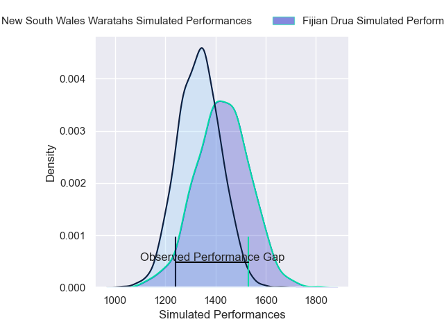
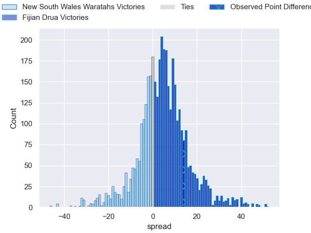
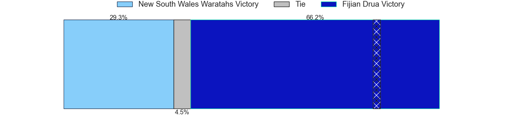
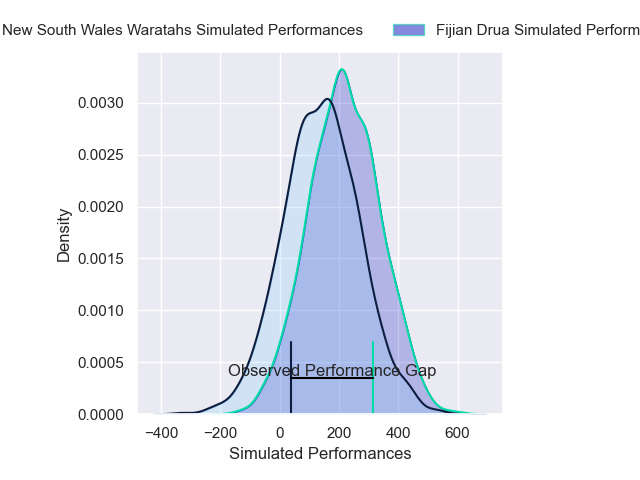
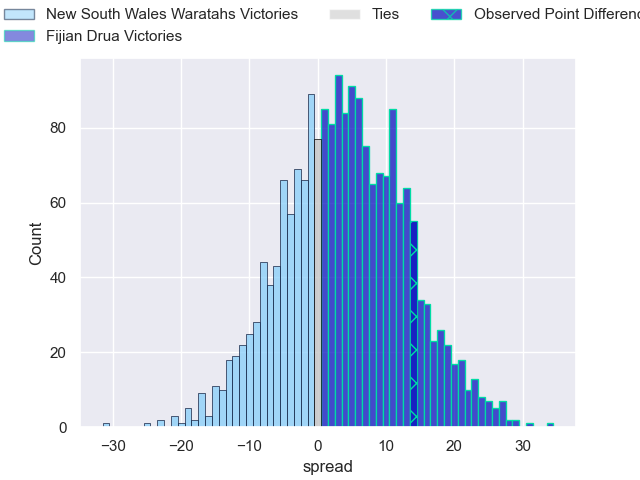
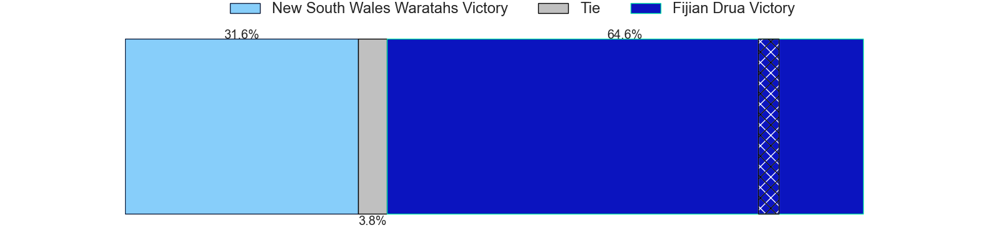

---  
layout: page  
title: New South Wales Waratahs at Fijian Drua; 14-28  
date: 2025-04-18 18:00:00 -0500  
categories: "Super Rugby Pacific 2025" match review  
---
# New South Wales Waratahs at Fijian Drua; 14-28

# Club Level Predictions

The first set of predictions treats a club as the smallest object, as the club develops its members, organizes a gameplan, and deploys its players as needed for each match. This club model has a prediction of 0.621, which translates to predicting Fijian Drua to win by 4.4.

Our Over/Under is 56.5 - and combined with the spread above, we have a predicted scoreline of 26 to 30

Each club has a rating and a rating deviation (similar to a Glicko rating), and expected performances can be generated. This allows for simulated matches and spreads like the ones below.
## Projected Performances - Club Model

## Projected Spreads - Club Model

## Projected Results - Club Model

# Player Level Predictions

Treating teams instead as an entity made up of the currently active players, I have ratings for each player in an altogether different system. These can be combined to form team ratings once teamsheets are announced, weighting starters a bit higher than the reserves. After the match is played, players can be weighted by their minutes on the field, allowing for an accurate measure of the team's composition. With these compiled team ratings, we can make predictions, measure inaccuracy, and update the individual player ratings.
## Prediction without Player Minutes: Fijian Drua by 4.9

Fijian Drua by 2.0 on a neutral pitch

## Projected Performances - Player Model

## Projected Spreads - Player Model

## Projected Results - Player Model

|   Away Minutes | Away Player           |   Away Percentile |   Number |   Home Percentile | Home Player             |   Home Minutes |
|---------------:|:----------------------|------------------:|---------:|------------------:|:------------------------|---------------:|
|             20 | Isaac Kailea          |             39.63 |        1 |             82.57 | Peni Ravai Kovekalou    |             29 |
|              0 | Ethan Dobbins         |             24.32 |        2 |             77.72 | Mesu Dolokoto           |             80 |
|             63 | Daniel Botha          |             50.93 |        3 |             29.62 | Mesake Doge             |             52 |
|             53 | Hugh Sinclair         |              7.8  |        4 |             74.86 | Isoa Nasilasila         |             52 |
|             80 | Ben Grant             |             97.78 |        5 |             71.29 | Ratu Rotuisolia         |             20 |
|             75 | Jamie Adamson         |             35.85 |        6 |             83.52 | Etonia Waqa             |              2 |
|             80 | Charlie Gamble        |             54.19 |        7 |             60.8  | Motikiai Murray         |             80 |
|              0 | Leafi Talataina       |             42.84 |        8 |             81.39 | Elia Canakaivata        |             80 |
|             80 | Teddy Wilson          |             28.21 |        9 |             63.85 | Simione Kuruvoli        |             51 |
|             80 | Lawson Creighton      |              7.49 |       10 |             65.38 | Isaiah Armstrong-Ravula |             28 |
|             80 | Lawson Creighton      |              7.49 |       10 |             65.38 | Isaiah Armstrong-Ravula |             30 |
|             80 | Lawson Creighton      |              7.49 |       10 |             65.38 | Isaiah Armstrong-Ravula |             26 |
|             12 | Triston Reilly        |             33.84 |       11 |             51.95 | Ponipate Loganimasi     |             20 |
|             80 | Joey Walton           |             61.8  |       12 |             80.95 | Inia Tabuavou           |             80 |
|             80 | Lalakai Foketi        |             66.04 |       13 |             17.97 | Tuidraki Samusamuvodre  |             37 |
|             50 | Andrew Kellaway       |             51.29 |       14 |             38.42 | Taniela Rakuro          |             56 |
|             75 | Joseph-Aukuso Suaalii |             31.35 |       15 |             12.7  | Isikeli Rabitu          |             80 |
|             22 | Julian Heaven         |             24.49 |       16 |             51.53 | Zuriel Togiatama        |             30 |
|             24 | Tom Lambert           |            nan    |       17 |            nan    | Emosi Tuqiri            |              5 |
|             80 | Siosifa Amone         |            nan    |       18 |             45.36 | Samu Tawake             |              5 |
|              5 | Miles Amatosero       |              2.89 |       19 |             76.07 | Vilive Miramira         |             60 |
|             80 | Langi Gleeson         |             70.76 |       20 |            nan    | Isoa Tuwai              |              8 |
|             27 | Jack Grant            |            nan    |       21 |            nan    | Leone Nawai             |             60 |
|             40 | Tane Edmed            |             14.98 |       22 |             50.35 | Kemu Valetini           |             80 |
|              0 | Henry O'Donnell       |            nan    |       23 |             94.38 | Selestino Ravutaumada   |             80 |

