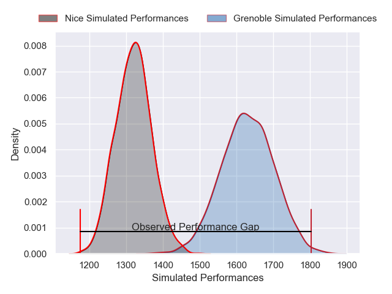
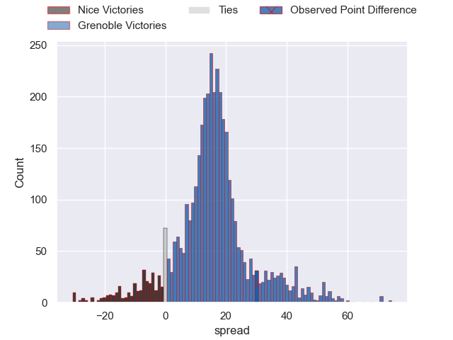
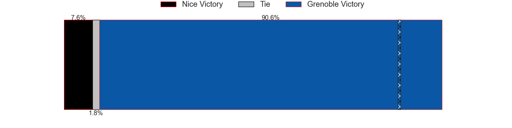
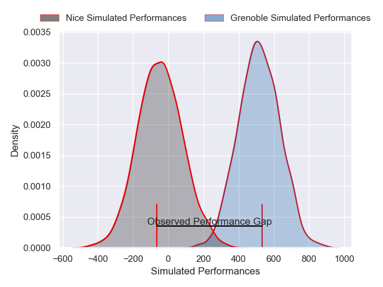
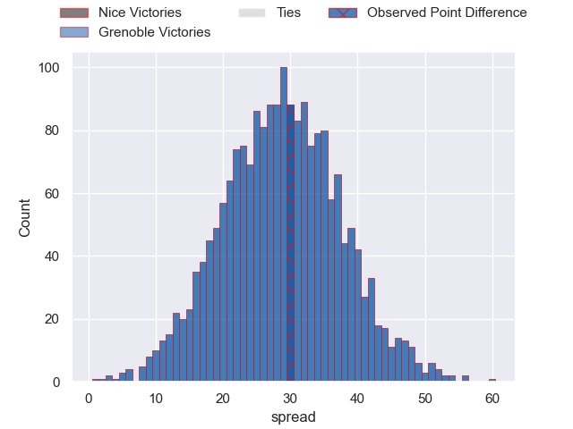

---  
layout: page  
title: Nice at Grenoble; 17-47  
date: 2025-04-18 18:00:00 -0500  
categories: "Pro D2 24/25" match review  
---
# Nice at Grenoble; 17-47

# Club Level Predictions

The first set of predictions treats a club as the smallest object, as the club develops its members, organizes a gameplan, and deploys its players as needed for each match. This club model has a prediction of 0.854, which translates to predicting Grenoble to win by 15.5.

Our Over/Under is 71.5 - and combined with the spread above, we have a predicted scoreline of 28 to 43

Each club has a rating and a rating deviation (similar to a Glicko rating), and expected performances can be generated. This allows for simulated matches and spreads like the ones below.
## Projected Performances - Club Model

## Projected Spreads - Club Model

## Projected Results - Club Model

# Player Level Predictions

Treating teams instead as an entity made up of the currently active players, I have ratings for each player in an altogether different system. These can be combined to form team ratings once teamsheets are announced, weighting starters a bit higher than the reserves. After the match is played, players can be weighted by their minutes on the field, allowing for an accurate measure of the team's composition. With these compiled team ratings, we can make predictions, measure inaccuracy, and update the individual player ratings.
## Prediction without Player Minutes: Grenoble by 31.6

Grenoble by 18.5 on a neutral pitch

## Projected Performances - Player Model

## Projected Spreads - Player Model

## Projected Results - Player Model

|   Away Minutes | Away Player           |   Away Percentile |   Number |   Home Percentile | Home Player        |   Home Minutes |
|---------------:|:----------------------|------------------:|---------:|------------------:|:-------------------|---------------:|
|             80 | Facundo Gigena        |              6.01 |        1 |             90.2  | Tommy Raynaud      |           31   |
|             80 | Pierre Strippoli      |              6.19 |        2 |             74.75 | Lilian Rossi       |           31   |
|             55 | Nicolas Ciancio       |             41.19 |        3 |             37.31 | Johannes Jonker    |           61   |
|              5 | Thibault Rey          |              2.09 |        4 |             67.36 | Pierce Phillips    |           80   |
|             40 | Martin Freytes        |             17.17 |        5 |             82.35 | Giorgi Javakhia    |           76   |
|             80 | Hugo Sarrasin         |              5.3  |        6 |             91.29 | Jose Madeira       |           30.5 |
|             65 | Bastien Berenguel     |              0.47 |        7 |             81.25 | Victor Guillaumond |           80   |
|             80 | Kylian Laurans        |             10.95 |        8 |             47.93 | Richard Hardwick   |           63   |
|             19 | Jules Solinas         |              7.86 |        9 |             17.26 | Barnabe Couilloud  |           30.5 |
|             37 | Mathis Viard          |             64.15 |       10 |             40.25 | Sam Davies         |            8   |
|             63 | Benjamin Dutard       |             44.6  |       11 |             88.35 | Wilfried Hulleu    |           80   |
|             36 | Alban Conduche        |              0.82 |       12 |             93.53 | Giorgi Kveseladze  |           54   |
|             56 | Nathan Courtade       |             13.04 |       13 |             75.15 | Romain Trouilloud  |           19   |
|             46 | David Odiete          |             89.58 |       14 |             47.82 | Gerswin Mouton     |           80   |
|             36 | Tanguy Ménoret        |             22.43 |       15 |             71.6  | Hugo Trouilloud    |           80   |
|             80 | Fabio Gonzalez        |             57.5  |       16 |             58.07 | Eli Eglaine        |           58   |
|             46 | Julien Beaufils       |            nan    |       17 |             91.97 | Eric Escande       |           80   |
|             80 | Luca Cutayar          |             28.13 |       18 |             36.96 | Mathis Sarragallet |           80   |
|             68 | Paul Auradou          |              3.09 |       19 |             75.98 | Julien Heriteau    |           48   |
|             80 | Kevin Yameogo         |            nan    |       20 |             46.87 | Brandon Nansen     |           28   |
|             80 | Louis Suaud           |             87.12 |       21 |             89.62 | Giorgi Pertaia     |            2   |
|             24 | Joris Sylvestre Simon |             22.82 |       22 |             85.23 | Antonin Berruyer   |           75   |
|            nan | nan                   |            nan    |       23 |              9.64 | Marc Palmier       |           38   |

