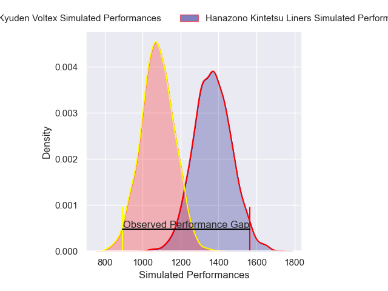
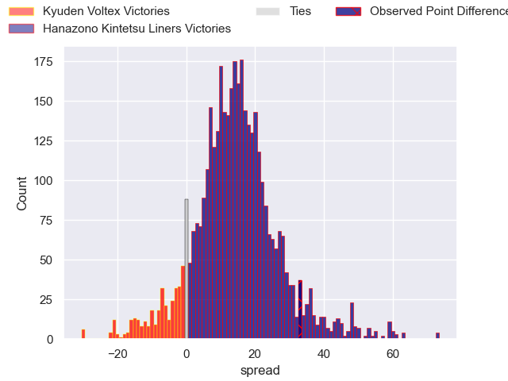
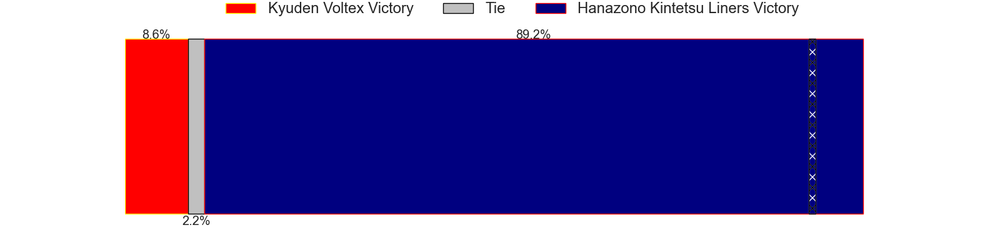
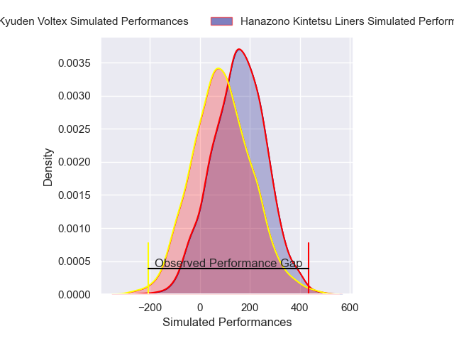
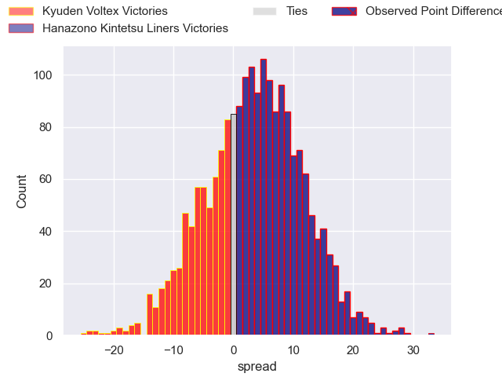
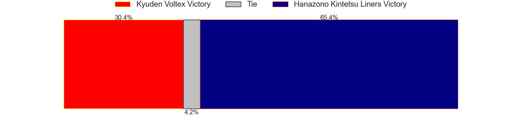

---  
layout: page  
title: Kyuden Voltex at Hanazono Kintetsu Liners; 21-54  
date: 2025-04-18 18:00:00 -0500  
categories: "Japan Rugby League One D2 24/25" match review  
---
# Kyuden Voltex at Hanazono Kintetsu Liners; 21-54

# Club Level Predictions

The first set of predictions treats a club as the smallest object, as the club develops its members, organizes a gameplan, and deploys its players as needed for each match. This club model has a prediction of 0.836, which translates to predicting Hanazono Kintetsu Liners to win by 14.7.

Our Over/Under is 48.5 - and combined with the spread above, we have a predicted scoreline of 17 to 32

Each club has a rating and a rating deviation (similar to a Glicko rating), and expected performances can be generated. This allows for simulated matches and spreads like the ones below.
## Projected Performances - Club Model

## Projected Spreads - Club Model

## Projected Results - Club Model

# Player Level Predictions

Treating teams instead as an entity made up of the currently active players, I have ratings for each player in an altogether different system. These can be combined to form team ratings once teamsheets are announced, weighting starters a bit higher than the reserves. After the match is played, players can be weighted by their minutes on the field, allowing for an accurate measure of the team's composition. With these compiled team ratings, we can make predictions, measure inaccuracy, and update the individual player ratings.
## Prediction without Player Minutes: Hanazono Kintetsu Liners by 6.8

Hanazono Kintetsu Liners by 2.2 on a neutral pitch

## Projected Performances - Player Model

## Projected Spreads - Player Model

## Projected Results - Player Model

|   Away Minutes | Away Player            |   Away Percentile |   Number |   Home Percentile | Home Player       |   Home Minutes |
|---------------:|:-----------------------|------------------:|---------:|------------------:|:------------------|---------------:|
|             40 | Samuel Nozomu Faialaga |             15.22 |        1 |             86.82 | Shintaro Okamoto  |             64 |
|             80 | Kyungmun Wang          |              1.32 |        2 |             37.79 | Kazuma Matsuda    |             70 |
|              0 | Kosuke Oike            |             18.51 |        3 |             30.2  | Lata Tangimana    |             70 |
|             80 | Masahiro Eriguchi      |             44.58 |        4 |             98.49 | Sam Jeffries      |             80 |
|             10 | Ray Tatafu             |              9.14 |        5 |             95.85 | Sanaila Waqa      |             19 |
|             33 | Aaron Carroll          |             89.62 |        6 |              4.96 | Patrick Tafa      |             19 |
|             80 | Yuuki Yamada           |             16.35 |        7 |              1.29 | Takahito Sugahara |             11 |
|             80 | Alex Takuya Walker     |             22.02 |        8 |              5.56 | Daiki Miyashita   |             26 |
|             54 | Yusaku Kanda           |              9.14 |        9 |             91.37 | Will Genia        |             26 |
|             80 | Tom Taylor             |             85.09 |       10 |             99.01 | Quade Cooper      |             22 |
|             22 | Ren Hagiwara           |             12.03 |       11 |             71.18 | Ryosuke Kataoka   |             22 |
|             80 | Hayato Kojo            |             13.08 |       12 |             10.16 | Koji Okamura      |             40 |
|             54 | Sione Likuata Teaupa   |             44.77 |       13 |             73.04 | Tom Hendrickson   |             71 |
|             80 | Goki Saito             |             75.56 |       14 |             67.91 | Takehito Ekawa    |             17 |
|             80 | Charlie Worthington    |             14.78 |       15 |             10.53 | Will Harrison     |             80 |
|             25 | Shinpei Kamata         |            nan    |       16 |             14.88 | Shohei Nonaka     |             61 |
|             65 | Shunta Takenouchi      |             28.6  |       17 |            nan    | Rintaro Maruyama  |             10 |
|             24 | Yasuo Saruwatari       |             14.98 |       18 |             47.14 | Yushi Inoue       |             27 |
|             35 | Michiro Takai          |            nan    |       19 |              5.78 | Keiichi Kaneko    |             73 |
|             20 | Akihito Yamada         |             97.67 |       20 |             21.02 | Kota Mitake       |             58 |
|             34 | Hayato Yoshida         |            nan    |       21 |            nan    | Timo Fiti Sufia   |             67 |
|             27 | Keisuke Yamzoe         |             38.93 |       22 |            nan    | Keitaro Hitora    |             42 |
|             27 | Shinhichiro Matsushita |            nan    |       23 |            nan    | Isamu Matsuoka    |             53 |

