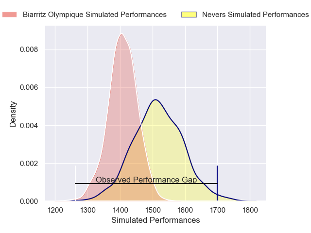
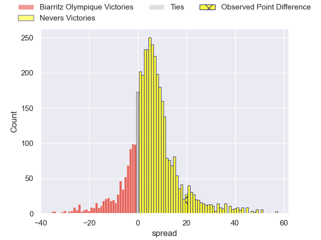
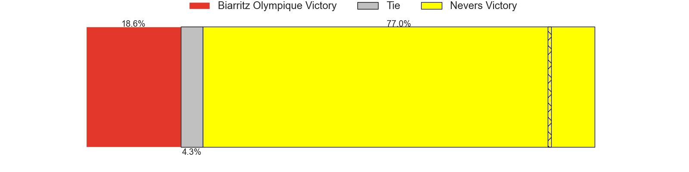
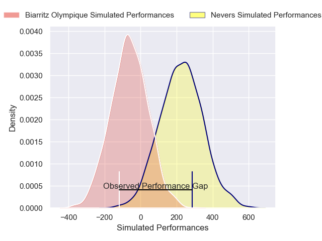
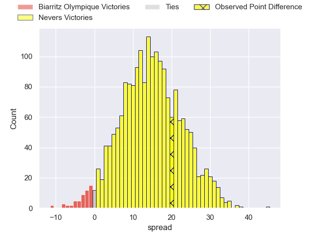
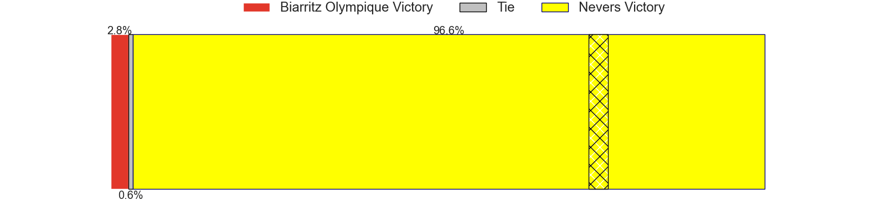

---  
layout: page  
title: Biarritz Olympique at Nevers; 15-35  
date: 2025-04-18 18:00:00 -0500  
categories: "Pro D2 24/25" match review  
---
# Biarritz Olympique at Nevers; 15-35

# Club Level Predictions

The first set of predictions treats a club as the smallest object, as the club develops its members, organizes a gameplan, and deploys its players as needed for each match. This club model has a prediction of 0.646, which translates to predicting Nevers to win by 5.3.

Our Over/Under is 55.5 - and combined with the spread above, we have a predicted scoreline of 25 to 30

Each club has a rating and a rating deviation (similar to a Glicko rating), and expected performances can be generated. This allows for simulated matches and spreads like the ones below.
## Projected Performances - Club Model

## Projected Spreads - Club Model

## Projected Results - Club Model

# Player Level Predictions

Treating teams instead as an entity made up of the currently active players, I have ratings for each player in an altogether different system. These can be combined to form team ratings once teamsheets are announced, weighting starters a bit higher than the reserves. After the match is played, players can be weighted by their minutes on the field, allowing for an accurate measure of the team's composition. With these compiled team ratings, we can make predictions, measure inaccuracy, and update the individual player ratings.
## Prediction without Player Minutes: Nevers by 15.0

Nevers by 9.9 on a neutral pitch

## Projected Performances - Player Model

## Projected Spreads - Player Model

## Projected Results - Player Model

|   Away Minutes | Away Player         |   Away Percentile |   Number |   Home Percentile | Home Player                |   Home Minutes |
|---------------:|:--------------------|------------------:|---------:|------------------:|:---------------------------|---------------:|
|              8 | Killian Taofifenua  |             23.69 |        1 |             51.92 | Aitor Kitutu               |             80 |
|              0 | Clement Martinez    |              5.45 |        2 |             80.2  | Stefan Buruiana            |             53 |
|             10 | Zakaria El Fakir    |              4.78 |        3 |             66.9  | Aselo Ikahehegi            |             80 |
|              4 | Charlie Matthews    |             21.21 |        4 |             65.5  | Ugo Vignolles              |             30 |
|             80 | Eliande Sanderson   |             13.38 |        5 |             45.15 | Chris Gabriel              |             72 |
|             59 | Johnny Dyer         |              0.55 |        6 |             90.91 | Hugues Bastide             |             53 |
|              6 | Jessy Jegerlehner   |              1.1  |        7 |             34.34 | Mahamadou Coulibaly        |             53 |
|             80 | Cornell du Preez    |             36.01 |        8 |             95.06 | Jason-Colin Fraser         |             53 |
|             35 | Kerman Aurrekoetxea |             32.32 |        9 |              3.72 | Hugo Bouyssou              |             62 |
|             45 | Edgar Retiere       |             15.71 |       10 |             20.87 | Shaun Reynolds             |             80 |
|              0 | Mathieu Acebes      |             90.67 |       11 |             36.66 | Dylan Jaminet              |             80 |
|             18 | Tyler Morgan        |             20.62 |       12 |             49.2  | Noa Pommelet               |             24 |
|             24 | Yohan Tapie         |             11.97 |       13 |             48.09 | Alivereti Loaloa           |             72 |
|             45 | Nicolas Elissondo   |             42.26 |       14 |             14.37 | Gabin Rocher               |             80 |
|              8 | Kylian Jaminet      |             84.62 |       15 |             42.91 | Perry Mayo                 |             55 |
|             35 | Aitor Hourcade      |              1.41 |       16 |             21.83 | Simon Tarel                |             21 |
|             50 | François Mur        |            nan    |       17 |             32.61 | George Smith               |             80 |
|              0 | Zach Kibirige       |              2.24 |       18 |             76.31 | Julien Kazubek             |             23 |
|             72 | Imanol Biscay       |              6.09 |       19 |             48    | Louis Chanet               |              0 |
|             80 | Adrian Motoc        |              1.6  |       20 |             47.61 | Hugo Ndiaye                |             16 |
|             29 | Thomas Dolhagaray   |             24.25 |       21 |             72.08 | Luka Plataret              |             17 |
|             80 | Luteru Tolai        |             65.02 |       22 |             40.59 | Jean-Maxence Jules-Rosette |             80 |
|             80 | Nikoloz Narmania    |             69.02 |       23 |             80.32 | Yohan Le Bourhis           |             80 |

