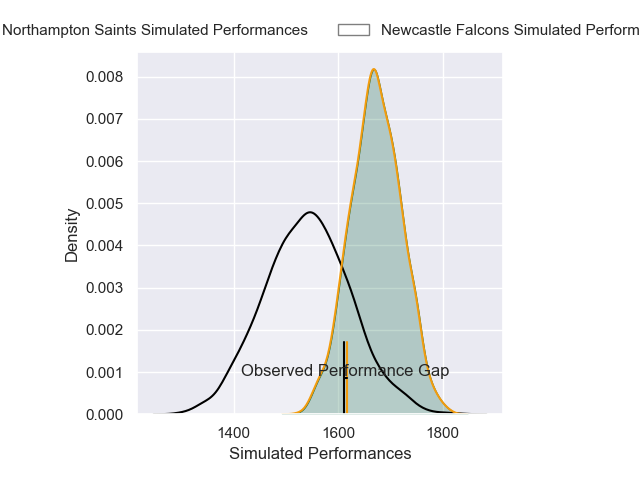
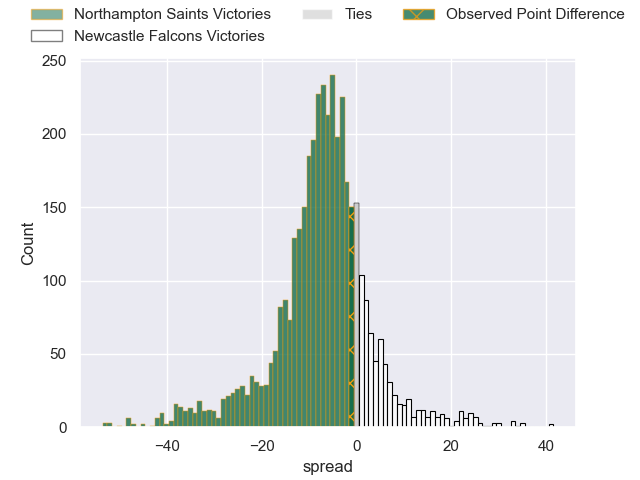
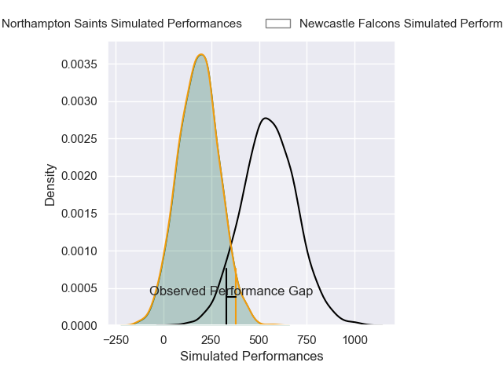
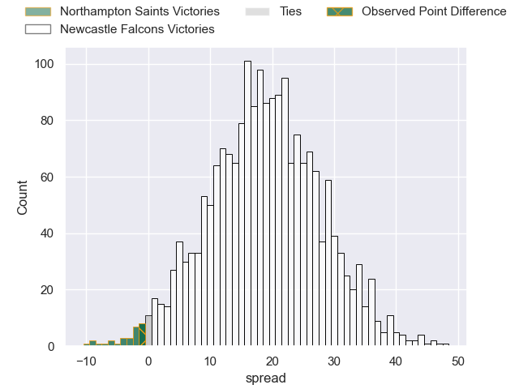
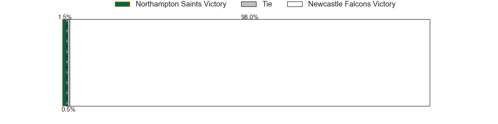

---  
layout: page  
title: Northampton Saints at Newcastle Falcons; 35-34  
date: 2025-04-18 18:00:00 -0500  
categories: "Gallagher Premiership 24/25" match review  
---
# Northampton Saints at Newcastle Falcons; 35-34

# Club Level Predictions

The first set of predictions treats a club as the smallest object, as the club develops its members, organizes a gameplan, and deploys its players as needed for each match. This club model has a prediction of 0.321, which translates to predicting Northampton Saints to win by 6.6.

Our Over/Under is 59.5 - and combined with the spread above, we have a predicted scoreline of 33 to 26

Each club has a rating and a rating deviation (similar to a Glicko rating), and expected performances can be generated. This allows for simulated matches and spreads like the ones below.
## Projected Performances - Club Model

## Projected Spreads - Club Model

## Projected Results - Club Model

# Player Level Predictions

Treating teams instead as an entity made up of the currently active players, I have ratings for each player in an altogether different system. These can be combined to form team ratings once teamsheets are announced, weighting starters a bit higher than the reserves. After the match is played, players can be weighted by their minutes on the field, allowing for an accurate measure of the team's composition. With these compiled team ratings, we can make predictions, measure inaccuracy, and update the individual player ratings.
## Prediction without Player Minutes: Newcastle Falcons by 9.6

Northampton Saints by 4.3 on a neutral pitch

## Projected Performances - Player Model

## Projected Spreads - Player Model

## Projected Results - Player Model

|   Away Minutes | Away Player         |   Away Percentile |   Number |   Home Percentile | Home Player         |   Home Minutes |
|---------------:|:--------------------|------------------:|---------:|------------------:|:--------------------|---------------:|
|             80 | Tom West            |             79.1  |        1 |              3.23 | Adam Brocklebank    |             80 |
|             69 | Craig Wright        |             65.99 |        2 |              0.51 | Jamie Blamire       |             80 |
|             55 | Luke Green          |             30.27 |        3 |             10.9  | Murray McCallum     |             73 |
|             13 | Chunya Munga        |             67.63 |        4 |             16.47 | John Hawkins        |             51 |
|             20 | Tom Lockett         |             32.37 |        5 |              1.73 | Sebastian de Chaves |             80 |
|             15 | Angus Scott-Young   |             31.1  |        6 |             49.91 | Freddie Lockwood    |             66 |
|             18 | Tom Pearson         |             96.83 |        7 |             21.14 | Cameron Neild       |             80 |
|              7 | Iakopo Petelo-Mapu  |             49.9  |        8 |              0.41 | Callum Chick        |              1 |
|             62 | Tom James           |             80.57 |        9 |              0.17 | Sam Stuart          |             33 |
|             80 | Charlie Savala      |             76.11 |       10 |              1.82 | Brett Connon        |             59 |
|             80 | Tom Seabrook        |              6.2  |       11 |              4    | Ben Stevenson       |             71 |
|             80 | Tom Litchfield      |             75.12 |       12 |             99.8  | Max Clark           |             25 |
|             80 | Tom Litchfield      |             75.12 |       12 |             99.8  | Max Clark           |              0 |
|             80 | Tom Litchfield      |             75.12 |       12 |             99.8  | Max Clark           |             15 |
|             80 | Tom Litchfield      |             75.12 |       12 |             99.8  | Max Clark           |             59 |
|             13 | Burger Odendaal     |             80.36 |       13 |             20.63 | Connor Doherty      |             25 |
|             30 | Will Glister        |             55.2  |       14 |             63.11 | Alex Hearle         |             21 |
|             62 | Rory Hutchinson     |             84.63 |       15 |              5.53 | Elliott Obatoyinbo  |             18 |
|             25 | Henry Walker        |             82.31 |       16 |             10.71 | Ollie Fletcher      |             80 |
|             18 | Tarek Haffar        |             79.58 |       17 |             13.64 | Mike Rewcastle      |             80 |
|             50 | Elliot Millar Mills |             89.1  |       18 |             66.75 | Richard Palframan   |             80 |
|             29 | Temo Mayanavanua    |             97.98 |       19 |            nan    | Finn Baker          |              9 |
|             20 | Juarno Augustus     |             56.24 |       20 |             34.17 | Ollie Leatherbarrow |             21 |
|             47 | Alex Mitchell       |             96.96 |       21 |             76.07 | Max Pepper          |             80 |
|              9 | Fin Smith           |             61.13 |       22 |             57.55 | Sammy Arnold        |             62 |
|             71 | Rafe Witheat        |            nan    |       23 |              7.44 | Oliver Spencer      |             18 |
|             71 | Rafe Witheat        |            nan    |       23 |              7.44 | Oliver Spencer      |             79 |

