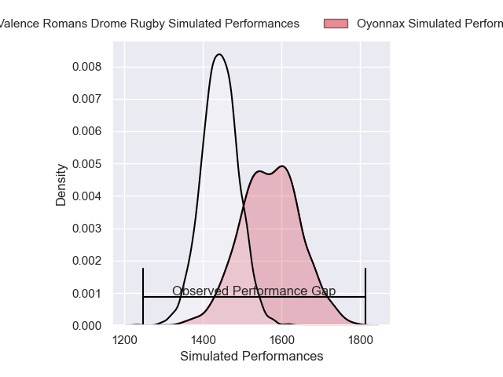
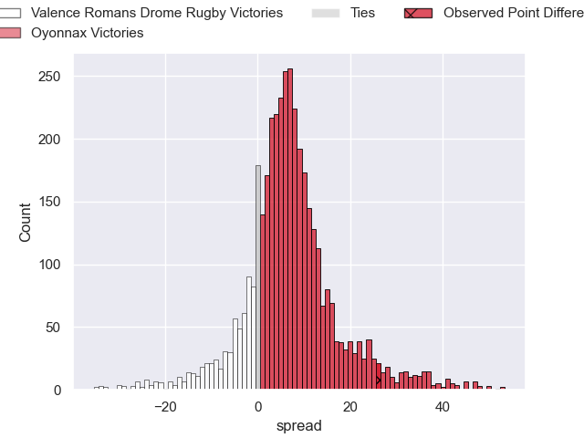
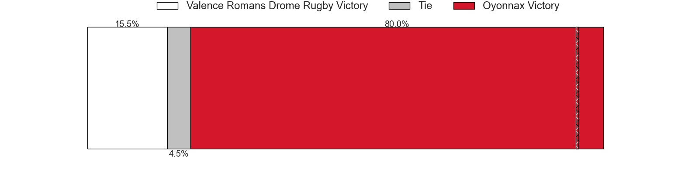
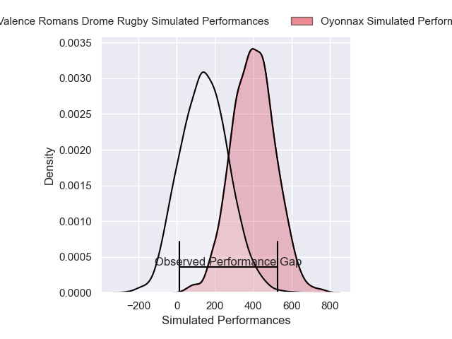
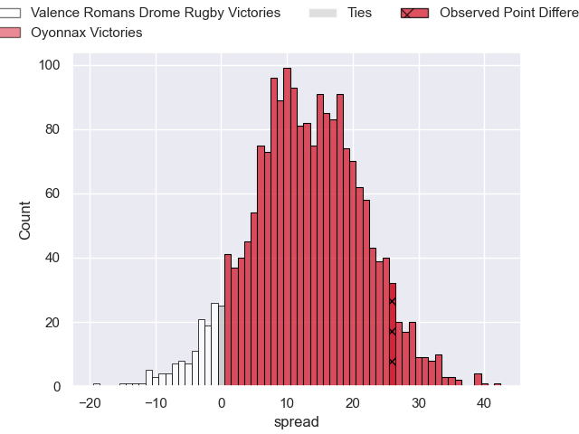
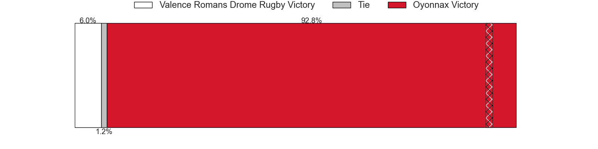

---  
layout: page  
title: Valence Romans Drome Rugby at Oyonnax; 17-43  
date: 2025-04-18 18:00:00 -0500  
categories: "Pro D2 24/25" match review  
---
# Valence Romans Drome Rugby at Oyonnax; 17-43

# Club Level Predictions

The first set of predictions treats a club as the smallest object, as the club develops its members, organizes a gameplan, and deploys its players as needed for each match. This club model has a prediction of 0.676, which translates to predicting Oyonnax to win by 6.5.

Our Over/Under is 52.5 - and combined with the spread above, we have a predicted scoreline of 23 to 30

Each club has a rating and a rating deviation (similar to a Glicko rating), and expected performances can be generated. This allows for simulated matches and spreads like the ones below.
## Projected Performances - Club Model

## Projected Spreads - Club Model

## Projected Results - Club Model

# Player Level Predictions

Treating teams instead as an entity made up of the currently active players, I have ratings for each player in an altogether different system. These can be combined to form team ratings once teamsheets are announced, weighting starters a bit higher than the reserves. After the match is played, players can be weighted by their minutes on the field, allowing for an accurate measure of the team's composition. With these compiled team ratings, we can make predictions, measure inaccuracy, and update the individual player ratings.
## Prediction without Player Minutes: Oyonnax by 14.0

Oyonnax by 0.7 on a neutral pitch

## Projected Performances - Player Model

## Projected Spreads - Player Model

## Projected Results - Player Model

|   Away Minutes | Away Player          |   Away Percentile |   Number |   Home Percentile | Home Player        |   Home Minutes |
|---------------:|:---------------------|------------------:|---------:|------------------:|:-------------------|---------------:|
|             80 | Andrea Pontanier     |             82.49 |        1 |             30.43 | Antoine Abraham    |             57 |
|             80 | Cyril Deligny        |              0.68 |        2 |             90.31 | Peniami Narisia    |             80 |
|             80 | Gareth Milasinovich  |             19.85 |        3 |             15.66 | Ali Oz             |             71 |
|             80 | Nathan Huguen        |             56.26 |        4 |             90.37 | Phoenix Battye     |             80 |
|             80 | Florian Goumat       |             70.33 |        5 |             12.33 | Hugo Fabregue      |             80 |
|             46 | Axel Bruchet         |             40.41 |        6 |             13.69 | Kevin Lebreton     |             30 |
|             76 | Ilia Spanderashvili  |             25.98 |        7 |             88.36 | Wandrille Picault  |             45 |
|              8 | Sven Bernat Girlando |             85.48 |        8 |             21.27 | Antoine Miquel     |             80 |
|             80 | Mattéo Rodor         |             17.74 |        9 |             91.89 | Jonathan Ruru      |             57 |
|             80 | Lucas Meret          |             59.92 |       10 |             78.34 | Zack Holmes        |             80 |
|             27 | Mosese Mawalu        |             87.42 |       11 |             61.58 | Karim Qadiri       |             80 |
|             80 | Louis Marrou         |             81.93 |       12 |             12.24 | Lucas Mensa        |             80 |
|             68 | Anatole Pauvert      |             82.63 |       13 |             36.62 | Afusipa Taumoepeau |             80 |
|             23 | Owen Lane            |              2.1  |       14 |             51.67 | Maxime Salles      |             51 |
|             20 | Joris De Moura       |             86.27 |       15 |             18.24 | Martin Bogado      |             55 |
|             12 | Loan Real            |             70.48 |       16 |            nan    | nan                |            nan |
|             26 | Adrien Roux          |             78.12 |       17 |            nan    | nan                |            nan |
|             26 | Mathieu Guillomot    |              9.97 |       18 |            nan    | nan                |            nan |
|             37 | Gauthier Minguillon  |             75.41 |       19 |            nan    | nan                |            nan |
|             26 | Dorian Marco Pena    |             88.27 |       20 |            nan    | nan                |            nan |
|             49 | Esteban Chouteau     |             68.6  |       21 |            nan    | nan                |            nan |
|             26 | Thomas Lhusero       |             72.13 |       22 |            nan    | nan                |            nan |
|             80 | Vincent Vial         |             63.36 |       23 |            nan    | nan                |            nan |

