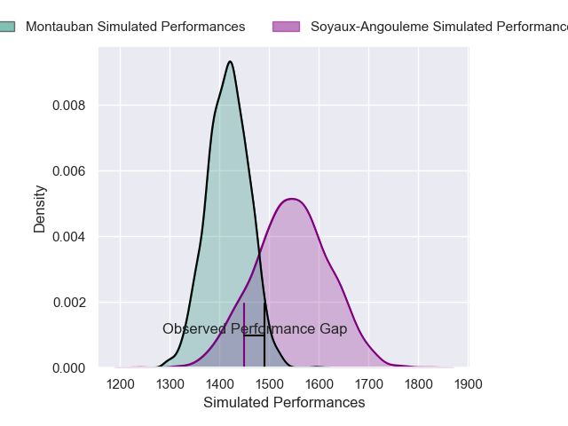
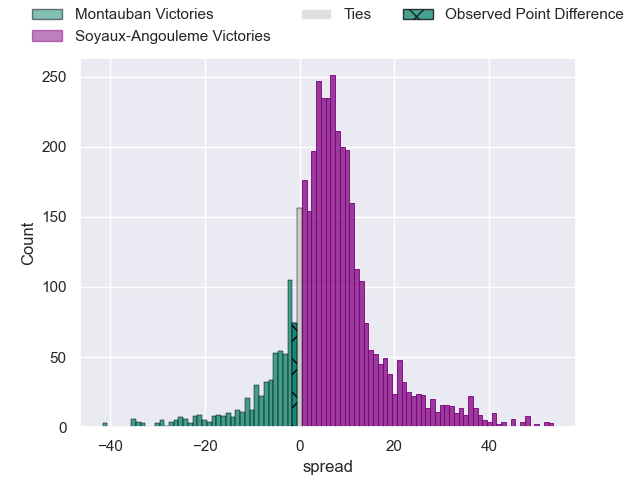
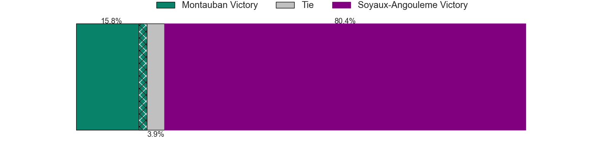
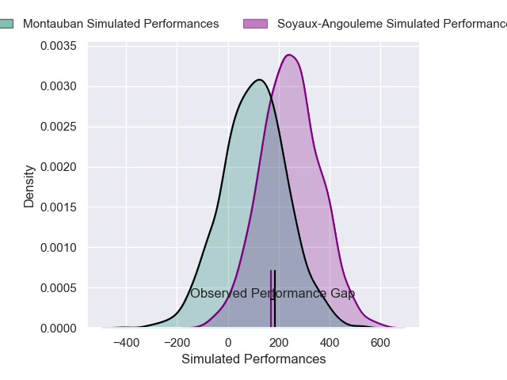
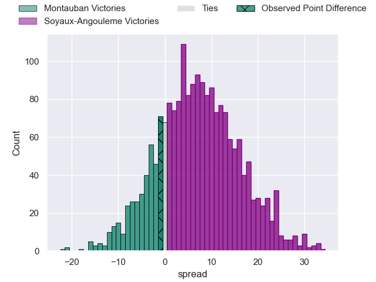

---  
layout: page  
title: Montauban at Soyaux-Angouleme; 19-18  
date: 2025-04-18 18:00:00 -0500  
categories: "Pro D2 24/25" match review  
---
# Montauban at Soyaux-Angouleme; 19-18

# Club Level Predictions

The first set of predictions treats a club as the smallest object, as the club develops its members, organizes a gameplan, and deploys its players as needed for each match. This club model has a prediction of 0.67, which translates to predicting Soyaux-Angouleme to win by 6.2.

Our Over/Under is 54.5 - and combined with the spread above, we have a predicted scoreline of 24 to 30

Each club has a rating and a rating deviation (similar to a Glicko rating), and expected performances can be generated. This allows for simulated matches and spreads like the ones below.
## Projected Performances - Club Model

## Projected Spreads - Club Model

## Projected Results - Club Model

# Player Level Predictions

Treating teams instead as an entity made up of the currently active players, I have ratings for each player in an altogether different system. These can be combined to form team ratings once teamsheets are announced, weighting starters a bit higher than the reserves. After the match is played, players can be weighted by their minutes on the field, allowing for an accurate measure of the team's composition. With these compiled team ratings, we can make predictions, measure inaccuracy, and update the individual player ratings.
## Prediction without Player Minutes: Soyaux-Angouleme by 7.9

Soyaux-Angouleme by 2.4 on a neutral pitch

## Projected Performances - Player Model

## Projected Spreads - Player Model

## Projected Results - Player Model

|   Away Minutes | Away Player           |   Away Percentile |   Number |   Home Percentile | Home Player        |   Home Minutes |
|---------------:|:----------------------|------------------:|---------:|------------------:|:-------------------|---------------:|
|             80 | Lucas Seyrolle        |              8.56 |        1 |             97.9  | Sami Zouhair       |             80 |
|             40 | Vakhtang Jintcharadze |             66.84 |        2 |             16.33 | Mamoudou Meite     |             23 |
|             80 | Badri Alkhazashvili   |             23.08 |        3 |             55.77 | Omar Dahir         |              9 |
|             64 | Clément Bitz          |             78.61 |        4 |             81.41 | Maxence Lemardelet |             23 |
|             40 | Noa Kanika            |             66.57 |        5 |             92.97 | Sikeli Nabou       |             50 |
|             17 | Frédéric Quercy       |              2.7  |        6 |              5.31 | Gautier Gibouin    |             23 |
|             12 | Kyllian Ringuet       |             83.05 |        7 |             53.07 | Clément Sentubery  |             10 |
|              0 | Sikhumbuzo Notshe     |             74.23 |        8 |             45.4  | Alexander Masibaka |             59 |
|             27 | Joe Powell            |             84.63 |        9 |              5.57 | Adrien Bau         |             49 |
|             80 | Jérôme Bosviel        |             91.7  |       10 |             67.61 | Corentin Glenat    |             57 |
|             22 | Josua Vici            |             31.17 |       11 |             29.93 | Nathan Farissier   |             26 |
|             53 | Maxime Mathy          |              5.53 |       12 |             91.81 | George Tilsley     |             23 |
|             80 | JT Jackson            |             46.3  |       13 |              6.81 | Arthur Proult      |             80 |
|             67 | Stephane Ahmed        |             96.66 |       14 |             39.18 | Eoghan Barrett     |             65 |
|             80 | Segundo Tuculet       |              3.07 |       15 |              9.63 | Massimo Ortolan    |             34 |
|             26 | Baptiste Mouchous     |             88.52 |       16 |             83.21 | Georgy Balakarev   |             80 |
|             60 | Thomas Bue            |             38.98 |       17 |             15.48 | Motu Matu'u        |             80 |
|             80 | Facundo Pomponio      |             67.15 |       18 |             45.12 | Yassine Boutemane  |             68 |
|             35 | Jeremie Maurouard     |              3.91 |       19 |             74.83 | Manu Saubusse      |             80 |
|             80 | Tomas Lezana          |            nan    |       20 |             20.48 | Matt Beukeboom     |             51 |
|             80 | Hugo Zabalza          |             18.58 |       21 |             52.89 | Hubert Texier      |             72 |
|             70 | Frank Bradshaw        |             86.22 |       22 |             63.57 | François Carlo Mey |             52 |
|             22 | Victor Moreaux        |              4.05 |       23 |             17.18 | Samuel Nollet      |             73 |

