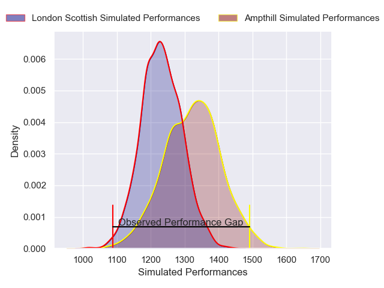
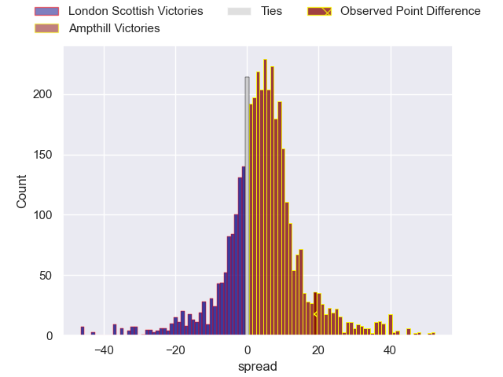
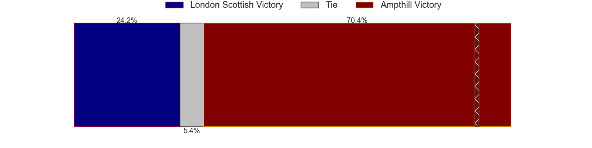
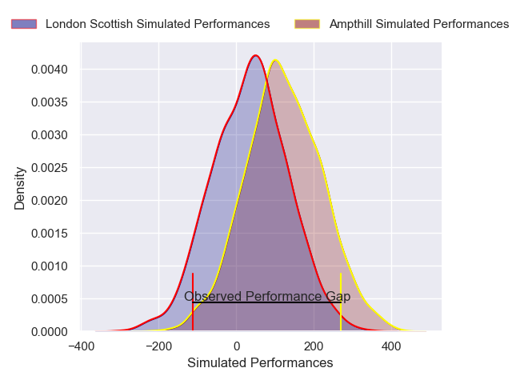
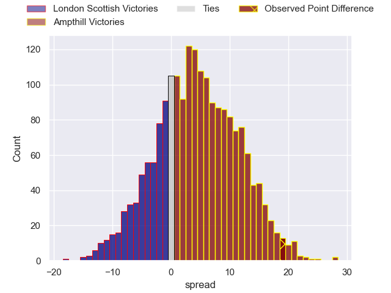
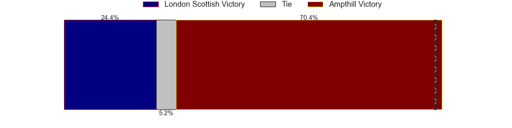

---  
layout: page  
title: London Scottish at Ampthill; 19-38  
date: 2025-04-19 18:00:00 -0500  
categories: "RFU Championship 24/25" match review  
---
# London Scottish at Ampthill; 19-38

# Club Level Predictions

The first set of predictions treats a club as the smallest object, as the club develops its members, organizes a gameplan, and deploys its players as needed for each match. This club model has a prediction of 0.63, which translates to predicting Ampthill to win by 4.7.

Our Over/Under is 55.5 - and combined with the spread above, we have a predicted scoreline of 25 to 30

Each club has a rating and a rating deviation (similar to a Glicko rating), and expected performances can be generated. This allows for simulated matches and spreads like the ones below.
## Projected Performances - Club Model

## Projected Spreads - Club Model

## Projected Results - Club Model

# Player Level Predictions

Treating teams instead as an entity made up of the currently active players, I have ratings for each player in an altogether different system. These can be combined to form team ratings once teamsheets are announced, weighting starters a bit higher than the reserves. After the match is played, players can be weighted by their minutes on the field, allowing for an accurate measure of the team's composition. With these compiled team ratings, we can make predictions, measure inaccuracy, and update the individual player ratings.
## Prediction without Player Minutes: Ampthill by 7.0

Ampthill by 3.5 on a neutral pitch

## Projected Performances - Player Model

## Projected Spreads - Player Model

## Projected Results - Player Model

|   Away Minutes | Away Player           |   Away Percentile |   Number |   Home Percentile | Home Player                 |   Home Minutes |
|---------------:|:----------------------|------------------:|---------:|------------------:|:----------------------------|---------------:|
|             48 | Will Prior            |             74.46 |        1 |             64.25 | Harrison Courtney           |             65 |
|             48 | Austin Wallis         |              1.67 |        2 |             97.99 | Rhys Marshall               |             19 |
|             48 | Ntinga Mpiko          |              8.73 |        3 |             21.42 | James Johnston              |             60 |
|             80 | Matt Wilkinson        |             23.43 |        4 |             38.9  | Aidan King                  |             80 |
|             80 | Harry Browne          |             58.54 |        5 |             63.38 | Kaden Pearce-Paul           |             30 |
|             20 | Will Trenholm         |             15.25 |        6 |              9.47 | Tino Mapapalangi            |             66 |
|             80 | Zach Carr             |             31.72 |        7 |             25.57 | Charles Rylands             |             60 |
|             61 | Tom Marshall          |             15.91 |        8 |             68.6  | Nathan Michelow             |             32 |
|             54 | Jonny Law             |              6.67 |        9 |             11.97 | Rory Morgan                 |             12 |
|             50 | Tom Wilstead          |             11.32 |       10 |              7.55 | Josh Barton                 |              0 |
|             20 | Roma Zheng            |             60.61 |       11 |             56.91 | Brandon Jackson-Richards    |             35 |
|             32 | Will Simonds          |              7.08 |       12 |             75.87 | Fraser James Kevin Strachan |             31 |
|             20 | Robert David McCallum |              4.11 |       13 |             45.07 | Sione Va'enuku              |             32 |
|             35 | Hayden Hyde           |             23.77 |       14 |             84.75 | Charlie Bracken             |             80 |
|             80 | Jonah Holmes          |             76.54 |       15 |             28.81 | Evan Mitchell               |             24 |
|            nan | nan                   |            nan    |       16 |             66.72 | Richard Barrington          |             24 |
|            nan | nan                   |            nan    |       17 |             56.02 | James Isaacs                |             29 |
|            nan | nan                   |            nan    |       18 |              4.04 | Callum Norrie               |             21 |
|            nan | nan                   |            nan    |       19 |             76.85 | Olamide Sodeke              |             80 |
|            nan | nan                   |            nan    |       20 |             48.01 | Kennedy Sylvester           |             29 |
|            nan | nan                   |            nan    |       21 |             22.54 | Reggie Hammick              |             23 |
|            nan | nan                   |            nan    |       22 |              7    | Oran McNulty                |             41 |
|            nan | nan                   |            nan    |       23 |             21.03 | Roan Frostwick              |             71 |

