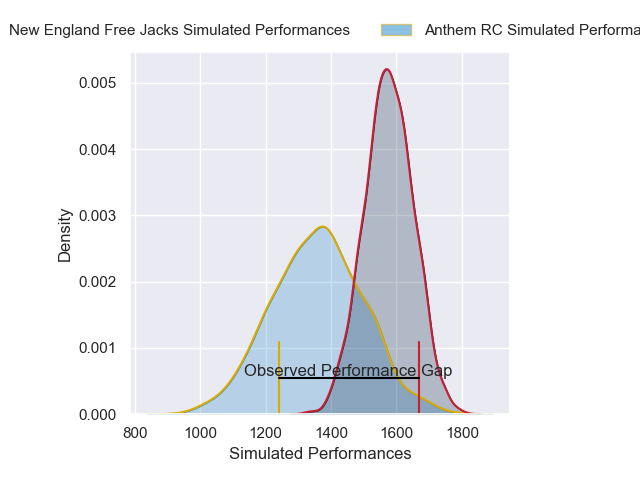
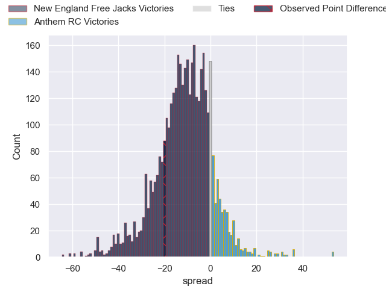
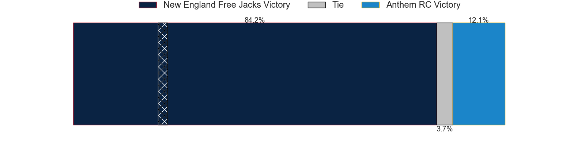
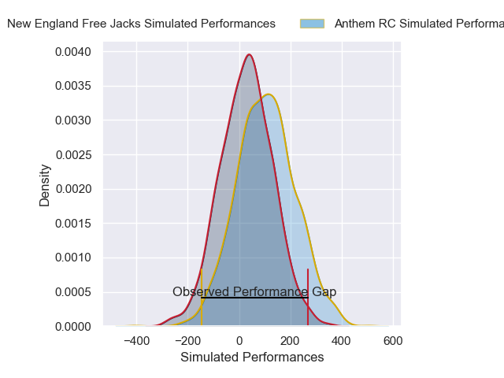
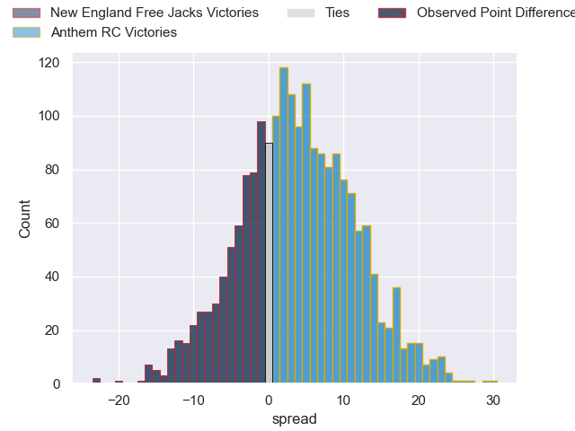
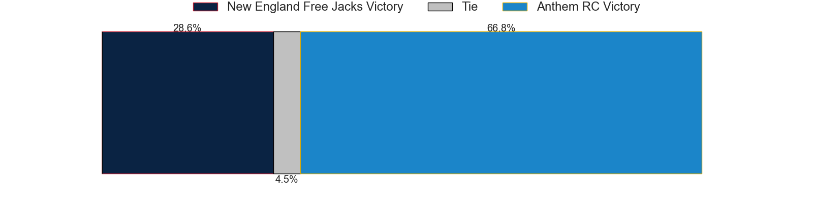

---  
layout: page  
title: New England Free Jacks at Anthem RC; 26-6  
date: 2025-04-19 18:00:00 -0500  
categories: "Major League Rugby 2025" match review  
---
# New England Free Jacks at Anthem RC; 26-6

# Club Level Predictions

The first set of predictions treats a club as the smallest object, as the club develops its members, organizes a gameplan, and deploys its players as needed for each match. This club model has a prediction of 0.232, which translates to predicting New England Free Jacks to win by 10.7.

Our Over/Under is 57.5 - and combined with the spread above, we have a predicted scoreline of 34 to 23

Each club has a rating and a rating deviation (similar to a Glicko rating), and expected performances can be generated. This allows for simulated matches and spreads like the ones below.
## Projected Performances - Club Model

## Projected Spreads - Club Model

## Projected Results - Club Model

# Player Level Predictions

Treating teams instead as an entity made up of the currently active players, I have ratings for each player in an altogether different system. These can be combined to form team ratings once teamsheets are announced, weighting starters a bit higher than the reserves. After the match is played, players can be weighted by their minutes on the field, allowing for an accurate measure of the team's composition. With these compiled team ratings, we can make predictions, measure inaccuracy, and update the individual player ratings.
## Prediction without Player Minutes: New England Free Jacks by 0.4

New England Free Jacks by 2.7 on a neutral pitch

## Projected Performances - Player Model

## Projected Spreads - Player Model

## Projected Results - Player Model

|   Away Minutes | Away Player         |   Away Percentile |   Number |   Home Percentile | Home Player              |   Home Minutes |
|---------------:|:--------------------|------------------:|---------:|------------------:|:-------------------------|---------------:|
|             32 | Malakai Hala-Ngatai |             13.96 |        1 |              5.41 | Jake Turnbull            |             18 |
|             76 | Andrew Quattrin     |              4.95 |        2 |              0.83 | Connor Robinson          |             49 |
|             61 | Kaleb Geiger        |             90.2  |        3 |              2.27 | Alex Maughan             |             80 |
|             68 | Piers Von Dadelszen |             80.58 |        4 |             22.15 | Viliami Vuli             |             48 |
|             80 | Sam Caird           |              5.94 |        5 |             19.23 | Sam Golla                |             47 |
|             21 | Jed Melvin          |             60.7  |        6 |             20.39 | Alejandro Martinez Tapia |             68 |
|             22 | Joe Johnston        |             90.73 |        7 |             45.82 | Makeen Alikhan           |             29 |
|             80 | Jeronimo Gomez Vara |             22.22 |        8 |             27.16 | Colin Turner             |             47 |
|             80 | Oscar Lennon        |             76.99 |        9 |             31.47 | Ishy Safodien            |             40 |
|             54 | Harrison Boyle      |             62.23 |       10 |             21.67 | Cliven Loubser           |             80 |
|             80 | Paula Balekana      |             13.25 |       11 |              4.48 | Toby Fricker             |             59 |
|             33 | Le Roux Malan       |             95.17 |       12 |             20.42 | Ej Freeman               |             80 |
|             49 | Ben LeSage          |             88.73 |       13 |             14.89 | Erich Storti             |             26 |
|             49 | Ben LeSage          |             88.73 |       13 |             14.89 | Erich Storti             |             33 |
|             49 | Ben LeSage          |             88.73 |       13 |             14.89 | Erich Storti             |             80 |
|             55 | Jack Reeves         |              9.42 |       14 |             77.99 | Conner Mooneyham         |             62 |
|             16 | Brock Webster       |             71.46 |       15 |             78.74 | Mitch Wilson             |             40 |

