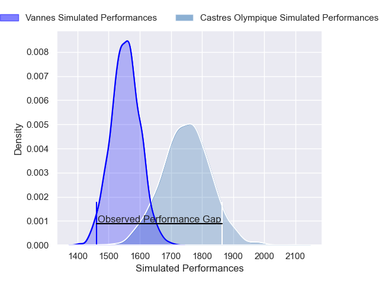
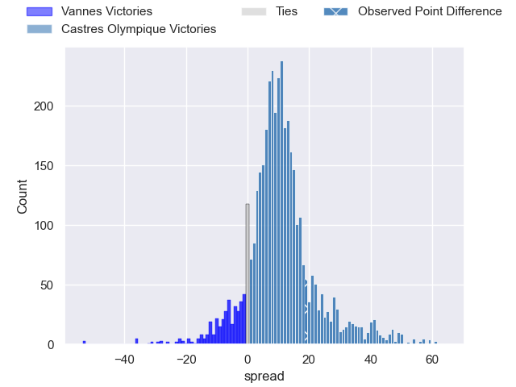
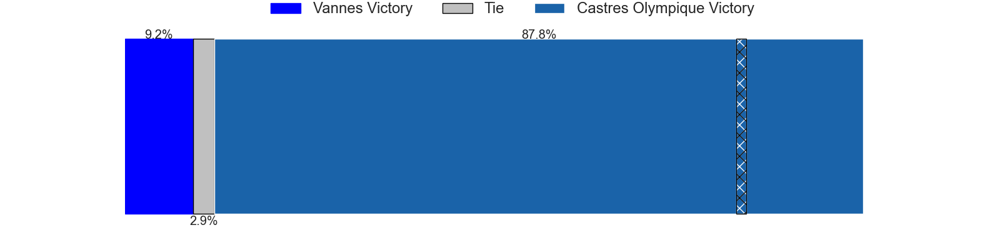
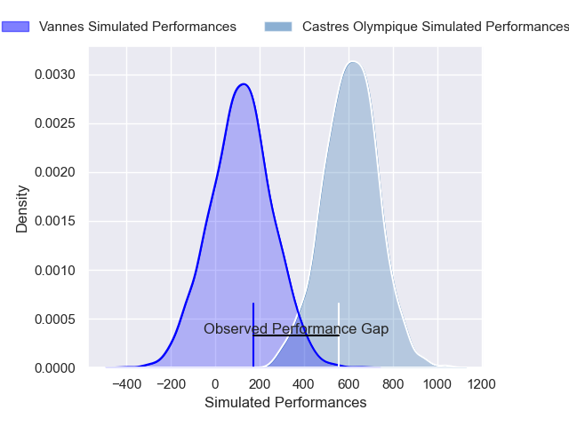
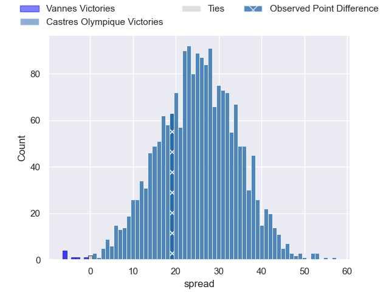
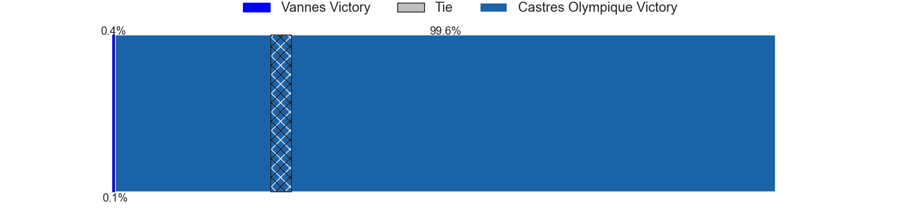

---  
layout: page  
title: Vannes at Castres Olympique; 13-32  
date: 2025-04-19 18:00:00 -0500  
categories: "Top 14 Orange 24/25" match review  
---
# Vannes at Castres Olympique; 13-32

# Club Level Predictions

The first set of predictions treats a club as the smallest object, as the club develops its members, organizes a gameplan, and deploys its players as needed for each match. This club model has a prediction of 0.752, which translates to predicting Castres Olympique to win by 9.8.

Our Over/Under is 53.5 - and combined with the spread above, we have a predicted scoreline of 22 to 32

Each club has a rating and a rating deviation (similar to a Glicko rating), and expected performances can be generated. This allows for simulated matches and spreads like the ones below.
## Projected Performances - Club Model

## Projected Spreads - Club Model

## Projected Results - Club Model

# Player Level Predictions

Treating teams instead as an entity made up of the currently active players, I have ratings for each player in an altogether different system. These can be combined to form team ratings once teamsheets are announced, weighting starters a bit higher than the reserves. After the match is played, players can be weighted by their minutes on the field, allowing for an accurate measure of the team's composition. With these compiled team ratings, we can make predictions, measure inaccuracy, and update the individual player ratings.
## Prediction without Player Minutes: Castres Olympique by 24.2

Castres Olympique by 9.9 on a neutral pitch

## Projected Performances - Player Model

## Projected Spreads - Player Model

## Projected Results - Player Model

|   Away Minutes | Away Player         |   Away Percentile |   Number |   Home Percentile | Home Player          |   Home Minutes |
|---------------:|:--------------------|------------------:|---------:|------------------:|:---------------------|---------------:|
|           26   | Thomas Moukoro      |             36.47 |        1 |             91.06 | Antoine Tichit       |             26 |
|           80   | Cyril Blanchard     |             46.86 |        2 |             85.48 | Gaetan Barlot        |             33 |
|           12   | Santiago Medrano    |             11.76 |        3 |             59.69 | Nicolas Corato       |             12 |
|           75   | Santiago Medrano    |             11.76 |        3 |             59.69 | Nicolas Corato       |             12 |
|           26   | Santiago Medrano    |             11.76 |        3 |             59.69 | Nicolas Corato       |             12 |
|           32   | Santiago Medrano    |             11.76 |        3 |             59.69 | Nicolas Corato       |             12 |
|           73   | Joe Edwards         |             93.87 |        4 |             12.82 | Gauthier Maravat     |             80 |
|           32   | Fabrice Metz        |             77.1  |        5 |             94.34 | Florent Vanverberghe |             31 |
|           80   | Simon Augry         |              8.72 |        6 |             90.36 | Baptiste Delaporte   |             76 |
|           80   | Francisco Gorrissen |             97.89 |        7 |             45    | Baptiste Cope        |             32 |
|           43   | Sione Kalamafoni    |             40.12 |        8 |             71.19 | Abraham Papali'i     |             64 |
|           18   | Stephen Varney      |              1.18 |        9 |             90.36 | Jeremy Fernandez     |             48 |
|           13   | Maxime Lafage       |             93.44 |       10 |             82.7  | Louis Le Brun        |             23 |
|           26   | Filipo Nakosi       |             68.38 |       11 |             93.94 | Remy Baget           |             80 |
|           80   | Tani Vili           |             59.05 |       12 |             96.88 | Jack Goodhue         |             67 |
|           32   | Pierre Boudehent    |             66.2  |       13 |             74.75 | Vilimoni Botitu      |             54 |
|           80   | Romaric Camou       |             80.69 |       14 |             74.81 | Christian Ambadiang  |             47 |
|           80   | Paul Surano         |             51.82 |       15 |             52.83 | Theo Chabouni        |             19 |
|           80   | Theo Beziat         |             72.61 |       16 |             63.37 | Pierre Colonna       |             80 |
|           50   | Hugo Djehi          |             62.43 |       17 |             65.73 | Quentin Walcker      |             80 |
|           23.5 | Timothe Mezou       |             52.78 |       18 |             96.14 | Leone Nakarawa       |             80 |
|           33   | Matthieu Uhila      |             62.02 |       19 |             62.53 | Mathieu Babillot     |             55 |
|           32   | Leon Boulier        |            nan    |       20 |             57.7  | Santiago Arata       |             80 |
|           32   | Thibault Debaes     |             68.39 |       21 |             77.94 | Julien Dumora        |             80 |
|           37   | Robin Taccola       |             74.35 |       22 |             87.97 | Nathanael Hulleu     |             33 |
|           32   | Phil Kite           |            nan    |       23 |             86.27 | Levan Chilachava     |             22 |

